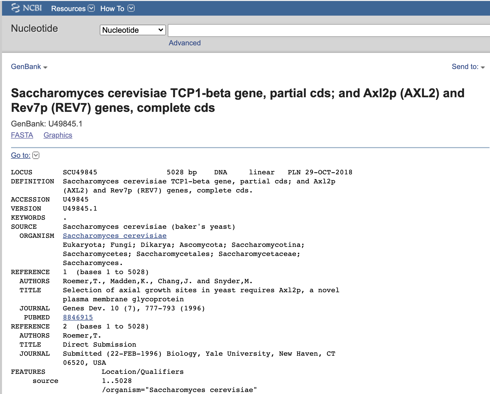

--- 
title: "A Little Book of R for Bioinformatics 2.0"
author: "Avril Coghlan, with contributions by Nathan L. Brouwer"
date: "`r Sys.Date()`"
site: bookdown::bookdown_site
documentclass: book
bibliography: [book.bib, packages.bib]
biblio-style: apalike
link-citations: yes
description: "An entry-level text for bioinformatics and computational biology"
geometry: margin=1in
---

# Preface to version 2.0 {-}

Welcome to *A Little Book of R for Bioinformatics 2.0*!.

This book is based on the original [*A Little Book of R for Bioinformatics*](https://a-little-book-of-r-for-bioinformatics.readthedocs.io/en/latest/) by Dr. Avril Coghlan (Hereafter "ALBRB 1.0").  Dr. Coghlan's book was one of the first and most thorough introductions to using *R* for bioinformatics and computational biology, and was generously published under the Creative Commons 3.0 Attribution License [(CC BY 3.0)](https://creativecommons.org/licenses/by/3.0/).  In addition to describing how to do bioinformatics in R, Coghlan provided numerous `R` functions to facilitate important tasks, practice questions, and references to further reading. 

[ALBRB 1.0](https://a-little-book-of-r-for-bioinformatics.readthedocs.io/en/latest/) was extremely useful to me when I was learning bioinformatics and computational biology.  In this version of the book, which I'll refer to as **ALBRB 2.0**, I have adapted Dr. Coghlan's original book to suit my own teaching needs, updated it with current packages now available in R, added background materials from other open-access sources, and added in my original  materials.

Below I've outlined the general types of changes I've made to the original book.  I have tried to link back to the original content that these updates are derived from and note how changes were made.  Any errors or inconsistencies should be ascribed to me, not Dr. Coghlan.  If you have any feedback, please email me at brouwern@gmail.com

~Nathan Brouwer, June 2021


**Changes implemented in ALBRB 2.0 by Nathan Brouwer**

1. Converted the entire book to RMarkdown and published it via `bookdown`.
1. Added instructions for using RStudio and RStudio Cloud.
1. Updated instructions to reflect any changes in software, including changes to how the bioinformatics repository `Bioconductor` works circa 2021.
1. Split up chapters into smaller units.
1. Reorganized the order of some material.
1. Added biological background information by integrating information from the Open Access textbook [LibreText General Biology](https://bio.libretexts.org/Bookshelves/Introductory_and_General_Biology/Book%3A_General_Biology_(OpenStax)) 
1. Added links to the books I am developing, *Get R Done!* and *Computational Biology for All*.
1. Moved functions written by Coghlan and datasets to my teaching package [compbio4all](https://github.com/brouwern/compbio4all).
1. Functions names changed from camelCase to snake_case
1. Functions re-written so as not to use Bioconductor to reduce/eliminate dependency of `compbio4all` on `Bioconductor`.
1. Changed some plotting to `ggplot2` or `ggpubr`.
1. Added additional subheadings
1. Added vocab and function lists to the beginning of many chapters
1. At times replaced non-biological examples with biological ones.
1. Change from British to American English (Sorry!  Couldn't help myself - the spellchecker made me do it!)
1. Provided additional links to external resources.
1. Added use of `rentrez` for querying NCBI databases

<!-- rentrez replaces what? Seqinr?-->


```{r include=FALSE}
# automatically create a bib database for R packages
knitr::write_bib(c(
  .packages(), 'bookdown', 'knitr', 'rmarkdown'
), 'packages.bib')
```


<!--chapter:end:index.Rmd-->

# Downloading R {#downloadR}

**By**: Avril Coghlan  

**Adapted, edited and expanded**: Nathan Brouwer (brouwern@gmail.com) under the Creative Commons 3.0 Attribution License [(CC BY 3.0)](https://creativecommons.org/licenses/by/3.0/).

## Preface

The following introduction to *R* is based on the first part of ["How to install *R* and a Brief Introduction to R"](https://a-little-book-of-r-for-bioinformatics.readthedocs.io/en/latest/src/installr.html) by Avril Coghlan, which was released under the Creative Commons 3.0 Attribution License [(CC BY 3.0)](https://creativecommons.org/licenses/by/3.0/).  For additional information see the Appendices and ["Getting *R* onto your computer"](https://brouwern.github.io/BOOK_R_Ecological_Data_Science/getting-r-onto-your-computer.html).

<!-- TODO: Update links to send to Comp Bio 4 All -->


## Introduction to R

_R_ (www.r-project.org) is a commonly used free statistics software. _R_ allows you to carry out statistical analyses in an interactive mode, as well as allowing  programming.

## Installing R

To use R, you first need to install the _R_ program on your computer.  

### Installing *R* on a Windows PC

These instructions will focus on installing *R* on a Windows PC. However, I will also briefly mention how to install *R* on a Macintosh or Linux computer (see below).  

**These steps have not been checked as of 8/13/2019 so there may be small variations in what the prompts are.  Installing R, however, is basically that same as any other program.  Clicking "Yes" etc on everything should work.**

> **PROTIP:** Even if you have used *R* before its good to regularly update it to avoid conflicts with recently produced software.

Minor updates of *R* are made very regularly (approximately every 6 months), as *R* is actively being improved all the time. It is worthwhile installing new versions of *R* a couple times a year, to make sure that you have a recent version of *R* (to ensure compatibility with all the latest versions of the *R* packages that you have downloaded).

To install *R* on your **Windows** computer, follow these steps:

1. Go to https://cran.r-project.org/
1. Under “Download and Install R”, click on the “Windows” link.
1. Under “Subdirectories”, click on the **“base”** link.
1. On the next page, you should see a link saying something like “Download *R* 4.1.0 for Windows” (or *R* X.X.X, where X.X.X gives the version of the program). Click on this link.
1. You may be asked if you want to save or run a file “R-x.x.x-win32.exe”. Choose “Save” and save the file. Then double-click on the icon for the file to run it.
1. You will be asked what language to install it in.
1. The *R* Setup Wizard will appear in a window. Click “Next” at the bottom of the *R* Setup wizard window.
1. The next page says “Information” at the top. Click “Next” again.
1. The next page says “Select Destination Location” at the top. By default, it will suggest to install *R* on the C drive in the  “Program Files” directory on your computer.
1. Click “Next” at the bottom of the *R* Setup wizard window.
1. The next page says “Select components” at the top. Click “Next” again.
1. The next page says “Startup options” at the top. Click “Next” again.
1. The next page says “Select start menu folder” at the top. Click “Next” again.
1. The next page says “Select additional tasks” at the top. Click “Next” again.
1. *R* should now be installing. This will take about a minute. When *R* has finished, you will see “Completing the *R* for Windows Setup Wizard” appear. Click “Finish”.
1. To start R, you can do one of the following steps:
1. Check if there is an “R” icon on the desktop of the computer that you are using. If so, double-click on the “R” icon to start R. If you cannot find an “R” icon, try the next step instead.
1. Click on the “Start” button at the bottom left of your computer screen, and then choose “All programs”, and start *R* by selecting “R” (or *R* X.X.X, where X.X.X gives the version of R) from the menu of programs.
1. The *R* console (a rectangle) should pop up:


### How to install *R* on non-Windows computers (eg. Macintosh or Linux computers)

**These steps have not been checked as of 8/13/2019 so there may be small variations in what the prompts are.  Installing R, however, is basically that same as any other program.  Clicking "Yes" etc on everything should work.**

The instructions above are for installing *R* on a Windows PC. If you want to install *R* on a computer that has a non-Windows operating system (for example, a Macintosh or computer running Linux, you should download the appropriate *R* installer for that operating system at https://cran.r-project.org/ and follow the *R* installation instructions for the appropriate operating system at https://cran.r-project.org/doc/FAQ/R-FAQ.html#How-can-R-be-installed_003f .

## Starting *R* 

To start R,  Check if there is an *R* icon on the desktop of the computer that you are using. If so, double-click on the *R* icon to start *R*. If you cannot find an *R* icon, try the next step instead.

You can also start *R* from the Start menu in Windows.  Click on the “Start” button at the bottom left of your computer screen, and then choose “All programs”, and start *R* by selecting “R” (or *R* X.X.X, where X.X.X gives the version of R, e.g.. *R* 2.10.0) from the menu of programs.

Say "Hi" to *R* and take a quick look at how it looks.  Now say "Goodbye", because we will never actually do any work in this version of *R*; instead, we'll use the **RStudio IDE (integrated development environment)**.

<!--chapter:end:001-getting_started/01-downloading_R_AC01-1.Rmd-->

# Installing the RStudio IDE {$installRStudio}

**By:** Nathan Brouwer

<!-- TODO: UPDATE with comp bio 4 all -->

The name "R" refers both to the programming language and the program that runs that language.  When you download *it*R* there is also a basic **GUI** (graphical user interface) that you can access via the *R* icon.

Other GUIs are available, and the most popular currently is **RStudio.**  RStudio a for-profit company that is a main driver of development of R.  Much of what they produce has free basic versions or is entirely free.  They produce software (RStudio), cloud-based applications (**RStudio Cloud**), and web server infrastructure for business applications of R. 

A brief overview of installing RStudio can be found here ["Getting RStudio on to your computer"](https://brouwern.github.io/BOOK_R_Ecological_Data_Science/getting-rstudio-on-to-your-computer.html)

## Getting to know RStudio

For a brief overview of RStudio see ["Getting started with RStudio"](https://brouwern.github.io/BOOK_R_Ecological_Data_Science/getting-started-with-rstudio.html)

A good overview of what the different parts of RStudio can be seen in the image in this tweet: https://twitter.com/RLadiesNCL/status/1138812826917724160?s=20


## RStudio versus RStudio Cloud

RStudio and RStudio cloud work almost identically, so anything you read about RStudio will apply to RStudio Cloud.  RStudio is easy to download an use, but RStudio Cloud eliminates even the minor hiccups that occur.  Free accounts with RStudio Cloud allow up to 15 hours per month, which is enough for you to get a taste for using R. 

<!--chapter:end:001-getting_started/02-installing_RStudio_AC01-2.Rmd-->

# Installing *R* packages {#installing-packages}

**By**: Avril Coghlan.  

**Adapted, edited & expanded**: Nathan Brouwer under the Creative Commons 3.0 Attribution License [(CC BY 3.0)](https://creativecommons.org/licenses/by/3.0/).

*R* is a programming language, and **packages**  (aka **libraries**) are bundles of software built using *R*.  Most sessions using *R* involve using additional *R*  packages.  This is especially true for bioinformatics and computational biology.

>**NOTE**: If you are working in an RStudio Cloud environment organized by someone else (e.g. a course instructor), they likely are taking care of many of the package management issues.  The following information is still useful to be familiar with.

<!-- TODO: link to compbio4all -->

## Downloading packages with the RStudio IDE

There is a point-and-click interface for installing *R*  packages in RStudio.  There is a brief introduction to downloading packages on this site: http://web.cs.ucla.edu/~gulzar/rstudio/ 

I've summarized it here:

1. "Click on the "Packages" tab in the bottom-right section and then click on "Install". The following dialog box will appear.
1. In the "Install Packages" dialog, write the package name you want to install under the Packages field and then click install. This will install the package you searched for or give you a list of matching package based on your package text.

## Downloading packages with the function `install.packages()`

The easiest way to install a package if you know its name is to use the *R* function `install.packages(`)`. Note that it might be better to call this “download.packages” since after you install it, you also have to load it!

Frequently I will include `install.packages(...)` at the beginning of a chapter the first time we use a package to make sure the package is downloaded. Note, however, that if you already have downloaded the package, running `install.packages(...)` will download a new copy.  While packages do get updated from time to time, but its best to re-run `install.packages(...)` only occassionaly. 

We’ll download a package used for plotting called `ggplot2`, which stands for “Grammar of Graphics.”  `ggplot2` was developed by Dr. [Hadley Wickham](http://hadley.nz/), who is now the Chief Scientists for RStudio.


To download `ggplot2`, run the following command: 

```{r, eval = F}
install.packages("ggplot2") # note the " "
```

Often when you download a package you’ll see a fair bit of angry-looking red text, and sometime other things will pop up. Usually there’s nothing of interest here, but sometimes you need to read things carefully over it for hints about why something didn’t work.


## Using packages after they are downloaded

To actually make the functions in package accessible you need to use the `library()` command.  Note that this is *not* in quotes.

```{r, eval = F}
library(ggplot2) # note: NO " "
```


<!-- Installing packages from github -->

<!--chapter:end:001-getting_started/03-installing_packages_in_RStudio_AC01-3.Rmd-->

---
output: html_document
editor_options: 
  chunk_output_type: console
---
# Installing Bioconductor {#installing-bioconductor}

```{r, echo = F}
# save the built-in output hook
hook_output <- knitr::knit_hooks$get("output")

# set a new output hook to truncate text output
knitr::knit_hooks$set(output = function(x, options) {
  if (!is.null(n <- options$out.lines)) {
    x <- xfun::split_lines(x)
    if (length(x) > n) {
      # truncate the output
      x <- c(head(x, n), "....\n")
    }
    x <- paste(x, collapse = "\n")
  }
  hook_output(x, options)
})
```


**By**: Avril Coghlan.  

**Adapted, edited and expanded**: Nathan Brouwer under the Creative Commons 3.0 Attribution License [(CC BY 3.0)](https://creativecommons.org/licenses/by/3.0/), including details on install Bioconductor and common prompts and error messages that appear during installation. 


## Bioconductor

*R* **packages** (aka "libraries") can live in many places.  Most are accessed via **CRAN**, the **Comprehensive R Archive Network**.  The bioinformatics and computational biology community also has its own package hosting system called [Bioconductor](www.bioconductor.org).  *R* has played an important part in the development and application of bioinformatics techniques in the 21th century.  Bioconductor 1.0 was released in 2002 with 15 packages.  As of winter 2021, there are almost 2000 packages in the current release!

>**NOTE**: If you are working in an RStudio Cloud environment organized by someone else (eg a course instructor), they likely are taking care of most of package management issues, inlcuding setting up Bioconductor.  The following information is still useful to be familiar with.


To interface with Bioconductor you need the [BiocManager](https://cran.r-project.org/web/packages/BiocManager/vignettes/BiocManager.html) package.  The Bioconductor people have put [BiocManager](https://cran.r-project.org/web/packages/BiocManager/vignettes/BiocManager.html) on CRAN to allow you to set up interactions with Bioconductor.  See the [BiocManager documentation](https://cran.r-project.org/web/packages/BiocManager/vignettes/BiocManager.html) for more information ([https://cran.r-project.org/web/packages/BiocManager/vignettes/BiocManager.html](https://cran.r-project.org/web/packages/BiocManager/vignettes/BiocManager.html)).

Note that if you have an old version of R you will need to update it to interact with Bioconductor.


## Installing BiocManager

BiocManager can be installed using the `install.packages()` packages command.

```{r, eval = F}
install.packages("BiocManager") # Remember the "  "; don't worry about the red text
```


Once downloaded, BioManager needs to be explicitly loaded into your active R session using `library()`
```{r, eval = F}
library(BiocManager) # no quotes; again, ignore the red text
```

Individual Bioconductor packages can then be downloaded using the `install()` command.  An essential packages is `Biostrings`.  To do this , 
```{r, eval=F}
BiocManager::install("Biostrings")
```


## The ins and outs of package installation

**IMPORANT** Bioconductor has many **dependencies** - other packages which is relies on.  When you install Bioconductor packages you may need to update these packages.  If something seems to not be working during this process, restart R and begin the Bioconductor installation process until things seem to work.

Below I discuss the series of prompts I had to deal with while re-installing Biostrings while editing this chapter.  

### Updating other packages when downloading a package

When I re-installed `Biostrings` while writing this I was given a HUGE blog of red test that contained something like what's shown below (this only about 1/3 of the actual output!):
```{r, eval = F}
'getOption("repos")' replaces Bioconductor standard repositories, 
see '?repositories' for details

replacement repositories:
    CRAN: https://cran.rstudio.com/

Bioconductor version 3.11 (BiocManager 1.30.16), R 4.0.5 (2021-03-31)
Old packages: 'ade4', 'ape', 'aster', 'bayestestR', 
  'bio3d', 'bitops', 'blogdown',
  'bookdown', 'brio', 'broom', 'broom.mixed', 
  'broomExtra', 'bslib', 'cachem', 'callr',
  'car', 'circlize', 'class', 'cli', 'cluster', 
  'colorspace', 'corrplot', 'cpp11', 'curl',
  'devtools', 'DHARMa', 'doBy', 'dplyr', 'DT', 
  'e1071', 'ellipsis', 'emmeans', 'emojifont',
  'extRemes', 'fansi', 'flextable', 'forecast', 
  'formatR', 'gap', 'gargle', 'gert', 'GGally'
```

Hidden at the bottom was a prompt: 
`"Update all/some/none? [a/s/n]:"`

Its a little vague, but what it wants me to do is type in `a`, `s` or `n`  and press enter to tell it what to do.  I almost always chose `a`, though this may take a while to update everything.

### Packages "from source"

You are likely to get lots of random-looking feedback from R when doing Bioconductor-related installations.  Look carefully for any prompts as the very last line.  While updating `Biostrings` I was told: "*There are binary versions available but the source versions are later:*" and given a table of packages.  I was then asked "*Do you want to install from sources the packages which need compilation? (Yes/no/cancel)*"

I almost always chose "no".

### More on angry red text

After the prompt about packages from source, R proceeded to download a lot of updates to packages, which took a few minutes.  Lots of red text scrolled by, but this is normal.

<!-- TODO: add example of angry red text -->

```{r echo = F,out.width = '40%'}
knitr::include_graphics("images/angry_red_text_download_biostrings.png")
```


## Actually loading a package

Again, to actually load the `Biostrings` package into your active R sessions requires the `libary()` command:

```{r, eval = F}
library(Biostrings)
```

As you might expect, there's more red text scrolling up my screen!

```{r echo = F,out.width = '40%',}
knitr::include_graphics("images/angry_red_text_library_biostrings.png")
```

I can tell that is actually worked because at the end of all the red stuff is the R prompt of ">" and my cursor.

```{r echo = F}
knitr::include_graphics("images/R_cursor.png")

```


<!--chapter:end:001-getting_started/04-installing_bioconductor_AC01-4.Rmd-->

---
output: html_document
editor_options: 
  chunk_output_type: console
---
# A Brief introduction to R {#basic-R}

**By**: Avril Coghlan.  

**Adapted, edited and expanded**: Nathan Brouwer under the Creative Commons 3.0 Attribution License [(CC BY 3.0)](https://creativecommons.org/licenses/by/3.0/).

This chapter provides a brief introduction to R.  At the end of are links to additional resources for getting started with R.

<!-- Add link to compbio4all -->


## Vocabulary

* scalar
* vector
* list
* class
* numeric
* character
* assignment
* elements of an object
* indices
* attributes of an object
* argument of a function

## R functions 

* <-
* [ ]
* $
* table()
* function
* c()
* log10()
* help(), ?
* help.search()
* RSiteSearch()
* mean()
* return()
* q()

## Interacting with R

You will type *R* commands into the RStudio **console** in order to carry out analyses in *R*. In the RStudio console you will see the R prompt starting with the symbol ">".  ">" will always be there at the beginning of each new command - don't try to delete it!  Moreover, you never need to type it.

```{r echo = F}
knitr::include_graphics("images/R_cursor.png")
```


We type the **commands** needed for a particular task after this prompt. The command is carried out by *R* after you hit the Return key.

Once you have started R, you can start typing commands into the RStudio console, and the results will be calculated immediately, for example:

```{r}
2*3
```

Note that prior to the output of "6" it shows "[1]".

Now subtraction:

```{r}
10-3
```

Again, prior to the output of "7" it shows "[1]".

*R* can act like a basic calculator that you type commands in to.  You can also use it like a more advanced scientific calculator and create **variables** that store information. All variables created by R are called **objects**. In R, we assign values to variables using an arrow-looking function `<-` the **assignment operator**. For example, we can **assign** the value 2*3 to the variable x using the command:


```{r}
x <- 2*3
```


To view the contents of any R object, just type its name, press enter, and the contents of that R object will be displayed:
```{r}
x
```

## Variables in R

There are several different types of objects in R with fancy math names, including **scalars**, **vectors**, **matrices** (singular: **matrix), **arrays**,  **dataframes**, **tables**, and **lists**. The **scalar** variable x above is one example of an R object. While a scalar variable such as x has just one element, a **vector** consists of several elements. The elements in a vector are all of the same **type** (e.g.. numbers or alphabetic characters), while **lists** may include elements such as characters as well as numeric quantities.  Vectors and dataframes are the most common variables you'll use.  You'll also encounter matrices often, and lists are ubiquitous in R but beginning users often don't encounter them because they remain behind the scenes.


### Vectors

To create a vector, we can use the `c()` (combine) function. For example, to create a vector called `myvector` that has elements with values 8, 6, 9, 10, and 5, we type:

```{r}
myvector <- c(8, 6, 9, 10, 5) # note: commas between each number!
```

 
To see the contents of the variable `myvector`, we can just type its name and press enter:

```{r}
myvector
```

### Vector indexing

The `[1]` is the **index** of the first **element** in the vector. We can **extract** any element of the vector by typing the vector name with the index of that element given in **square brackets** `[...]`. 

For example, to get the value of the 4th element in the vector `myvector`, we type:

```{r}
myvector[4]
```


### Character vectors

Vectors can contain letters, such as those designating nucleic acids

```{r}
my.seq <- c("A","T","C","G")
```

They can also contain multi-letter **strings**:

```{r}
my.oligos <- c("ATCGC","TTTCGC","CCCGCG","GGGCGC")
```


### Lists 

**NOTE**: *below is a discussion of lists in R.  This is excellent information, but not necessary if this is your very very first time using R.*

In contrast to a vector, a **list** can contain elements of different types, for example, both numbers and letters. A list can even include other variables such as a vector. The `list()` function is used to create a list. For example, we could create a list `mylist` by typing:

```{r}
mylist <- list(name="Charles Darwin", 
               wife="Emma Darwin", 
               myvector)
```

We can then print out the contents of the list `mylist` by typing its name:

```{r}
mylist
```

The **elements** in a list are numbered, and can be referred to using **indices**. We can extract an element of a list by typing the list name with the index of the element given in double **square brackets** (in contrast to a vector, where we only use single square brackets). 

We can extract the second element from `mylist` by typing:

```{r}
mylist[[2]]  # note the double square brackets [[...]]
```


As a baby step towards our next task, we can wrap index values as in the `c()` command like this: 

```{r}
mylist[[c(2)]]  # note the double square brackets [[...]]
```


The number `2` and `c(2)` mean the same thing.


Now, we can extract the second AND third elements from `mylist`.  First, we put the indices 2 and 3 into a vector `c(2,3)`, then wrap that vector in double square brackets: `[c(2,3)]`.  All together it looks like this.

```{r}
mylist[c(2,3)] # note the double brackets
```

Elements of lists may also be named, resulting in a **named lists**.  The elements may then be referred to by giving the list name, followed by “\$”, followed by the element name. For example, mylist\$name is the same as mylist[[1]] and mylist$wife is the same as mylist[[2]]:

```{r}
mylist$wife
```

We can find out the names of the named elements in a list by using the `attributes()` function, for example:

```{r}
attributes(mylist)
```

When you use the `attributes()` function to find the named elements of a list variable, the named elements are always listed under a heading “\$names”. Therefore, we see that the named elements of the list variable `mylist` are called “name” and “wife”, and we can retrieve their values by typing mylist\$name and mylist\$wife, respectively.

### Tables 

Another type of object that you will encounter in R is a **table**.  The `table()` function allows you to total up or tabulate the number of times a value occurs within a vector.  Tables are typically used on vectors containing **character data**, such as letters, words, or names, but can work on numeric data data.

#### Tables - The basics

If we made a vector variable "nucleotides" containing the of a DNA molecule, we can use the `table()` function to produce a **table variable** that contains the number of bases with each possible nucleotides:

```{r}
bases <- c("A", "T", "A", "A", "T", "C", "G", "C", "G")
```

Now make the table
```{r}
table(bases)
```

We can store the table variable produced by the function `table()`, and call the stored table “bases.table”, by typing:
```{r}
bases.table <- table(bases)
```

Tables also work on vectors containing numbers.  First, a vector of numbers.

```{r}
numeric.vecter <- c(1,1,1,1,3,4,4,4,4)
```

Second, a table, showing how many times each number occurs.

```{r}
table(numeric.vecter)
```


#### Tables - further details

To access elements in a table variable, you need to use double square brackets, just like accessing elements in a list. For example, to access the fourth element in the table bases.table (the number of Ts in the sequence), we type:


```{r}
bases.table[[4]]  # double brackets!
```

Alternatively, you can use the name of the fourth element in the table (“John”) to find the value of that table element:


```{r}
bases.table[["T"]]
```


## Arguments 

Functions in R usually require **arguments**, which are input variables (i.e.. objects) that are **passed** to them, which they then carry out some operation on. For example, the `log10()` function is passed a number, and it then calculates the log to the base 10 of that number:

```{r}
log10(100)
```

There's a more generic function, `log()`, where we pass it not only a number to take the log of, but also the specific **base** of the logarithm.  To take the log base 10 with the `log()` function we do this

```{r}
log(100, base = 10)
```

We can also take logs with other bases, such as 2:

```{r}
log(100, base = 2)
```

## Help files with `help()` and `?`

In *R*, you can get help about a particular function by using the `help()` function. For example, if you want help about the `log10()` function, you can type:

```{r, eval = F}
help("log10")
```
 
When you use the `help()` function, a box or web page will show up in one of the panes of RStudio with information about the function that you asked for help with.  You can also use the `?` next to the function like this

```{r, eval = F}
?log10
```

Help files are a mixed bag in R, and it can take some getting used to them.  An excellent overview of this is Kieran Healy's ["How to read an R help page."](https://socviz.co/appendix.html)


## Searching for functions with `help.search()` and `RSiteSearch()`

If you are not sure of the name of a function, but think you know part of its name, you can search for the function name using the `help.search()` and `RSiteSearch()` functions. The `help.search()` function searches to see if you already have a function installed (from one of the R packages that you have installed) that may be related to some topic you’re interested in.  `RSiteSearch()`  searches *all* R functions (including those in packages that you haven’t yet installed) for functions related to the topic you are interested in.

For example, if you want to know if there is a function to calculate the standard deviation (SD) of a set of numbers, you can search for the names of all installed functions containing the word “deviation” in their description by typing:

```{r, eval = F}
help.search("deviation")
```

Among the functions that were found, is the function `sd()` in the `stats` package (an R package that comes with the base R installation), which is used for calculating the standard deviation.

Now, instead of searching just the packages we've have on our computer let's search all R packages on CRAN.  Let's look for things related to DNA.  Note that `RSiteSearch()` doesn't provide output within RStudio, but rather opens up your web browser for you to display the results.

```{r, eval = F}
RSiteSearch("DNA")
```

The results of the `RSiteSearch()` function will be hits to descriptions of R functions, as well as to R mailing list discussions of those functions.


## More on functions 

We can perform computations with R using objects such as scalars and vectors. For example, to calculate the average of the values in the vector `myvector` (i.e.. the average of 8, 6, 9, 10 and 5), we can use the `mean()` function:

```{r}
mean(myvector) # note: no " "
```

We have been using built-in R functions such as mean(), length(), print(), plot(), etc. 

### Writing your own functions

**NOTE**: *Writing your own functions is an advanced skills.  New users can skip this section.

We can also create our own functions in R to do calculations that you want to carry out very often on different input data sets. For example, we can create a function to calculate the value of 20 plus square of some input number:

```{r}
myfunction <- function(x) { return(20 + (x*x)) }
```

This function will calculate the square of a number (x), and then add 20 to that value. The `return()` statement returns the calculated value. Once you have typed in this function, the function is then available for use. For example, we can use the function for different input numbers (e.g.. 10, 25):

```{r}
myfunction(10)
```


## Quiting R

To quit R either close the program, or type:

```{r,eval = F}
q()
```

## Links and Further Reading

Some links are included here for further reading.

For a more in-depth introduction to R, a good online tutorial is available on the “Kickstarting R” website, cran.r-project.org/doc/contrib/Lemon-kickstart.

There is another nice (slightly more in-depth) tutorial to R available on the “Introduction to R” website, cran.r-project.org/doc/manuals/R-intro.html.

[Chapter 3](https://learningstatisticswithr.com/book/introR.html) of Danielle Navarro's book is an excellent intro to the basics of R.

<!-- Add compbio4all -->

```{r}

```


<!--chapter:end:001-getting_started/05-brief_intro_to_R-vector_list_fnxns_arguements_objects_indices.Rmd-->

---
output: html_document
editor_options: 
  chunk_output_type: console
---
# A primer for working with vectors {#vectors-in-R}

**By**: Avril Coghlan  

**Adapted, edited and expanded**: Nathan Brouwer (brouwern@gmail.com) under the Creative Commons 3.0 Attribution License [(CC BY 3.0)](https://creativecommons.org/licenses/by/3.0/).


## Preface 

<!-- rename this attribution?  put at end? -->

This is a modification of part of["DNA Sequence Statistics (2)"](https://a-little-book-of-r-for-bioinformatics.readthedocs.io/en/latest/src/chapter2.html) from Avril Coghlan's [*A little book of R for bioinformatics.*](https://a-little-book-of-r-for-bioinformatics.readthedocs.io/en/latest/index.html).  Most of text and code was originally written by Dr. Coghlan and distributed under the [Creative Commons 3.0](https://creativecommons.org/licenses/by/3.0/us/) license. 

## Vocab 

* base R
* scalar, vector, matrix
* vectorized operation
* regular expressions

# Functions
* `seq()`
* `is()`, `is.vector()`, `is.matrix()`
* `gsub()`


## Vectors in R

**Variables** in R include **scalars**, **vectors**, and **lists**.  **Functions** in R carry out operations on variables, for example, using the `log10()` function to calculate the log to the base 10 of a scalar variable `x`, or using the `mean()` function to calculate the average of the values in a vector variable `myvector`.  For example, we can use `log10()` on a scalar object like this:

```{r}
# store value in object
x <- 100

# take log base 10 of object
log10(x)
```

Note that while mathematically x is a single number, or a scalar, R considers it to be a vector:

```{r}
is.vector(x)
```

There are many "is" commands.  What is returned when you run `is.matrix()` on a vector?
```{r}
is.matrix(x)
```


Mathematically this is a bit odd, since often a vector is defined as a one-dimensional matrix, e.g., a single column or single row  of a matrix.  But in *R* land, a vector is a vector, and matrix is a matrix, and there are no explicit scalars.


## Math on vectors

Vectors can serve as the input for mathematical operations. When this is done *R* does the mathematical operation separately on each element of the vector.  This is a unique feature of *R* that can be hard to get used to even for people with previous programming experience.

Let's make a vector of numbers:

```{r}
myvector <- c(30,16,303,99,11,111)
```

What happens when we multiply `myvector` by 10?

```{r}
myvector*10
```

R has taken each of the 6 values, 30 through 111, of `myvector` and multiplied each one by 10, giving us 6 results.  That is, what R did was

```{r, eval =-F}
30*10    # first value of myvector
16*10    # second value of myvector
303*10   # ....
99*10
111*10   # last value of myvector
```

 The normal order of operations rules apply to vectors as they do to operations we're more used to.   So multiplying `myvector` by 10 is the same whether you put he 10 before or after vector.  That is `myvector\*10` is the same as `10\*myvector`.

```{r}
myvector*10
10*myvector
```


What happen when you subtract 30 from myvector?  Write the code below.

```{r}
myvector-30
```

So, what R did was
```{r, eval =-F}
30-30    # first value of myvector
16-30    # second value of myvector
303-30   # ....
99-30
111-30   # last value of myvector
```

Again, `myvector-30` is vectorized operation.

You can also square a vector

```{r}
myvector^2
```

Which is the same as
```{r, eval =-F}
30^2    # first value of myvector
16^2    # second value of myvector
303^2   # ....
99^2
111^2   # last value of myvector
```

Also you can take the square root of a vector using the functions `sqrt()`...

```{r}
sqrt(myvector)
```


...and take the log of a vector with `log()`...

```{r}

log(myvector)

```

...and just about any other mathematical operation.  Here we are working on a separate vector object; all of these rules apply to a column in a matrix or a dataframe.  

This attribute of R is called **vectorization**.  When you run the code `myvector*10` or `log(myvector)` you are doing a **vectorized** operation - its like normal math with special vector-based super power to get more done faster than you normally could.


## Functions on vectors

As we just saw, we can use functions on vectors.  Typically these use the vectors as an input and all the numbers are processed into an output.  Call the `mean()` function  on the vector we made called `myvector`.
```{r}
mean(myvector)
```
 
Note how we get a single value back - the mean of all the values in the vector.  R saw that we had a vector of multiple and knew that the mean is a function that doesn't get applied to single number, but sets of numbers.
 
The function `sd()` calculates the standard deviation. Apply the `sd()` to myvector:

```{r}
sd(myvector)
```


## Operations with two vectors

You can also subtract one vector from another vector.  This can be a little weird when you first see it.  Make another vector with the numbers 5, 10, 15, 20, 25, 30.  Call this myvector2:

```{r}
myvector2 <- c(5, 10, 15, 20, 25, 30)
```


Now subtract myvector2 from myvector.  What happens?

```{r}
myvector-myvector2
```

 
## Subsetting vectors
 
You can extract an **element** of a vector by typing the vector name with the index of that element given in **square brackets**. For example, to get the value of the 3rd element in the vector `myvector`, we type:


```{r}
myvector[3]
```


Extract the 4th element of the vector:

```{r}
myvector[4]
```


You can extract more than one element by using a vector in the brackets:

First, say I want to extract the 3rd and the 4th element.  I can make a vector with 3 and 4 in it:
```{r}
nums <- c(3,4)
```


Then put that vector in the brackets:
```{r}
myvector[nums]
```


We can also do it directly like this, skipping the vector-creation step:

```{r}
myvector[c(3,4)]
```


In the chunk below extract the 1st and 2nd elements:

```{r}
myvector[c(1,2)]
```

## Sequences of numbers

Often we want a vector of numbers in **sequential order**. That is, a vector with the numbers 1, 2, 3, 4, ... or 5, 10, 15, 20, ...  The easiest way to do this is using a colon
```{r}
1:10
```

Note that in R 1:10 is equivalent to c(1:10)
```{r}
c(1:10)
```

Usually to emphasize that a vector is being created I will use c(1:10)

We can do any number to any numbers
```{r}
c(20:30)
```


We can also do it in *reverse*.  In the code below put 30 before 20:

```{r}
c(30:20)
```


A useful function in *R* is the `seq()` function, which is an explicit function that can be used to create a vector containing a sequence of numbers that run from a particular number to another particular number.

```{r}
seq(1, 10)
```

Using `seq()` instead of a `:` can be useful for readability to make it explicit what is going on.  More importantly, `seq` has an argument `by = ...` so you can make a sequence of number with any interval between  For example, if we want to create the sequence of numbers from 1 to 10 in steps of 1 (i.e.. 1, 2, 3, 4, ... 10), we can type:

```{r}
seq(1, 10,
    by = 1)
```


We can change the **step size** by altering the value of the `by` argument given to the function `seq()`. For example, if we want to create a sequence of numbers from 1-100 in steps of 20 (i.e.. 1, 21, 41, ... 101), we can type:

```{r}
seq(1, 101,
    by = 20)
```


## Vectors can hold numeric or character data

The vector we created above holds numeric data, as indicated by `class()`

```{r}
class(myvector)
```

Vectors can also holder character data, like the genetic code:

```{r}
# vector of character data
myvector <- c("A","T","G")

# how it looks
myvector

# what is "is"
class(myvector)
```

## Regular expressions can modify character data

We can use **regular expressions** to modify character data. For example, change the Ts to Us

```{r}
myvector <- gsub("T", "U", myvector)
```

Now check it out
```{r}
myvector
```

Regular expressions are a deep subject in computing.  You can find some more information about them [here](https://rstudio-pubs-static.s3.amazonaws.com/74603_76cd14d5983f47408fdf0b323550b846.html).


<!--chapter:end:002-R-programming_basics/01-vectors-vectorized_math_seq_gsub.Rmd-->

---
output: html_document
editor_options: 
  chunk_output_type: console
---
# Plotting vectors in base R {#plotting-vectors}

**By**: Avril Coghlan  

**Adapted, edited and expanded**: Nathan Brouwer (brouwern@gmail.com) under the Creative Commons 3.0 Attribution License [(CC BY 3.0)](https://creativecommons.org/licenses/by/3.0/).


## Preface 

<!-- rename this attribution?  put at end? -->

This is a modification of part of["DNA Sequence Statistics (2)"](https://a-little-book-of-r-for-bioinformatics.readthedocs.io/en/latest/src/chapter2.html) from Avril Coghlan's [*A little book of R for bioinformatics.*](https://a-little-book-of-r-for-bioinformatics.readthedocs.io/en/latest/index.html).  Most of text and code was originally written by Dr. Coghlan and distributed under the [Creative Commons 3.0](https://creativecommons.org/licenses/by/3.0/us/) license. 


## Plotting numeric data

R allows the production of a variety of plots, including **scatterplots**, **histograms**, **piecharts**, and **boxplots**.  Usually we make plots from **dataframes** with 2 or more columns, but we can also make them from two separate vectors.  This flexibility is useful, but also can cause some confusion.   

For example, if you have two equal-length vectors of numbers `numeric.vect1` and `numeric.vect1`, you can plot a [**scatterplot**](https://en.wikipedia.org/wiki/Scatter_plot) of the values in `myvector1` against the values in `myvector2` using the **base R** `plot() `function. 

First, let's make up some data in put it in vectors:

```{r}
numeric.vect1 <- c(10, 15,  22,  35,  43)
numeric.vect2 <- c(3,  3.2, 3.9, 4.1, 5.2)
```

Not plot with the base R `plot()` function:
```{r}
plot(numeric.vect1, numeric.vect2)
```

Note that there is a comma between the two vector names.  When building plots from dataframes you usually see a tilde (~), but when you have two vectors you can use just a comma.  

Also note the order of the vectors within the `plot()` command and which axes they appear on.  The first vector is `numeric.vect1` and it appears on the horizontal x-axis.

If you want to label the axes on the plot, you can do this by giving the `plot()` function values for its optional arguments `xlab = ` and `ylab = `:
```{r}
plot(numeric.vect1,   # note again the comma, not a ~
     numeric.vect2, 
     xlab="vector1", 
     ylab="vector2")
```

We can store character data in vectors so if we want we could do this to set up our labels:
```{r}
mylabels <-  c("numeric.vect1","numeric.vect2")
```

Then use bracket notation to call the labels from the vector
```{r}
plot(numeric.vect1, 
     numeric.vect2, 
     xlab=mylabels[1],
     ylab=mylabels[2])

```


If we want we can use a tilde to make our plot like this:
```{r}
plot(numeric.vect2 ~ numeric.vect1)
```

Note that now, `numeric.vect2` is on the left and `numeric.vect1` is on the right.  This flexibility can be tricky to keep track of.

We can also combine these vectors into a dataframe and plot the data by referencing the data frame.  First, we combine the two separate vectors into a dataframe using the `cbind()` command.

```{r}
df <- cbind(numeric.vect1, numeric.vect2)
```

Then we plot it like this, referencing the dataframe `df` via the `data = ...` argument.

```{r}
plot(numeric.vect2 ~ numeric.vect1, data = df)
```


## Other plotting packages

Base R has lots of plotting functions; additionally, people have written packages to implement new plotting capabilities. The package `ggplot2` is currently the most popular plotting package, and `ggpubr` is a package which makes `ggplot2` easier to use.  For quick plots we'll use base R functions, and when we get to more important things we'll use ggplot2 and ggpubr.


<!--chapter:end:002-R-programming_basics/02-vectors_plotting-c_plot.Rmd-->

# Intro to R objects {#R-objects}

**By**: Nathan Brouwer

## Commands used

* <-
* c()
* length()
* dim()
* is()


## R Objects

* Everything in R is an object, works with an object, tells you about an object, etc
* We'll do a simple data analysis with a t.test and then look at properties of R objects
* There are several types of objects: **vectors, matrices, lists, dataframes**
* R objects can hold numbers, text, or both
* A typical dataframe has columns of **numeric data** and columns of text that represent **factor variables** (aka "**categorical variables**")


## Differences between objects

Different objects are used and show up in different contexts.

* Most practical stats work in R is done with **dataframes** .  
* A dataframe is kind of like a spreadsheet, loaded into R.
* For the sake of simplicity, we often load data in as a **vector**.  This just makes things smoother when we are starting out.
* **vectors** pop up in many places, usually in a support role until you start doing more programming.
* **matrices** are occasionally used for applied stats stuff but show up more for programming.  A matrix is like a stripped-down dataframe.
* **lists** show up everywhere, but you often don't know it; many R functions make lists
* Understanding **lists** will help you efficiently work with stats output and make plots.


## The Data

We'll use the following data to explore R objects.

Motulsky 2nd Ed, Chapter 30, page 220, Table 30.1.  Maximal relaxation of muscle strips of old and young rat bladders stimulated with high concentrations of [norepinephrine](https://en.wikipedia.org/wiki/Norepinephrine) (Frazier et al. 2006).  Response variable is % E.max

```{r, echo = F}

#Old data
old.E.max <- c(20.8,2.8,50.0,33.3,29.4,38.9, 29.4,52.6,14.3)

#Young data
young.E.max <- c(45.5,55.0, 60.7, 61.5, 61.1, 65.5,42.9,37.5)

```


## The assignment operator "<-" makes object

The code above has made two objects.  We can use several commands to learn about these objects.

* is(): what an object is, i.e., vector, matrix, list, dataframe
* length():how long an object is; only works with vectors and lists, not dataframes!
* dim(): how long AND how wide and object is; doesn't work with vectors, only dataframes and matrices :(


### is()

What is our "old.E.max" object?

```{r}

is(old.E.max)
is(young.E.max)
```


Its a vector, containing numeric data.


What if we made a vector like this?
```{r}
cat.variables <- c("old","old","old","old",
                   "old","old","old","old","old")
```


And used `is()`

```{r}
is(cat.variables)
```

It tells us we have a vector, containing character data.  Not sure why it feels the need to tell us all the other stuff...


### length()

Our vector has 9 elements, or is 9 elements long.
```{r}
length(old.E.max)
```


Note that `dim()`, for dimension, doesn't work with vectors!

```{r}
dim(old.E.max)
```

It would be nice if it said something like "1 x 9" for 1 row tall and 9 elements long.  So it goes.


### str()

`str()` stands for "structure". 

* It summarizes info about an object; 
* I find it most useful for looking at lists.  
* If our vector here was really really long, str() would only show the first part of the vector

```{r}
str(old.E.max)
```


### c()

* We typically use `c()` to gather together things like numbers, as we did to make our objects above. 
* note: this is *lower case* "c"! 
* Uppercase is something else
* For me, R's font makes it hard sometimes to tell the difference between "c" and "C"
* If code isn't working, one problem might be a "C" instead of a "c"

Use `c()` to combine two objects

```{r}
old.plus.new <- c(old.E.max, young.E.max)
```


Look at the length

```{r}
length(old.plus.new)
```


Note that `str()` just shows us the first few digits, not all 17
```{r}
str(old.plus.new)
```


## Debrief

We can...

* learn about objects using length(), is(), str()
* access parts of list using $ (and also brackets)
* access parts of vectors using square brackets [ ]
* save the output of a model / test to an object
* access part of lists for plotting instead of copying stuff

<!--chapter:end:002-R-programming_basics/03-R_objects_n_at-length_dim_is.Rmd-->

# Nucleic Acids {#nucleic-acids-review}

**Authors**: OpenStax / Libretext  Formatted in RMarkdown by Nathan Brouwer under the  Creative Commons Attribution License 4.0 license.

This chapter was adapted from [LibreText General Biology](https://bio.libretexts.org/Bookshelves/Introductory_and_General_Biology/Book%3A_General_Biology_(OpenStax)), Chapter 3, Section 3.5: [Nucleic Acids](https://bio.libretexts.org/Bookshelves/Introductory_and_General_Biology/Book%3A_General_Biology_(OpenStax)/1%3A_The_Chemistry_of_Life/3%3A_Biological_Macromolecules/3.5%3A_Nucleic_Acids).  The LibreText book is based on  [OpenStax Biology 2nd edition](https://openstax.org/details/books/biology-2e), Chapter 3, Section 3.5: [Nucleic Acids](https://openstax.org/books/biology-2e/pages/3-5-nucleic-acids).  A full list of authors is found under the **Contributors and Attributions** section at the end of this document. 


>Nucleic acids are the most important macromolecules for the continuity
of life. They carry the genetic blueprint of a cell and carry
instructions for the functioning of the cell.

## DNA and RNA

The two main types of nucleic acids are deoxyribonucleic acid (DNA) 
and ribonucleic acid (RNA). DNA is the genetic material found in all
living organisms, ranging from single-celled bacteria to multicellular
mammals. It is found in the nucleus of eukaryotes and in the
organelles, chloroplasts, and mitochondria. In prokaryotes, the DNA is
not enclosed in a membranous envelope.

The entire genetic content of a cell is known as its genome, and the
study of genomes is genomics. In eukaryotic cells but not in
prokaryotes, DNA forms a complex with histone proteins to form
chromatin, the substance of eukaryotic chromosomes. A chromosome may
contain tens of thousands of genes. Many genes contain the information
to make protein products; other genes code for RNA products. DNA
controls all of the cellular activities by turning the genes "on" or
"off."

The other type of nucleic acid, RNA, is mostly involved in protein
synthesis. The DNA molecules never leave the nucleus but instead use
an intermediary to communicate with the rest of the cell. This
intermediary is the messenger RNA (mRNA). Other types of RNA---like
rRNA, tRNA, and microRNA---are involved in protein synthesis and its
regulation.

DNA and RNA are made up of monomers known as nucleotides. The
nucleotides combine with each other to form a polynucleotide, DNA or
RNA. Each nucleotide is made up of three components: a nitrogenous
base, a pentose (five-carbon) sugar, and a phosphate group (Figure
3.5.1). Each nitrogenous base in a nucleotide is attached to a sugar
molecule, which is attached to one or more phosphate groups.

```{r, echo = F, fig.cap="A nucleotide is made up of three components: a nitrogenous base, a pentose sugar, and one or more phosphate groups. Carbon residues in the pentose are numbered 1′ through 5′ (the prime distinguishes these residues from those in the base, which are numbered without using a prime notation). The base is attached to the 1′ position of the ribose, and the phosphate is attached to the 5′ position. When a polynucleotide is formed, the 5′ phosphate of the incoming nucleotide attaches to the 3′ hydroxyl group at the end of the growing chain. Two types of pentose are found in nucleotides, deoxyribose (found in DNA) and ribose (found in RNA). Deoxyribose is similar in structure to ribose, but it has an H instead of an OH at the 2′ position. Bases can be divided into two categories: purines and pyrimidines. Purines have a double ring structure, and pyrimidines have a single ring."}

knitr::include_graphics(here::here("./images/image5.jpeg"))
```


The nitrogenous bases, important components of nucleotides, are
organic molecules and are so named because they contain carbon and
nitrogen. They are bases because they contain an amino group that has
the potential of binding an extra hydrogen, and thus, decreases the
hydrogen ion concentration in its environment, making it more basic.
Each nucleotide in DNA contains one of four possible nitrogenous
bases: adenine (A), guanine (G) cytosine (C), and thymine (T).

Adenine and guanine are classified as purines. The primary structure
of a purine is two carbon-nitrogen rings. Cytosine, thymine, and
uracil are classified as pyrimidines which have a single
carbon-nitrogen ring as their primary structure (Figure 3.5.1). Each
of these basic carbon-nitrogen rings has different functional groups
attached to it. In molecular biology shorthand, the nitrogenous bases are simply known by their symbols A, T, G, C, and U. DNA contains A, T, G, and C whereas RNA contains A, U, G, and
C.

The pentose sugar in DNA is deoxyribose, and in RNA, the sugar is
ribose (Figure 3.5.1). The difference between the sugars is the
presence of the hydroxyl group on the second carbon of the ribose and
hydrogen on the second carbon of the deoxyribose. The carbon atoms of
the sugar molecule are numbered as 1′, 2′, 3′, 4′, and 5′ (1′ is read
as "one prime"). The phosphate residue is attached to the hydroxyl
group of the 5′ carbon of one sugar and the hydroxyl group of the 3′
carbon of the sugar of the next nucleotide, which forms a 5′--3′
phosphodiester linkage. The phosphodiester linkage is not formed by
simple dehydration reaction like the other linkages connecting
monomers in macromolecules: its formation involves the removal of two
phosphate groups. A polynucleotide may have thousands of such
phosphodiester linkages.

## DNA Double-Helix Structure

DNA has a double-helix structure (Figure 3.5.2). The sugar and
phosphate lie on the outside of the helix, forming the backbone of the
DNA. The nitrogenous bases are stacked in the interior, like the steps
of a staircase, in pairs; the pairs are bound to each other by
hydrogen bonds. Every base pair in the double helix is separated from
the next base pair by 0.34 nm. The two strands of the helix run in
opposite directions, meaning that the 5′ carbon end of one strand will
face the 3′ carbon end of its matching strand. (This is referred to as
antiparallel orientation and is important to DNA replication and in
many nucleic acid interactions.)

```{r, echo = F, fig.cap="Figure 3.5.2 : Native DNA is an antiparallel double helix. The phosphate backbone (indicated by the curvy lines) is on the outside, and the bases are on the inside. Each base from one strand interacts via hydrogen bonding with a base from the opposing strand. (credit: Jerome Walker/Dennis Myts)"}
knitr::include_graphics(here::here("./images/image6.jpeg"))
```


Only certain types of base pairing are allowed. For example, a certain
purine can only pair with a certain pyrimidine. This means A can pair
with T, and G can pair with C, as shown in Figure 3.5.3. This is known
as the base complementary rule. In other words, the DNA strands are
complementary to each other. If the sequence of one strand is
AATTGGCC, the complementary strand would have the sequence TTAACCGG.
During DNA replication, each strand is copied, resulting in a daughter
DNA double helix containing one parental DNA strand and a newly
synthesized strand.

Art Connection
```{r, echo = F}
knitr::include_graphics(here::here("./images/image7.jpeg"))
```


Figure 3.5.3 : In a double stranded DNA molecule, the two strands run
antiparallel to one another so that one strand runs 5′ to 3′ and the
other 3′ to 5′. The phosphate backbone is located on the outside, and
the bases are in the middle. Adenine forms hydrogen bonds (or base
pairs) with thymine, and guanine base pairs with cytosine.

A mutation occurs, and cytosine is replaced with adenine. What impact
do you think this will have on the DNA structure?

## RNA

Ribonucleic acid, or RNA, is mainly involved in the process of protein
synthesis under the direction of DNA. RNA is usually single-stranded
and is made of ribonucleotides that are linked by phosphodiester
bonds. A ribonucleotide in the RNA chain contains ribose (the pentose
sugar), one of the four nitrogenous bases (A, U, G, and C), and the
phosphate group.

There are four major types of RNA: messenger RNA (mRNA), ribosomal RNA
(rRNA), transfer RNA (tRNA), and microRNA (miRNA). The first, mRNA,
carries the message from DNA, which controls all of the cellular
activities in a cell. If a cell requires a certain protein to be
synthesized, the gene for this product is turned "on" and the
messenger RNA is synthesized in the nucleus. The RNA base sequence is
complementary to the coding sequence of the DNA from which it has been
copied. However, in RNA, the base T is absent and U is present
instead. If the DNA strand has a sequence AATTGCGC, the sequence of
the complementary RNA is UUAACGCG. In the cytoplasm, the mRNA
interacts with ribosomes and other cellular machinery (Figure 3.5.4).

```{r, echo = F}
knitr::include_graphics(here::here("./images/image8.jpeg"))
```


Figure 3.5.4 : A ribosome has two parts: a large subunit and a small
subunit. The mRNA sits in between the two subunits. A tRNA molecule
recognizes a codon on the mRNA, binds to it by complementary base
pairing, and adds the correct amino acid to the growing peptide chain.

The mRNA is read in sets of three bases known as codons. Each codon
codes for a single amino acid. In this way, the mRNA is read and the
protein product is made. Ribosomal RNA (rRNA) is a major constituent
of ribosomes on which the mRNA binds. The rRNA ensures the proper
alignment of the mRNA and the ribosomes; the rRNA of the ribosome also
has an enzymatic activity (peptidyl transferase) and catalyzes the
formation of the peptide bonds between two aligned amino acids.
Transfer RNA (tRNA) is one of the smallest of the four types of RNA,
usually 70--90 nucleotides long. It carries the correct amino acid to
the site of protein synthesis. It is the base pairing between the tRNA
and mRNA that allows for the correct amino acid to be inserted in the
polypeptide chain. microRNAs are the smallest RNA molecules and their
role involves the regulation of gene expression by interfering with
the expression of certain mRNA messages. Table 3.5.1 below summarizes
features of DNA and RNA.

***Table*** 3.5.1 ***:** Features of DNA and RNA.

+---------------------+------------------------+-----------------------+
|                     | Features of DNA and    |                       |
|                     | RNA                    |                       |
+=====================+========================+=======================+
|                     | DNA                    | RNA                 |
+---------------------+------------------------+-----------------------+
| Function            | Carries genetic        | Involved in protein |
|                     | information            | synthesis           |
+---------------------+------------------------+-----------------------+
| Location            | Remains in the nucleus | Leaves the nucleus  |
+---------------------+------------------------+-----------------------+
| Structure           | Double helix           | Usually             |
|                     |                        | single-stranded     |
+---------------------+------------------------+-----------------------+
| Sugar               | Deoxyribose            | Ribose              |
+---------------------+------------------------+-----------------------+
| Pyrimidines         | Cytosine, thymine      | Cytosine, uracil    |
+---------------------+------------------------+-----------------------+
| Purines             | Adenine, guanine       | Adenine, guanine    |
+---------------------+------------------------+-----------------------+

Even though the RNA is single stranded, most RNA types show extensive
intramolecular base pairing between complementary sequences, creating
a predictable three-dimensional structure essential for their
function.

As you have learned, information flow in an organism takes place from
DNA to RNA to protein. DNA dictates the structure of mRNA in a process
known as transcription, and RNA dictates the structure of protein in a
process known as translation. This is known as the Central Dogma of
Life, which holds true for all organisms; however, exceptions to the
rule occur in connection with viral infections.

*Link to Learning*
```{r, echo = F, out.width="10%"}
knitr::include_graphics(here::here("./images/image9.png"))
```


* To learn more about DNA, explore the Howard Hughes Medical Institute
BioInteractive animations on the topic of DNA.*

## Summary

Nucleic acids are molecules made up of nucleotides that direct
cellular activities such as cell division and protein synthesis. Each
nucleotide is made up of a pentose sugar, a nitrogenous base, and a
phosphate group. There are two types of nucleic acids: DNA and RNA.
DNA carries the genetic blueprint of the cell and is passed on from
parents to offspring (in the form of chromosomes). It has a
double-helical structure with the two strands running in opposite
directions, connected by hydrogen bonds, and complementary to each
other. RNA is single-stranded and is made of a pentose sugar (ribose),
a nitrogenous base, and a phosphate group. RNA is involved in protein
synthesis and its regulation. Messenger RNA (mRNA) is copied from the
DNA, is exported from the nucleus to the cytoplasm, and contains
information for the construction of proteins. Ribosomal RNA (rRNA) is
a part of the ribosomes at the site of protein synthesis, whereas
transfer RNA (tRNA) carries the amino acid to the site of protein
synthesis. microRNA regulates the use of mRNA for protein synthesis.

Art Connections

## Analysis Questions

Free Response

## Glossary

**deoxyribonucleic acid (DNA)**: double-helical molecule that carries the hereditary information of the cell  
**messenger RNA (mRNA)**: DNA that carries information from DNA to ribosomes during protein synthesis   
**nucleic acid**: biological macromolecule that carries the genetic blueprint of a cell
and carries instructions for the functioning of the cell  
**nucleotide**: monomer of nucleic acids; contains a pentose sugar, one or more phosphate groups, and a nitrogenous base  
**phosphodiester**: linkage covalent chemical bond that holds together the polynucleotide
chains with a phosphate group linking two pentose sugars of neighboring nucleotides  
**polynucleotide**: long chain of nucleotides  
**purine**: type of nitrogenous base in DNA and RNA; adenine and guanine are   
**purines, pyrimidine**: type of nitrogenous base in DNA and RNA; cytosine, thymine, and uracil
are pyrimidines  
**ribonucleic acid (RNA)**: single-stranded, often internally base paired, molecule that is
involved in protein synthesis  
**ribosomal RNA (rRNA)**: RNA that ensures the proper alignment of the mRNA and the ribosomes
during protein synthesis and catalyzes the formation of the peptide linkage  
**transcription**: process through which messenger RNA forms on a template of DNA  
**transfer RNA (tRNA)**: RNA that carries activated amino acids to the site of protein
synthesis on the ribosome  
**translation**: process through which RNA directs the formation of protein  

## Contributors and Attributions

Connie Rye (East Mississippi Community College), Robert Wise
(University of Wisconsin, Oshkosh), Vladimir Jurukovski (Suffolk
County Community College), Jean DeSaix (University of North Carolina
at Chapel Hill), Jung Choi (Georgia Institute of Technology), Yael
Avissar (Rhode Island College) among other contributing authors.
Original content by OpenStax (CC BY 4.0; Download for free at
[http://cnx.org/contents/185cbf87-c72\...f21b5eabd\@9.87](http://cnx.org/contents/185cbf87-c72e-48f5-b51e-f14f21b5eabd%409.87)).

<!--chapter:end:003-biology_review/00g-review-nucleic_acids-LibreText.Rmd-->

# Proteins {#proteins-review}

**Authors**: OpenStax / LibreText.  Formatted in RMarkdown by Nathan Brouwer under the  Creative Commons Attribution License 4.0 license.

This chapter was adapted from [LibreText General Biology](), Chapter 3, Section 3.4: [Proteins](https://bio.libretexts.org/Bookshelves/Introductory_and_General_Biology/Book%3A_General_Biology_(OpenStax)/1%3A_The_Chemistry_of_Life/3%3A_Biological_Macromolecules/3.4%3A_Proteins).  The LibreText book is based on  [OpenStax Biology 2nd edition](https://openstax.org/details/books/biology-2e), Chapter 3, Section 3.4: [Nucleic Acids](https://openstax.org/books/biology-2e/pages/3-4-proteins).  A full list of authors is found under the **Contributors and Attributions** section at the end of this document. 

### Skills to develop:

1. Describe the functions proteins perform in the cell and in tissues
1. Discuss the relationship between amino acids and proteins
1. Explain the four levels of protein organization
1. Describe the ways in which protein shape and function are linked

Proteins are one of the most abundant organic molecules in living systems and have the most diverse range of functions of all **macromolecules**. Proteins may be structural, regulatory, contractile, or protective; they may serve in transport, storage, or membranes; or they may be toxins or enzymes. Each cell in a living system may contain thousands of proteins, each with a unique function. Their structures, like their functions, vary greatly. They are all, however, **polymers** of **amino acids**, arranged in a linear sequence.

## Types and Functions of Proteins

**Enzymes**, which are produced by living cells, are **catalysts** in biochemical reactions (like digestion) and are usually complex or conjugated proteins. Each enzyme is specific for the substrate (a reactant that binds to an enzyme) it acts on. The enzyme may help in breakdown, rearrangement, or synthesis reactions. Enzymes that break down their substrates are called **catabolic enzymes**, enzymes that build more complex molecules from their substrates are called **anabolic enzymes**, and enzymes that affect the rate of reaction are called **catalytic enzymes**. 
<!-- TODO: is this terminology standard?  -->
It should be noted that all enzymes increase the rate of reaction and, therefore, are considered to be organic catalysts. An example of an enzyme is salivary amylase, which
hydrolyzes its substrate amylose, a component of starch.

**Hormones** are chemical-signaling molecules, usually small proteins or steroids, secreted by endocrine cells that act to control or regulate specific physiological processes, including growth, development, metabolism, and reproduction. For example, insulin is a **protein hormone** that helps to regulate the blood glucose level. 

<!-- TODO: Fix table -->
<!-- The primary types and functions of proteins are listed in Table 3.4.1. -->

<!-- **Table** 3.4.1***:*** Protein Types and Functions -->

<!-- Digestive Enzymes Amylase, lipase, pepsin, trypsin Help in digestion -->
<!-- of food by catabolizing -->

<!-- nutrients into monomeric units -->

<!-- Structural Actin, tubulin, keratin Construct different structures, -->
<!-- like the cytoskeleton -->

<!-- Defense Immunoglobulins Protect the body from foreign pathogens -->

<!-- Storage Legume storage proteins, egg white (albumin) Provide -->
<!-- nourishment in early development of -->

<!-- the embryo and the seedling -->

Proteins have different shapes and molecular weights; some proteins are **globular** in shape whereas others are fibrous. For example, hemoglobin is a globular protein, but collagen, found in our skin, is a fibrous protein. Protein shape is critical to its function, and this shape is maintained by many different types of chemical bonds. Changes in temperature, pH, and exposure to chemicals may lead to permanent changes in the shape of the protein, leading to loss of function, known as **denaturation**. All proteins are made up of different arrangements of the same 20 types of **amino acids**.

<!-- shoutout to non-canonical AAs? -->

## Amino Acids

Amino acids are the **monomers** that make up proteins. Each amino acid has the same fundamental structure, which consists of a central carbon atom, also known as the alpha (*α*) carbon, bonded to an amino group (NH~2~), a carboxyl group (COOH), and to a hydrogen atom. Every amino acid also has another atom or group of atoms bonded to the central atom known as the R group (Figure 3.4.1).

```{r, echo = F, fig.cap="Amino acids have a central asymmetric carbon to which an amino group, a carboxyl group, a hydrogen atom, and a side chain (R group) are attached."}
knitr::include_graphics(here::here("./images/protimage1.jpeg"))
```

The name "amino acid" is derived from the fact that they contain both an amino group and carboxyl-acid-group in their basic structure. For each amino acid, the R group (or side chain) is different (Figure 3.4.2).
<!-- As mentioned, there are 20 amino acids present in proteins. Ten of these are considered essential amino acids in humans because the human body cannot produce them and they are obtained from the diet.  Just as some fatty acids are essential to a diet, some amino acids are necessary as well. They are
known as essential amino acids, and in humans they include isoleucine, leucine, and cysteine. Essential amino acids refer to those necessary for construction of proteins in the body, although not produced by the body; which amino acids are essential varies from organism to organism.-->


```{r, echo = F,  out.width = '60%', fig.cap="There are 20 common amino acids commonly found in proteins, each with a different R group (variant group) that determines its chemical nature."}
knitr::include_graphics(here::here("./images/protimage2.jpeg"))
```

<!-- TODO:awk transition -->
Which categories of amino acid would you expect to find on the surface
of a soluble protein, and which would you expect to find in the
interior? What distribution of amino acids would you expect to find in
a protein embedded in a lipid bilayer?

The chemical nature of the side chain determines the nature of the amino acid (that is, whether it is **acidic**, **basic**, **polar**, or **nonpolar**). For example, the amino acid glycine has a hydrogen atom as the R group. Amino acids such as valine, methionine, and alanine are nonpolar or hydrophobic, while amino acids such as serine, threonine, and cysteine are polar and have hydrophilic side chains. The side chains of lysine and arginine are positively charged, and therefore these amino acids are also known as basic amino acids. Proline has an R group that is linked to the amino group, forming a ring-like structure. Proline is an exception to the standard structure of an amino acid since its amino group is not separate from the side chain 
<!-- (Figure 3.4.2). -->

Amino acids are represented by a single upper case letter or a three-letter abbreviation. For example, valine is known by the letter V or the three-letter code val. 

The sequence and the number of amino acids ultimately determine a protein's shape, size, and function. Each amino acid is attached to another amino acid by a covalent bond, known as a **peptide bond**, which is formed by a dehydration reaction. The carboxyl group of one amino acid and the amino group of the incoming amino acid combine, releasing a molecule of water. The resulting bond is the peptide bond 
<!-- (Figure 3.4.3). -->

```{r, echo = F, fig.cap="Peptide bond formation is a dehydration synthesis reaction. The carboxyl group of one amino acid is linked to the amino group of the incoming amino acid. In the process, a molecule of water is released."}
knitr::include_graphics(here::here("./images/protimage3.jpeg"))
```

The products formed by such linkages are called **peptides**. As more amino acids join to this growing chain, the resulting chain is known as a **polypeptide**. Each polypeptide has a free amino group at one end. This end is called the **N-terminal**, or the amino terminal, and the other end has a free carboxyl group, also known as the C- or carboxyl
terminal.  The terms polypeptide and protein are sometimes used interchangeably, a polypeptide is technically a polymer of amino acids, whereas the term protein is more formally used for a polypeptide or  that have combined together, often have bound non-peptide prosthetic groups, have a distinct shape, and have a unique function.
<!-- is this a standard definition? -->


After **protein synthesis (translation)**, most proteins are modified. These are known as **post-translational modifications**. They may undergo **cleavage**, **phosphorylation** (addition of a phosphate group), or may require the addition of other chemical groups. Only after these modifications is the protein completely functional.

## Evolution Connection:

---------------

**The Evolutionary Significance of Cytochrome**: Cytochrome c is an
important component of the electron transport chain, a part of
cellular respiration, and it is normally found in the cellular
organelle, the mitochondrion. This protein has a heme prosthetic
group, and the central ion of the heme gets alternately reduced and
oxidized during electron transfer. Because this essential protein's
role in producing cellular energy is crucial, it has changed very
little over millions of years. Protein sequencing has shown that there
is a considerable amount of cytochrome c amino acid sequence **homology**
among different species; in other words, evolutionary kinship can be
assessed by measuring the similarities or differences among various
species' DNA or protein sequences.

Scientists have determined that human cytochrome c contains 104 amino
acids. For each cytochrome c molecule from different organisms that
has been sequenced to date, 37 of these amino acids appear in the same
position in all samples of cytochrome c. This indicates that there may
have been a **common ancestor**. On comparing the human and chimpanzee
protein sequences, no sequence difference was found. When human and
rhesus monkey sequences were compared, the single difference found was
in one amino acid. In another comparison, human to yeast sequencing
shows a difference in the 44th position.

---------------

## Protein Structure

The shape of a protein is critical to its function. For example, an enzyme can bind to a specific substrate at a site known as the **active site**. If this active site is altered because of local changes or changes in overall protein structure, the enzyme may be unable to bind to the substrate. To understand how the protein gets its final shape or conformation, we need to understand the four levels of protein structure: primary, secondary, tertiary, and quaternary.

### Primary Structure

The unique sequence of amino acids in a polypeptide chain is its
primary structure. For example, the pancreatic hormone insulin has two
polypeptide chains, A and B, and they are linked together by disulfide
bonds. The N terminal amino acid of the A chain is glycine, whereas
the C terminal amino acid is asparagine (Figure 3.4.4). The sequences
of amino acids in the A and B chains are unique to insulin.


```{r, echo = F,out.width = '40%', fig.cap="Bovine serum insulin is a protein hormone made of two peptide chains, A (21 amino acids long) and B (30 amino acids long). In each chain, primary structure is indicated by three-letter abbreviations that represent the names of the amino acids in the order they are present. The amino acid cysteine (cys) has a sulfhydryl (SH) group as a side chain. Two sulfhydryl groups can react in the presence of oxygen to form a disulfide (S-S) bond. Two disulfide bonds connect the A and B chains together, and a third helps the A chain fold into the correct shape. Note that all disulfide bonds are the same length, but are drawn different sizes for clarity."}
knitr::include_graphics(here::here("./images/protimage4.jpeg"))
```

The unique sequence for every protein is ultimately determined by the
gene encoding the protein. A change in nucleotide sequence of the
gene's coding region may lead to a different amino acid being added to
the growing polypeptide chain, causing a change in protein structure
and function. In sickle cell anemia, the hemoglobin *beta* chain (a small
portion of which is shown in Figure 3.4.5) has a single amino acid
substitution, causing a change in protein structure and function.
Specifically, the amino acid glutamic acid is substituted by valine in
the beta chain. What is most remarkable to consider is that a
hemoglobin molecule is made up of two alpha chains and two beta chains
that each consist of about 150 amino acids. The molecule, therefore,
has about 600 amino acids. The structural difference between a normal
hemoglobin molecule and a sickle cell molecule---which dramatically
decreases life expectancy---is a single amino acid of the 600. What is
even more remarkable is that those 600 amino acids are encoded by
three nucleotides each, and the mutation is caused by a single base
change (point mutation), 1 in 1800 bases.


```{r, echo = F,out.width = '40%', fig.cap="The beta chain of hemoglobin is 147 residues in length, yet a single amino acid substitution leads to sickle cell anemia. In normal hemoglobin, the amino acid at position seven is glutamate. In sickle cell hemoglobin, this glutamate is replaced by a valine."}
knitr::include_graphics(here::here("./images/protimage5.jpeg"))
```


Because of this change of one amino acid in the chain, hemoglobin
molecules form long fibers that distort the biconcave, or disc-shaped,
red blood cells and assume a crescent or "sickle" shape, which clogs
arteries (Figure 3.4.6). This can lead to myriad serious health
problems such as breathlessness, dizziness, headaches, and abdominal
pain for those affected by this disease.

```{r, echo = F, out.width = '60%',fig.cap="In this blood smear, visualized at 535x magnification using bright field microscopy, sickle cells are crescent shaped, while normal cells are disc-shaped. (credit: modification of work by Ed Uthman; scale-bar data from Matt Russell)"}
knitr::include_graphics(here::here("./images/protimage6.jpeg"))
```

### Secondary Structure

The local folding of the polypeptide in some regions gives rise to the
secondary structure of the protein. The most common are the *α*-helix
and *beta*-pleated sheet structures (Figure 3.4.7). Both structures are
the *α*-helix structure---the helix held in shape by hydrogen bonds.
The hydrogen bonds form between the oxygen atom in the carbonyl group
in one amino acid and another amino acid that is four amino acids
farther along the chain.

```{r, echo = F,out.width = '40%', fig.cap="The α-helix and β-pleated sheet are secondary structures of proteins that form because of hydrogen bonding between carbonyl and amino groups in the peptide backbone. Certain amino acids have a propensity to form an α-helix, while others have a propensity to form a β-pleated sheet."}
knitr::include_graphics(here::here("./images/protimage7.jpeg"))
```

Every helical turn in an alpha helix has 3.6 amino acid residues. The
R groups (the variant groups) of the polypeptide protrude out from the
*α*-helix chain. In the *beta*-pleated sheet, the "pleats" are formed by
hydrogen bonding between atoms on the backbone of the polypeptide
chain. The R groups are attached to the carbons and extend above and
below the folds of the pleat. The pleated segments align parallel or
antiparallel to each other, and hydrogen bonds form between the
partially positive nitrogen atom in the amino group and the partially
negative oxygen atom in the carbonyl group of the peptide backbone.
The *α*-helix and *beta*-pleated sheet structures are found in most
globular and fibrous proteins and they play an important structural
role.

### Tertiary Structure

The unique three-dimensional structure of a polypeptide is its
tertiary structure (Figure 3.4.8). This structure is in part due to
chemical interactions at work on the polypeptide chain. Primarily, the
interactions among R groups creates the complex three- dimensional
tertiary structure of a protein. The nature of the R groups found in
the amino acids involved can counteract the formation of the hydrogen
bonds described for standard secondary structures. For example, R
groups with like charges are repelled by each other and those with
unlike charges are attracted to each other (ionic bonds). When protein
folding takes place, the hydrophobic R groups of nonpolar amino acids
lay in the interior of the protein, whereas the hydrophilic R groups
lay on the outside. The former types of interactions are also known as
hydrophobic interactions. Interaction between cysteine side chains
forms disulfide linkages in the presence of oxygen, the only covalent
bond forming during protein folding.

```{r, echo = F,out.width = '40%', fig.cap="The tertiary structure of proteins is determined by a variety of chemical interactions. These include hydrophobic interactions, ionic bonding, hydrogen bonding and disulfide linkages."}
knitr::include_graphics(here::here("./images/protimage8.jpeg"))
```

All of these interactions, weak and strong, determine the final
three-dimensional shape of the protein. When a protein loses its
three-dimensional shape, it may no longer be functional.

### Quaternary Structure

In nature, some proteins are formed from several polypeptides, also
known as subunits, and the interaction of these subunits forms the
quaternary structure. Weak interactions between the subunits help to
stabilize the overall structure. For example, insulin (a globular
protein) has a combination of hydrogen bonds and disulfide bonds that
cause it to be mostly clumped into a ball shape. Insulin starts out as
a single polypeptide and loses some internal sequences in the presence
of post-translational modification after the formation of the
disulfide linkages that hold the remaining chains together. Silk (a
fibrous protein), however, has a *beta*-pleated sheet structure that is
the result of hydrogen bonding between different chains.

The four levels of protein structure (primary, secondary, tertiary,
and quaternary) are illustrated in Figure 3.4.9.

```{r, echo = F, fig.cap="The four levels of protein structure can be observed in these illustrations. (credit: modification of work by National Human Genome Research Institute)"}
knitr::include_graphics(here::here("./images/protimage9.jpeg"))
```


## Denaturation and Protein Folding

Each protein has its own unique sequence and shape that are held
together by chemical interactions. If the protein is subject to
changes in temperature, pH, or exposure to chemicals, the protein
structure may change, losing its shape without losing its primary
sequence in what is known as denaturation. Denaturation is often
reversible because the primary structure of the polypeptide is
conserved in the process if the denaturing agent is removed, allowing
the protein to resume its function. Sometimes denaturation is
irreversible, leading to loss of function. One example of irreversible
protein denaturation is when an egg is fried. The albumin protein in
the liquid egg white is denatured when placed in a hot pan. Not all
proteins are denatured at high temperatures; for instance, bacteria
that survive in hot springs have proteins that function at
temperatures close to boiling. The stomach is also very acidic, has a
low pH, and denatures proteins as part of the digestion process;
however, the digestive enzymes of the stomach retain their activity
under these conditions.

Protein folding is critical to its function. It was originally thought
that the proteins themselves were responsible for the folding process.
Only recently was it found that often they receive assistance in the
folding process from protein helpers known as chaperones (or
chaperonins) that associate with the target protein during the folding
process. They act by preventing aggregation of polypeptides that make
up the complete protein structure, and they disassociate from the
protein once the target protein is folded.

## Summary

Proteins are a class of macromolecules that perform a diverse range of
functions for the cell. They help in metabolism by providing
structural support and by acting as enzymes, carriers, or hormones.
The building blocks of proteins (monomers) are amino acids. Each amino
acid has a central carbon that is linked to an amino group, a carboxyl
group, a hydrogen atom, and an

R group or side chain. There are 20 commonly occurring amino acids,
each of which differs in the R group. Each amino acid is linked to its
neighbors by a peptide bond. A long chain of amino acids is known as a
polypeptide.

Proteins are organized at four levels: primary, secondary, tertiary,
and (optional) quaternary. The primary structure is the unique
sequence of amino acids. The local folding of the polypeptide to form
structures such as the *α* helix and *beta*-pleated sheet constitutes the
secondary structure. The overall three-dimensional structure is the
tertiary structure. When two or more polypeptides combine to form the
complete protein structure, the configuration is known as the
quaternary structure of a protein. Protein shape and function are
intricately linked; any change in shape caused by changes in
temperature or pH may lead to protein denaturation and a loss in
function.

## Art Connections

* Which categories of amino acid would you expect to find on
the surface of a soluble protein, and which would you expect to find
in the interior? What distribution of amino acids would you expect to
find in a protein embedded in a lipid bilayer?

* Polar and charged amino acid residues (the remainder after
peptide bond formation) are more likely to be found on the surface of
soluble proteins where they can interact with water, and nonpolar
(e.g., amino acid side chains) are more likely to be found in the
interior where they are sequestered from water. In membrane proteins,
nonpolar and hydrophobic amino acid side chains associate with the
hydrophobic tails of phospholipids, while polar and charged amino acid
side chains interact with the polar head groups or with the aqueous
solution. However, there are exceptions. Sometimes, positively and
negatively charged amino acid side chains interact with one another in
the interior of a protein, and polar or charged amino acid side chains
that interact with a ligand can be found in the ligand binding pocket.

## Review Questions

The monomers that make up proteins are called
1. nucleotides
1. disaccharides
1. amino acids
1. chaperones

Answer: C

The *α* helix and the *beta*-pleated sheet are part of which protein
structure?

1. primary
1. secondary
1. tertiary
1. quaternary 

Answer: B

## Free Response

**Explain what happens if even one amino acid is substituted for another
in a polypeptide chain. Provide a specific example.**

A change in gene sequence can lead to a different amino acid being
added to a polypeptide chain instead of the normal one. This causes a
change in protein structure and function. For example, in sickle cell
anemia, the hemoglobin *beta* chain has a single amino acid
substitution---the amino acid glutamic acid in position six is
substituted by valine. Because of this change, hemoglobin molecules
form aggregates, and the disc-shaped red blood cells assume a crescent
shape, which results in serious health problems.

**Describe the differences in the four protein structures.**

The sequence and number of amino acids in a polypeptide chain is its
primary structure. The local folding of the polypeptide in some
regions is the secondary structure of the protein. The
three-dimensional structure of a polypeptide is known as its tertiary
structure, created in part by chemical interactions such as hydrogen
bonds between polar side chains, van der Waals interactions, disulfide
linkages, and hydrophobic interactions. Some proteins are formed from
multiple polypeptides, also known as subunits, and the interaction of
these subunits forms the quaternary structure.

## Glossary

**alpha-helix structure (*α*-helix)**: type of secondary structure of proteins formed by folding of the polypeptide into a helix shape with hydrogen bonds stabilizing the
structure  
**amino acid**: monomer of a protein; has a central carbon or alpha carbon to which an
amino group, a carboxyl group, a hydrogen, and an R group or side
chain is attached; the R group is different for all 20 amino acids  
**beta-pleated sheet (*beta*-pleated)**:  secondary structure found in proteins in which "pleats" are formed by hydrogen bonding between atoms on the backbone of the polypeptide chain  
**chaperone**: (also, chaperonin) protein that helps nascent protein in the folding process **denaturation**: loss of shape in a protein as a result of changes in temperature, pH, or exposure to chemicals  
**enzyme**: catalyst in a biochemical reaction that is usually a complex or conjugated protein  
**hormone**: chemical signaling molecule, usually protein or steroid, secreted by endocrine cells that act to control or regulate specific physiological processes
**peptide bond**: bond formed between two amino acids by a dehydration reaction  
**polypeptide**: long chain of amino acids linked by peptide bonds   
**primary structure**: linear sequence of amino acids in a protein  
**protein**: biological macromolecule composed of one or more chains of amino acids  
**quaternary structure**: association of discrete polypeptide subunits in a protein  
**secondary structure**: regular structure formed by proteins by intramolecular hydrogen bonding between the oxygen atom of one amino acid residue and the hydrogen attached to the nitrogen atom of another amino acid residue 
**tertiary structure**: three-dimensional conformation of a protein, including interactions between secondary structural elements; formed from interactions between amino acid side chains  

## Contributors and Attributions

Connie Rye (East Mississippi Community College), Robert Wise
(University of Wisconsin, Oshkosh), Vladimir Jurukovski (Suffolk
County Community College), Jean DeSaix (University of North Carolina
at Chapel Hill), Jung Choi (Georgia Institute of Technology), Yael
Avissar (Rhode Island College) among other contributing authors.
Original content by OpenStax (CC BY 4.0; Download for free at
[http://cnx.org/contents/185cbf87-c72\...f21b5eabd\@9.87](http://cnx.org/contents/185cbf87-c72e-48f5-b51e-f14f21b5eabd%409.87)).

<!--chapter:end:003-biology_review/00h-proteins-LibreText.rmd-->

# NCBI: The National Center for Biotechnology Information

**NOTE:** The following material was partially adapted by N. Brouwer from [Wikipedia](https://en.wikipedia.org/wiki/National_Center_for_Biotechnology_Information).  See the underlying .Rmd file for information on specific paragraphs from Wikipedia.

## Key concepts

* NCBI
* Rentrez
* accession numbers
* BLAST

## NCBI

<!-- This paragraph is from Wikipedia -->
The **National Center for Biotechnology Information (NCBI)** is part of the United States National Library of Medicine (NLM), a branch of the National Institutes of Health (NIH). It was founded in 1988 and is approved and funded by the government of the United States.  The NCBI houses a series of **databases** relevant to the basic and applied life sciences and is an important resource for **bioinformatics** tools and services. Major databases include **GenBank** for DNA sequences and **PubMed**, a **bibliographic** database for biomedical literature.  All these databases are available online through the **Entrez** search engine. 
<!-- end paragraph  from Wikipedia -->

In this chapter we'll briefly discuss the major databases, following up with specific details in subsequent chapters.  One thing to note is that in practice people do no always adhere to the specific names of databases and other tools.  For example, someone may say "I searched NCBI for sequences."  It would be more accurate to say "I used Entrez to search GenBank for sequences."  For in-depth details on all the features see [Database resources of the National Center for Biotechnology Information](https://academic.oup.com/nar/article/41/D1/D8/1067646)

## GenBank sequence database

The GenBank sequence database is an open access collection of  publicly available DNA and protein sequences.  If you've work with sequence data, you'll work with GenBank.  GenBank is the actual database, and it  can be searched several ways.  For example, you can search for a sequence by its ID number (**accession number**) if you know it, or do a **BLAST search** using an actual sequence to look for similar sequences.

A key component of GenBank are the **GeneBank Records**, which are annotated summaries of sequences in the databases.  For example, below is shown record for a gene [pallysin](https://www.ncbi.nlm.nih.gov/protein/AAC65720) https://www.ncbi.nlm.nih.gov/protein/AAC65720 from syphilis  In addition to the actual A, T, C, and Gs of the sequences, the record provides **metadata**, such as the scientific name of the organism (*Treponema pallidum*), who did the sequencing, the name of the paper where the sequence was published, and important features of the gene.  
<!-- Accession number for Tp0751 is AAC65720.1 -->

A key feature of PubMed records is that they are **hyperlinked** to other NCBI databases.  For example, you can click link under the name of the paper which reported the sequence of the gene and it will take you to the PubMed record for that paper (see below).  You can also click the "Run BLAST" link and you can search the database for similar sequences.  This protein coded for by this particular gene has had its structured solved using x-ray crystallography, and you can see these results under "Protein 3D Structure."  In a later chapter we'll get to know these records in further detail.

```{r, echo = F}

```


## PubMed and PubMed Central article database

**PubMed** and **PubMed Central (PMC)** are databases of scientific articles related to data contained in NCBI databases.  PubMed contains basic bibliographic information, the abstract,  relevant links to sequences, and to the websites of the actual publishers of the papers.  If the text of an article is open-access, PMC should have a copy of it.  Articles in PMC contain relevant hyperlinks, such as to any sequences that are mentioned.  For example, the image below show where the sequence of Tp0751 is mentioned in a paper and linked to the GenBank record we looked at above.


## Entrez

<!-- https://en.wikipedia.org/wiki/Entrez -->
<!-- This paragraph is from Wikipedia -->
Entrez is a  search engine and web portal that allows users to search many discrete health sciences databases of the NCBI website.  The name "Entrez" (a greeting meaning "Come in" in French) was chosen to reflect the spirit of welcoming the public to search the content available from NCBI.

<!-- This paragraph is from Wikipedia -->
Entrez Global Query is an integrated search and retrieval system that provides access to all databases simultaneously with a single query  and user interface. Entrez can efficiently retrieve related sequences, structures, and references. The Entrez system can provide views of gene and protein sequences and chromosome maps. Some textbooks are also available online through the Entrez system.


## BLAST

<!-- https://en.wikipedia.org/wiki/BLAST_(biotechnology) -->
<!-- This paragraph is from Wikipedia -->
BLAST (Basic Local Alignment Search Tool) is an algorithm and program for comparing primary biological sequence information, such as the amino-acid sequences of proteins or the nucleotides of DNA and/or RNA sequences. A BLAST search enables a researcher to compare a subject protein or nucleotide sequence (called a query) with a library or database of sequences, and identify database sequences that resemble the query sequence above a certain threshold. For example, following the discovery of a previously unknown gene in the mouse, a scientist will typically perform a BLAST search of the human genome to see if humans carry a similar gene; BLAST will identify sequences in the human genome that resemble the mouse gene based on similarity of sequence.


<!--chapter:end:004-NCBI/01-NCBI_overview.Rmd-->

# Introduction to biological sequences databases

```{r , eval = F}
library(compbio4all)
```

**By**: Avril Coghlan.  

**Adapted, edited and expanded**: Nathan Brouwer under the Creative Commons 3.0 Attribution License [(CC BY 3.0)](https://creativecommons.org/licenses/by/3.0/).


<!-- ## To do -->

<!-- * replicate these searches in R using rentrez and make into a separate chapter? -->
<!-- * expand background info? -->
<!-- * make graph of increase in amount of sequence info on NCBI -->
<!-- * check relationship between NCBI, entrez, GenBank, etc -->


## Topics

* NCBI vs. EMBL vs. DDBJ
* annotation
* Nucleotide vs. Protein vs. EST vs. Genome
* PubMed
* GenBank Records
* FASTA file format
* FASTA header line 
* RefSeq
* refining searches

## Introduction

**NCBI** is the National Center for Biotechnology Information.  The [NCBI Webiste](https://www.ncbi.nlm.nih.gov/) www.ncbi.nlm.nih.gov/ is the entry point to a large number of databases giving access to **biological sequences** (DNA, RNA, protein) and biology-related publications.

When scientists sequence DNA, RNA and proteins they typically publish their data via databases with the NCBI.  Each is given a unique identification number known as an **accession number**.  For example, each time a unique human genome sequence is produced it is uploaded to the relevant databases, assigned a unique **accession**, and a website created to access it.  Sequence are also cross-referenced to related papers, so you can start with a sequence and find out what scientific paper it was used in, or start with a paper and see if any sequences are associated with it.

This chapter provides an introduction to the general search features of the NCBI databases via the interface on the website, including how to locate sequences using accession numbers and other search parameters, such as specific authors or papers.  Subsequent chapters will introduce advanced search features, and how to carry out searches using R commands.

One consequence of the explosion of biological sequences used in publications is that the system of databases has become fairly complex.  There are databases for different types of data, different types of molecules, data from individual experiments showing **genetic variation** and also the **consensus sequence** for a given molecule.  Luckily, if you know the accession number of the sequence you are looking for -- which will be our starting point throughout this book -- its fairly straight forward.  There are numerous other books on bioinformatics and genomics that provide all details if you need to do more complex searches.

In this chapter we'll typically refer generically to "NCBI data" and "NCBI databases."  This is a simplification, since NCBI is the name of the organization and the databases and search engines often have specific names.  


## Biological sequence databases

Almost published biological sequences are available online, as it is a requirement of every scientific journal that any published DNA or RNA or protein sequence must be deposited in a public database. The main resources for storing and distributing sequence data are three large databases: 

1. USA: **[NCBI database](https://www.ncbi.nlm.nih.gov/)** (www.ncbi.nlm.nih.gov/)
1. Europe: **European Molecular Biology Laboratory (EMBL)** database (https://www.ebi.ac.uk/ena)
1. Japan: **DNA Database of Japan (DDBJ)** database (www.ddbj.nig.ac.jp/). 
These databases collect all publicly available DNA, RNA and protein sequence data and make it available for free. They exchange data nightly, so contain essentially the same data.  The redundancy among the databases allows them to serve different communities (e.g. native languages), provide different additional services such as tutorials, and assure that the world's scientists have their data backed up in different physical locations -- a key component of good data management!

## The NCBI Sequence Database

In this chapter we will explore the **NCBI sequence database** using the accession number NC_001477, which is for the complete DEN-1 Dengue virus genome sequence. The accession number is reported in scientific papers originally describing the sequence, and also in subsequent papers that use that particular sequence.

In addition to the sequence itself, for each sequence the NCBI database also stores some additional **annotation** data, such as the name of the species it comes from, references to publications describing that sequence, information on the structure of the proteins coded by the sequence, etc. Some of this annotation data was added by the person who sequenced a sequence and submitted it to the NCBI database, while some may have been added later by a human curator working for NCBI.  


## The NCBI Sub-Databases

<!-- TODO: Set this up -->

<!-- ```{r, echo = F, eval = F} -->
<!-- knitr::include_graphics(here::here("images/NCBI_search_bar.png")) -->
<!-- ``` -->


The NCBI database contains several sub-databases, the most important of which are:

* **Nucleotide database**: contains DNA and RNA sequences
* **Protein database**: contains protein sequences
* **EST database**: contains ESTs (expressed sequence tags), which are short sequences derived from mRNAs.  (This terminology is likely to be unfamiliar because it is not often used in introductory biology courses.  The "Expressed" of EST comes from the fact that mRNA is the result of gene expression.)
* **Genome database**: contains the DNA sequences for entire genomes
* **PubMed**: contains data on scientific publications 

From the main NCBI website you can initiate a search and it will look for hits across all the databases.  You can narrow your search by selecting a particular database.


## NCBI GenBank Record Format

As mentioned above, for each sequence the NCBI database stores some extra information such as the species that it came from, publications describing the sequence, etc. This information is stored in the GenBank entry (aka GenBank Record) for the sequence. The GenBank entry for a sequence can be viewed by searching the NCBI database for the accession number for that sequence. 

To view the GenBank entry for the DEN-1 Dengue virus, follow these steps:

1. Go to the [NCBI website](https://www.ncbi.nlm.nih.gov) (www.ncbi.nlm.nih.gov).
1. Search for the accession number NC_001477.
1. Since we searched for a particular accession we are only returned a single main result which is titled "NUCLEOTIDE SEQUENCE: Dengue virus 1, complete genome."
1. Click on "Dengue virus 1, complete genome" to go to the GenBank entry.

<!-- TODO: Set this up -->

<!-- ```{r, echo = F, eval = FALSE} -->
<!-- knitr::include_graphics(here::here("images/NCBI_accesssion_NC_001477_main_result.png")) -->
<!-- ``` -->

The GenBank entry for an accession contains a LOT of information about the sequence, such as papers describing it, features in the sequence, etc. The **DEFINITION** field gives a short description for the sequence. The **ORGANISM** field in the NCBI entry identifies the species that the sequence came from. The **REFERENCE** field contains scientific publications describing the sequence. The **FEATURES** field contains information about the location of features of interest inside the sequence, such as regulatory sequences or genes that lie inside the sequence. The **ORIGIN** field gives the sequence itself.


<!-- # ```{r, echo = F, eval = F} -->
<!-- # knitr::include_graphics(here::here("images/NCBI_accesssion_NC_001477_genbank.png")) -->
<!-- # ``` -->


## The FASTA file format

The **FASTA** file format is a simple file format commonly used to store and share sequence information.  When you download sequences from databases such as NCBI you usually want FASTA files.  

The first line of a FASTA file starts with the "greater than" character (>) followed by a name and/or description for the sequence. Subsequent lines contain the sequence itself.  A short FASTA file might contain just something like this:

```{r, echo = F}
cat(">mysequence1
ACATGAGACAGACAGACCCCCAGAGACAGACCCCTAGACACAGAGAGAG\nTATGCAGGACAGGGTTTTTGCCCAGGGTGGCAGTATG")
```


A FASTA file can contain the sequence for a single, an entire genome, or more than one sequence. If a FASTA file contains many sequences, then for each sequence it will have a **header line** starting with a greater than character followed by the sequence itself.

This is what a FASTA file with two sequence looks like.

```{r, echo = F}
cat(">mysequence1
ACATGAGACAGACAGACCCCCAGAGACAGACCCCTAGACACAGAGAGAG\nTATGCAGGACAGGGTTTTTGCCCAGGGTGGCAGTATG\n
>mysequence2
AGGATTGAGGTATGGGTATGTTCCCGATTGAGTAGCCAGTATGAGCCAG\nAGTTTTTTACAAGTATTTTTCCCAGTAGCCAGAGAGAGAGTCACCCAGT\nACAGAGAGC")
```

<!-- TODO: Set this up -->


<!-- ```{r, echo = F, eval = F} -->
<!-- knitr::include_graphics(here::here("images/NCBI_accesssion_NC_001477_fasta.png")) -->
<!-- ``` -->


<!-- ## Graphics -->

<!-- TODO: Set this up -->


<!-- ```{r, echo = F, eval = F} -->
<!-- knitr::include_graphics(here::here("images/NCBI_accesssion_NC_001477_graphics.png")) -->
<!-- ``` -->


## RefSeq

When carrying out searches of the NCBI database, it is important to bear in mind that the database may contain **redundant sequences** for the same gene that were sequenced by different laboratories and experimental.  This is because many different labs have sequenced the gene, and submitted their sequences to the NCBI database, and variation exists between individual organisms due to population-level variation due to previous mutations and also potential recent spontaneous mutations.  There also can be some error in the sequencing process that results in differences between sequences. 

There are also many different types of nucleotide sequences and protein sequences in the NCBI database. With respect to nucleotide sequences, some many be entire genomic DNA sequences, some may be mRNAs, and some may be lower quality sequences such as expressed sequence tags (ESTs, which are derived from parts of mRNAs), or DNA sequences of **contigs** from genome projects.  That is, you can end up with an entry in the protein database based on sequence derived from a genomic sequence, from sequencing just the gene, and from other routes.  Furthermore, some sequences may be **manually curated** by NCBI staff so that the associated entries contain extra information, but the majority of sequences are **uncurated.**

Therefore, NCBI databases often contains redundant information for a gene, contains sequences of varying quality, and contains both uncurated and curated data.  As a result, NCBI has made a special database called **RefSeq (reference sequence database)**, which is a subset of the NCBI database. The data in RefSeq is manually curated, is high quality sequence data, and is non-redundant; this means that each gene (or **splice-form / isoform** of a gene, in the case of eukaryotes), protein, or genome sequence is only represented once.

The data in RefSeq is curated and is of much higher quality than the rest of the NCBI Sequence Database. However, unfortunately, because of the high level of manual curation required, RefSeq does not cover all species, and is not comprehensive for the species that are covered so far.  To speed up searches and simplify the results in to can be very useful to just search RefSeq.  However, for detailed and thorough work the full database should probably be searched and the results scrutinized.

You can easily tell that a sequence comes from RefSeq because its accession number starts with particular sequence of letters. That is, accessions of RefSeq sequences corresponding to protein records usually start with **NP_**, and accessions of RefSeq curated complete genome sequences usually start with **NC_** or **NS_**.


## Querying the NCBI Database

You may need to interrogate the NCBI Database to find particular sequences or a set of sequences matching given criteria, such as:

* The sequence with accession NC_001477
* The sequences published in Nature 460:352-358
* All sequences from *Chlamydia trachomatis*
* Sequences submitted by Caroline Cameron, a syphilis researcher
* Flagellin or fibrinogen sequences
* The glutamine synthetase gene from *Mycobacteriuma leprae*
* Just the upstream control region of the *Mycobacterium leprae* dnaA gene
* The sequence of the *Mycobacterium leprae* DnaA protein
* The genome sequence of syphilis, *Treponema pallidum* subspp. *pallidum*
* All human nucleotide sequences associated with malaria

There are two main ways that you can query the NCBI database to find these sets of sequences. The first possibility is to carry out searches on the NCBI website. The second possibility is to carry out searches from R using one of several packages that can interface with NCBI.  As of October 2019 rentrez seems to be the best package for this..

Below, I will explain how to manually carry out queries on the NCBI database.

## Querying the NCBI Database via the NCBI Website (for reference)

**NOTE**: The following section is here for reference; you need to know its *possible* to refine searches but do not need to know any of these actual tags.

If you are carrying out searches on the NCBI website, to narrow down your searches to specific types of sequences or to specific organisms, you will need to use **“search tags”.**

For example, the search tags “[PROP]” and “[ORGN]” let you restrict your search to a specific subset of the NCBI Sequence Database, or to sequences from a particular taxon, respectively. Here is a list of useful search tags, which we will explain how to use below:

* [AC], e.g. NC_001477[AC]	With a particular accession number
* [ORGN], e.g. Fungi[ORGN]	From a particular organism or taxon
* [PROP], e.g. biomol_mRNA[PROP]	Of a specific type (eg. mRNA) or from a specific database (eg. RefSeq)
* [JOUR], e.g. Nature[JOUR]	Described in a paper published in a particular journal
* [VOL], e.g. 531[VOL]	Described in a paper published in a particular journal volume
* [PAGE], e.g. 27[PAGE]	Described in a paper with a particular start-page in a journal
* [AU], e.g. “Smith J”[AU]	Described in a paper, or submitted to NCBI, by a particular author

To carry out searches of the NCBI database, you first need to go to the NCBI website, and type your search query into the search box at the top. For example, to search for all sequences from Fungi, you would type “Fungi[ORGN]” into the search box on the NCBI website.

You can combine the search tags above by using “AND”, to make more complex searches. For example, to find all mRNA sequences from Fungi, you could type “Fungi[ORGN] AND biomol_mRNA[PROP]” in the search box on the NCBI website.

Likewise, you can also combine search tags by using “OR”, for example, to search for all mRNA sequences from Fungi or Bacteria, you would type “(Fungi[ORGN] OR Bacteria[ORGN]) AND biomol_mRNA[PROP]” in the search box. Note that you need to put brackets around “Fungi[ORGN] OR Bacteria[ORGN]” to specify that the word “OR” refers to these two search tags.

Here are some examples of searches, some of them made by combining search terms using “AND”:

* NC_001477[AC]	 - With accession number NC_001477
* Nature[JOUR] AND 460[VOL] AND 352[PAGE]	- Published in Nature 460:352-358
* “Chlamydia trachomatis”[ORGN] -	From the bacterium Chlamydia trachomatis
* “Berriman M”[AU] -	Published in a paper, or submitted to NCBI, by M. Berriman
* flagellin OR fibrinogen -	Which contain the word "flagellin" or "fibrinogen" in their NCBI record
* “Mycobacterium leprae”[ORGN] AND dnaA	- Which are from M. leprae, and contain “dnaA” in their NCBI record
* “Homo sapiens”[ORGN] AND “colon cancer”	- Which are from human, and contain “colon cancer” in their NCBI record
* “Homo sapiens”[ORGN] AND malaria	- Which are from human, and contain “malaria” in their NCBI record
* “Homo sapiens”[ORGN] AND biomol_mrna[PROP]	- Which are mRNA sequences from human
* “Bacteria”[ORGN] AND srcdb_refseq[PROP] -	Which are RefSeq sequences from Bacteria
* “colon cancer” AND srcdb_refseq[PROP] -	From RefSeq, which contain “colon cancer” in their NCBI record

Note that if you are searching for a phrase such as “colon cancer” or “Chlamydia trachomatis", you need to put the phrase in quotes when typing it into the search box. This is because if you type the phrase in the search box without quotes, the search will be for NCBI records that contain either of the two words "colon" or "cancer" (or either of the two words "Chlamydia" or "trachomatis"), not necessarily both words.

As mentioned above, the NCBI database contains several sub-databases, including the NCBI **Nucleotide database** and the NCBI **Protein database**. If you go to the NCBI website, and type one of the search queries above in the search box at the top of the page, the results page will tell you how many matching NCBI records were found in each of the NCBI sub-databases.

For example, if you search for “Chlamydia trachomatis[ORGN]”, you will get matches to proteins from C. trachomatis in the NCBI Protein database, matches to DNA and RNA sequences from *C. trachomatis* in the NCBI Nucleotide database, matches to whole genome sequences for C. trachomatis strains in the NCBI Genome database, and so on:

Alternatively, if you know in advance that you want to search a particular sub-database, for example, the NCBI Protein database, when you go to the NCBI website, you can select that sub-database from the drop-down list above the search box, so that you will search that sub-database.

## Example: finding the sequences published in Nature 460:352-358 (for reference)

**NOTE**: The following section is here for reference; you need to know its *possible* to refine searches but do not need to know any of these actual tags.

For example, if you want to find sequences published in Nature 460:352-358, you can use the “[JOUR]”, “[VOL]” and “[PAGE]” search terms. That is, you would go to the NCBI website and type in the search box on the top: “Nature”[JOUR] AND 460[VOL] AND 352[PAGE], where [JOUR] specifies the journal name, [VOL] the volume of the journal the paper is in, and [PAGE] the page number.

This should bring up a results page with “50890” beside the word “Nucleotide”, and “1” beside the word “Genome”, and “25701” beside the word “Protein”, indicating that there were 50890 hits to sequence records in the Nucleotide database, which contains DNA and RNA sequences, and 1 hit to the Genome database, which contains genome sequences, and 25701 hits to the Protein database, which contains protein sequences.

If you click on the word “Nucleotide”, it will bring up a webpage with a list of links to the NCBI sequence records for those 50890 hits. The 50890 hits are all contigs from the schistosome worm *Schistosoma mansoni*.

Likewise, if you click on the word “Protein”, it will bring up a webpage with a list of links to the NCBI sequence records for the 25701 hits, and you will see that the hits are all predicted proteins for *Schistosoma mansoni*.

If you click on the word “Genome”, it will bring you to the NCBI record for the *Schistosoma mansoni* genome sequence, which has NCBI accession NS_00200. Note that the accession starts with “NS_”, which indicates that it is a RefSeq accession.

Therefore, in Nature volume 460, page 352, the *Schistosoma mansoni* genome sequence was published, along with all the DNA sequence contigs that were sequenced for the genome project, and all the predicted proteins for the gene predictions made in the genome sequence. You can view the original paper on the Nature website at http://www.nature.com/nature/journal/v460/n7253/abs/nature08160.html.

Note: *Schistmosoma mansoni* is a parasitic worm that is responsible for causing **schistosomiasis**, which is classified by the WHO as a **neglected tropical disease**.


```{r}

```


<!--chapter:end:004-NCBI/02-NCBI_genebank_fasta.Rmd-->

# Downloading NCBI sequence data by hand

**By**: Avril Coghlan.  

**Adapted, edited and expanded**: Nathan Brouwer under the Creative Commons 3.0 Attribution License [(CC BY 3.0)](https://creativecommons.org/licenses/by/3.0/).

## Preface

The following chapter was originally written by Avril Coghlan.  It provides brief, basic information for how to access sequences via the internet.  Subsequent chapters provide more details and R code.

## Retrieving genome sequence data via the NCBI website

You can easily retrieve DNA or protein sequence data by hand from the [NCBI](https://www.ncbi.nlm.nih.gov/) Sequence Database via its website www.ncbi.nlm.nih.gov.

Dengue DEN-1 DNA is a viral DNA sequence and its NCBI **accession number** is NC_001477. To retrieve the DNA sequence for the Dengue DEN-1 virus from NCBI, go to the NCBI website, type “NC_001477” in the Search box at the top of the webpage, and press the “Search” button beside the Search box.

(While this is the normal workflow, accessions related to well-known organisms can sometimes turn up using a direct Google search.  This is the case for NC_001477 - if you Google it you can go directly to the website with the genome sequence.)

On the results page of a normal NCBI search you will see the number of hits to “NC_001477” in each of the NCBI databases on the NCBI website. There are *many* databases on the NCBI website, for example,  **PubMed** and **Pubmed Central** contain abstracts from scientific papers, the **Genes** and **Genomes** database contains DNA and RNA sequence data, the **Proteins** database contains protein sequence data, and so on. 

Most biologist would do this type of work by hand from within their web browser, but it can also be done by writing small programs in **scripting languages** such as **Python** or **R**.  In R, the **rentrez** package is a powerful tool for intersecting with NCBI resource.  In this tutorial we'll focus on the web interface. Its good to remember, though, that almost anything done via the webpage can be automated using a computer **script**.

A challenge when learning to use NCBI resources is that there is a tremendous amount of sequence information available and you need to learn how to sort through what the search results provide. As you are looking for the *DNA* sequence of the Dengue DEN-1 virus genome, you expect to see a hit in the NCBI **Nucleotide database**.  This is indicated at the top of the page where it says "**NUCLEOTIDE SEQUENCE**" and lists "Dengue virus 1, complete genome."

When you click on the link for the Nucleotide database, it will bring you to the record for NC_001477 in the NCBI Nucleotide database. This will contain the name and NCBI **accession** of the sequence, as well as other details such as any papers describing the sequence.  If you scroll down you'll see the sequence also.

If you need it, you can retrieve the DNA sequence for the DEN-1 Dengue virus genome sequence as a **FASTA format** sequence file in a couple ways.  The easiest is just to copy and paste it into a text, .R, or other file.  You can also click on **“Send to”** at the top right of the NC_001477 sequence record webpage (just to the left of the side bar; its kinda small).

After you click on **Send to** you can pick several options. and then choose “File” in the menu that appears, and then choose FASTA from the “Format” menu that appears, and click on “Create file”.  The sequence will then download.  The default file name is **sequence.fasta** so you'll probably want to change it.


You can now open the FASTA file containing the DEN-1 Dengue virus genome sequence using a text editor like Notepad, WordPad, Notepad++, or even RStudio on your computer.  To find a text editor on your computer search for "text" from the start menu (Windows) and usually one will come up. (Opening the file in a word processor like word isn't recommended).

<!--chapter:end:004-NCBI/03-NCBI_seqdata_by_GUI1.Rmd-->

# Downloading sequences from UniProt by hand

**By**: Avril Coghlan.  

**Adapted, edited and expanded**: Nathan Brouwer under the Creative Commons 3.0 Attribution License [(CC BY 3.0)](https://creativecommons.org/licenses/by/3.0/).


<!-- TODO / NOTES: -->
<!-- The original online version has images, though they are somewhat outdated. -->


## Vocab

* RefSeq
* manual curation
* UniProt
* accession

## Downloading Protein data from UniProt

In a previous vignette you learned how to retrieve sequences from the NCBI database. The NCBI database is a key database in bioinformatics because it contains essentially all DNA sequences ever sequenced.

As mentioned previously, a subsection of the NCBI database called **RefSeq** consists of high quality DNA and protein sequence data. Furthermore, the NCBI entries for the RefSeq sequences have been **manually curated**, which means that expert biologists employed by NCBI have added additional information to the NCBI entries for those sequences, such as details of scientific papers that describe the sequences.

Another extremely important manually curated database is [UniProt](https://www.uniprot.org/) www.uniprot.org, which focuses on protein sequences. UniProt aims to contains manually curated information on all known protein sequences. While many of the protein sequences in UniProt are also present in RefSeq, the amount and quality of manually curated information in UniProt is much higher than that in RefSeq.

For each protein in UniProt, the UniProt curators read all the scientific papers that they can find about that protein, and add information from those papers to the protein’s UniProt entry. For example, for a human protein, the UniProt entry for the protein usually includes information about the biological function of the protein, in what human tissues it is expressed, whether it interacts with other human proteins, and much more. All this information has been manually gathered by the UniProt curators from scientific papers, and the papers in which the found the information are always listed in the UniProt entry for the protein.

Just like NCBI, UniProt also assigns an **accession** to each sequence in the UniProt database. Although the same protein sequence may appear in both the NCBI database and the UniProt database, it will have *different* NCBI and UniProt accessions. However, there is usually a link on the NCBI entry for the protein sequence to the UniProt entry, and vice versa.

## Viewing the UniProt webpage for a protein sequence

If you are given the UniProt accession for a protein, to find the UniProt entry for the protein, you first need to go the UniProt website, www.uniprot.org. At the top of the UniProt website, you will see a search box, and you can type the accession of the protein that you are looking for in this search box, and then click on the “Search” button to search for it.

For example, if you want to find the sequence for the chorismate lyase protein from *Mycobacterium leprae* (the bacterium which causes leprosy), which has UniProt accession Q9CD83, you would type just “Q9CD83” in the search box and press “Search”.  The UniProt entry for UniProt accession Q9CD83 will then appear in your web browser. 

Beside the heading “Organism” you can see the organism is given as *Mycobacterium leprae*.  If you scroll down you'll find a section **Names and Taxonomy** and beside the heading “Taxonomic lineage”, you can see “Bacteria - Actinobacteria - Actinobacteridae - Actinomycetales - Corynebacterineae - Mycobacteriaceae-  Mycobacterium”.

This tells us that *Mycobacterium* is a species of bacteria, which belongs to a group of related bacteria called the Mycobacteriaceae, which itself belongs to a larger group of related bacteria called the Corynebacterineae, which itself belongs to an even larger group of related bacteria called the Actinomycetales, which itself belongs to the Actinobacteridae, which itself belongs to a huge group of bacteria called the Actinobacteria.

### Protein function

Back up at the top under "organism" is says "Status", which tells us the **annotation score** is 2 out of 5, that it is a "Protein inferred from homology", which means what we know about it is derived from bioinformatics and computational tools, not lab work.  

Beside the heading “Function”, it says that the function of this protein is that it “Removes the pyruvyl group from chorismate to provide 4-hydroxybenzoate (4HB)”.  This tells us this protein is an enzyme (a protein that increases the rate of a specific biochemical reaction), and tells us what is the particular biochemical reaction that this enzyme is involved in.  At the end of this info it says "By similarity", which again indicates that what we know about this protein comes from bioinformatics, not lab work.

### Protein sequence and size

Under **Sequence** we see that the sequence length is 210 amino acids long (210 letters long) and has a mass of 24,045 daltons.  We can access the sequence as a FASTA file from here if we want and also carry out a BLAST search from a link on the right.

### Other information

Further down the UniProt page for this protein, you will see a lot more information, as well as many links to webpages in other biological databases, such as NCBI. The huge amount of information about proteins in UniProt means that if you want to find out about a particular protein, the UniProt page for that protein is a great place to start.


## Retrieving a UniProt protein sequence via the UniProt website

There are a couple different ways to retrieve the sequence.  At the top of the page is a tab that say "Format" which brings you to a page with th FASTA file.  You can copy and paste the sequence from here if you want.  To save it as a file, go to the “File” menu of your web browser, choose “Save page as”, and save the file. Remember to give the file a sensible name (eg. “Q9CD83.fasta” for accession Q9CD83), and in a place that you will remember (eg. in the “My Documents” folder).

For example, you can retrieve the protein sequences for the chorismate lyase protein from *Mycobacterium leprae* (which has UniProt accession Q9CD83) and for the chorismate lyase protein from *Mycobacterium ulcerans* (UniProt accession A0PQ23), and save them as FASTA-format files (eg. “Q9CD83.fasta” and “A0PQ23.fasta”, as described above.

You can also put the UniProt information into an online **Basket**.  If you do this for both Q9CD83 and A0PQ23 you can think click on **Basket**, select both entries, and carry out a pairwise alignment by clicking on **Align**.

*Mycobacterium leprae* is the bacterium which causes leprosy, while *Mycobacterium ulcerans* is a related bacterium which causes Buruli ulcer, both of which are classified by the WHO as neglected tropical diseases.  The *M. leprae* and *M. ulcerans* chorismate lyase proteins are an example of a pair of **homologous** (related) proteins in two related species of bacteria.

If you downloaded the protein sequences for UniProt accessions Q9CD83 and A0PQ23 and saved them as FASTA-format files (eg. “Q9CD83.fasta” and “A0PQ23.fasta”), you could read them into R using the read.fasta() function in the SeqinR R package (as detailed in another Vignette) or a similar function from another package.

Note that the read.fasta() function normally expects that you have put your FASTA-format files in the the **working directory** of R.  For convenience so you can explore these sequences they have been saved in a special folder in the *compbio4all* package and can be accessed like this for the Leprosy sequence

```{r, eval = F}
# load compbio4all
library(compbio4all)

# locate the file within the package using system.file()
file.1 <- system.file("./extdata/Q9CD83.fasta",package = "compbio4all")

# load seqinr
library("seqinr")

# load fasta
leprae <- read.fasta(file = file.1)
lepraeseq <- leprae[[1]]
```

We can confirm
```{r, eval = F}
str(lepraeseq)
```

```{r eval = F}
 # 'SeqFastadna' chr [1:210] "m" "t" "n" "r" "t" "l" "s" "r" "e" "e" "i" ...
 # - attr(*, "name")= chr "sp|Q9CD83|PHBS_MYCLE"
 # - attr(*, "Annot")= chr ">sp|Q9CD83|PHBS_MYCLE Chorismate pyruvate-lyase 
 # OS=Mycobacterium leprae (strain TN) OX=272631 GN=ML0133 PE=3 SV=1"
```


For the other sequence

```{r, eval = F}
# locate the file within the package using system.file()
file.2 <- system.file("./extdata/A0PQ23.fasta", package = "compbio4all")


# load fasta
ulcerans <- read.fasta(file = file.2)
ulceransseq <- ulcerans[[1]]

str(ulceransseq)[[1]]
```


```{r}
 # 'SeqFastadna' chr [1:212] "m" "l" "a" "v" "l" "p" "e" "k" "r" "e" "m" ...
 # - attr(*, "name")= chr "tr|A0PQ23|A0PQ23_MYCUA"
 # - attr(*, "Annot")= chr ">tr|A0PQ23|A0PQ23_MYCUA Chorismate pyruvate-lyase 
# OS=Mycobacterium ulcerans (strain Agy99) OX=362242 GN=MUL_2003 PE=4 SV=1"
```


<!--chapter:end:004-NCBI/04-uniprot_by_GUI-AC07-01.Rmd-->

# Introducing FASTA Files {#introducingFASTA}

<!-- TODO: Add images / examples -->

Adapted from [Wikipedia](https://en.wikipedia.org/wiki/FASTA_format): https://en.wikipedia.org/wiki/FASTA_format

<!-- begin wikipedia -->
In bioinformatics, the FASTA format is a text-based format for representing either nucleotide sequences or amino acid (protein) sequences, in which nucleotides or amino acids are represented using single-letter codes. The format allows for sequence names and comments to precede the sequences. The format originates from the FASTA alignment software, but has now become a near universal standard in the field of bioinformatics.

The simplicity of FASTA format makes it easy to manipulate and parse sequences using text-processing tools and scripting languages like the R programming language and Python.

The first line in a FASTA file starts with a ">" (greater-than) symbol and holds summary information about the sequence, often starting with a unique accession number and followed by information like the name of the gene, the type of sequence, and the organism it is from.

On the  next is the  sequence itself in a standard one-letter character string. Anything other than a valid character is be ignored (including spaces, tabs, asterisks, etc...).

A multiple sequence FASTA format can be obtained by concatenating several single sequence FASTA files in a common file (also known as multi-FASTA format). 

Following the header line, the actual sequence is represented. Sequences may be protein sequences or nucleic acid sequences, and they can contain gaps or alignment characters. Sequences are expected to be represented in the standard amino acid and nucleic acid codes.  Lower-case letters are accepted and are mapped into upper-case; a single hyphen or dash can be used to represent a gap character; and in amino acid sequences, U and * are acceptable letters.

FASTQ format is a form of FASTA format extended to indicate information related to sequencing. It is created by the Sanger Centre in Cambridge.

Bioconductor.org's Biostrings package can be used to read and manipulate FASTA files in R

<!-- end wikipedia -->

>"FASTA format is a text-based format for representing either nucleotide sequences or peptide sequences, in which base pairs or amino acids are represented using single-letter codes. A sequence in FASTA format begins with a single-line description, followed by lines of sequence data. The description line is distinguished from the sequence data by a greater-than (">") symbol in the first column. It is recommended that all lines of text be shorter than 80 characters in length." (https://zhanglab.dcmb.med.umich.edu/FASTA/)

## Example FASTA file

Here is an example of the contents of a FASTA file.  (If your are viewing this chapter in the form of the source .Rmd file, the `cat()` function is included just to print out the content properly and is not part of the FASTA format).

```{r, eval = T}
cat(">gi|186681228|ref|YP_001864424.1| phycoerythrobilin:ferredoxin oxidoreductase
MNSERSDVTLYQPFLDYAIAYMRSRLDLEPYPIPTGFESNSAVVGKGKNQEEVVTTSYAFQTAKLRQIRA
AHVQGGNSLQVLNFVIFPHLNYDLPFFGADLVTLPGGHLIALDMQPLFRDDSAYQAKYTEPILPIFHAHQ
QHLSWGGDFPEEAQPFFSPAFLWTRPQETAVVETQVFAAFKDYLKAYLDFVEQAEAVTDSQNLVAIKQAQ
LRYLRYRAEKDPARGMFKRFYGAEWTEEYIHGFLFDLERKLTVVK")
```

## Multiple sequences in a single FASTA file

Multiple sequences can be stored in a single FASTA file, each on separated by a line and have its own headline.

```{r, eval = T}
cat(">LCBO - Prolactin precursor - Bovine
MDSKGSSQKGSRLLLLLVVSNLLLCQGVVSTPVCPNGPGNCQVSLRDLFDRAVMVSHYIHDLSS
EMFNEFDKRYAQGKGFITMALNSCHTSSLPTPEDKEQAQQTHHEVLMSLILGLLRSWNDPLYHL
VTEVRGMKGAPDAILSRAIEIEEENKRLLEGMEMIFGQVIPGAKETEPYPVWSGLPSLQTKDED
ARYSAFYNLLHCLRRDSSKIDTYLKLLNCRIIYNNNC*

>MCHU - Calmodulin - Human, rabbit, bovine, rat, and chicken
MADQLTEEQIAEFKEAFSLFDKDGDGTITTKELGTVMRSLGQNPTEAELQDMINEVDADGNGTID
FPEFLTMMARKMKDTDSEEEIREAFRVFDKDGNGYISAAELRHVMTNLGEKLTDEEVDEMIREA
DIDGDGQVNYEEFVQMMTAK*

>gi|5524211|gb|AAD44166.1| cytochrome b [Elephas maximus maximus]
LCLYTHIGRNIYYGSYLYSETWNTGIMLLLITMATAFMGYVLPWGQMSFWGATVITNLFSAIPYIGTNLV
EWIWGGFSVDKATLNRFFAFHFILPFTMVALAGVHLTFLHETGSNNPLGLTSDSDKIPFHPYYTIKDFLG
LLILILLLLLLALLSPDMLGDPDNHMPADPLNTPLHIKPEWYFLFAYAILRSVPNKLGGVLALFLSIVIL
GLMPFLHTSKHRSMMLRPLSQALFWTLTMDLLTLTWIGSQPVEYPYTIIGQMASILYFSIILAFLPIAGX
IENY")
```


<!-- TODO: newline character, multiple entries per a single file, need for processing, etc.  Move info from chapter to here. -->


## Multiple sequence alignments can be stored in FASTA format

**Aligned FASTA format** can be used to store the output of **Multiple Sequence Alignment (MSA)**.  This format contains 

1. Multiple entries, each with their own header line
1. **Gaps** inserted to align sequences are indicated by `.`
1. Each spaces added to the beginning and end of sequences that vary in length are indicated by `~`

In the sample FASTA file below, the `example1` sequence has a gap of 8 near its beginning.  The `example2` sequence has numerous `~` indicating that this sequence is missing data from its beginning that are present in the other sequences.  The `example3` sequence has numerous `~` at its end, indicating that this sequence is shorter than the others.

```{r}
cat(">example1 
MKALWALLLVPLLTGCLA........EGELEVTDQLPGQSDQP.WEQALNRFWDYLRWVQ
GNQARDRLEEVREQMEEVRSKMEEQTQQIRLQAEIFQARIKGWFEPLVEDMQRQWANLME
KIQASVATNSIASTTVPLENQ
>example2 
~~~~~~~~~~~~~~~~~~~~~~~~~~KVQQELEPEAGWQTGQP.WEAALARFWDYLRWVQ
SSRARGHLEEMREQIQEVRVKMEEQADQIRQKAEAFQARLKSWFEPLLEDMQRQWDGLVE
KVQAAVAT.IPTSKPVEEP~~
>example3 
MRSLVVFFALAVLTGCQARSLFQAD..............APQPRWEEMVDRFWQYVSELN
AGALKEKLEETAENL...RTSLEGRVDELTSLLAPYSQKIREQLQEVMDKIKEATAALPT
QA~~~~~~~~~~~~~~~~~~~")
```


## FASTQ Format

Adapted from [Wikipedia](https://en.wikipedia.org/wiki/FASTQ_format): https://en.wikipedia.org/wiki/FASTQ_format

FASTQ format is a text-based format for storing both a biological sequence (usually nucleotide sequence) and its corresponding quality scores. Both the sequence letter and quality score are each encoded with a single ASCII character for brevity.

It was originally developed at the Wellcome Trust Sanger Institute to bundle a FASTA formatted sequence and its quality data, but has recently become the *de facto* standard for storing the output of high-throughput sequencing instruments such as the Illumina Genome Analyzer.

A FASTQ file normally uses four lines per sequence.

* Line 1 begins with a `@` character and is followed by a sequence identifier and an optional description (like a FASTA title line).
* Line 2 is the raw sequence letters.
* Line 3 begins with a `+` character and is optionally followed by the same sequence identifier (and any description) again.
* Line 4 encodes the **quality values** for the sequence in Line 2 of the file, and must contain the same number of symbols as letters in the sequence.

A FASTQ file containing a single sequence might look like this:"

```{r eval = T}
cat("@SEQ_ID
GATTTGGGGTTCAAAGCAGTATCGATCAAATAGTAAATCCATTTGTTCAACTCACAGTTT
+
!''*((((***+))%%%++)(%%%%).1***-+*''))**55CCF>>>>>>CCCCCCC65")
```


Here are the quality value characters in left-to-right increasing order of quality (ASCII):"

```{r eval = F}
 !"#$%&'()*+,-./0123456789:;<=>?@ABCDEFGHIJKLMNOPQRSTUVWXYZ[\]^_`abcdefghijklmnopqrstuvwxyz{|}~
```

FASTQ files typically do not include line breaks and do not wrap around when they reach the width of a normal page or file.

<!--chapter:end:004-NCBI/05-FASTA_files.Rmd-->

# A complete bioinformatics workflow in R

<!-- TODO for Dr. B: create function to simplify the prepwork -->

**By**: Nathan L. Brouwer

# "Worked example: Building a phylogeny in R" 

## Introduction

Phylogenies play an important role in computational biology and bioinformatics.  Phylogenetics itself is an obligatly computational field that only began rapid growth when computational power allowed the many algorithms it relies on to be done rapidly.  Phylogeneies of species, genes and proteins are used to address many biological issues, including

* Patterns of protein evolution
* Origin and evolution of phenotypic traits
* Origin and progression of epidemics
* Origin of evolution of diseases (e.g., zooenoses)
* Prediction of protein function from its sequence
* ... and many more

The actual building of a phylogeny is a computationally intensive task; moreover, there are many bioinformatics and computational tasks the precede the construction of a phylogeny:

* genome sequencing and assembly
* computational gene prediction and annotation
* database searching and results screening
* pairwise sequence alignment
* data organization and cleaning
* multiple sequence alignment
* evaluation and validation of alignment accuracy

Once all of these steps have been carried out, the building of a phylogeny involves

* picking a model of sequence evolution or other description of evolution
* picking a statistical approach to tree construction
* evaluating uncertainty in the final tree

In this chapter we will work through many of these steps.  In most cases we will pick the easiest or fastest option; in later chapters we will unpack the various options.  This chapter is written as an interactive R session.  You can follow along by opening the .Rmd file of the chapter or typing the appropriate commands into your own script.  I assume that all the necessary packages have been installed and they only need to be loaded into R using the *library()* command.


This lesson walks you through and entire workflow for a bioinformatics project, including

<!-- check all of this -->

1. obtaining FASTA sequences
1. cleaning sequences
1. creating alignments
1. creating a distance matrix
1. building a phylogenetic tree

We'll examine the Shroom family of genes, which produces Shroom proteins essential for tissue formation in many multicellular eukaryotes, including neural tube formation in vertebrates.  We'll examine shroom in several very different organism, including humans, mice and sea urchins.  There is more than one type of shroom in vertebrates, and we'll also look at two different Shroom genes: shroom 1 and shroom 2.

This lesson draws on skills from previous sections of the book, but is written to act as a independent summary of these activities.  There is therefore review of key aspects of R and bioinformatics throughout it.


### Vocab 

## Software Preliminaires


* argument
* function
* list
* named list
* vector
* named vector
* for() loop
* R console


### R functions

* library()
* round()
* plot()
* mtext()
* nchar()
* rentrez::entrez_fetch()
* compbio4all::entrez_fetch_list()
* compbio4all::print_msa() (Coghlan 2011)
* Biostrings::AAStringSet()
* msa::msa()
* msa::msaConvert()
* msa::msaPrettyPrint()
* seqinr::dist.alignment()
* ape::nj()

A few things need to be done to get started with our R session.

### Download necessary packages

Many *R* sessions begin by downloading necessary software packages to augment *R's* functionality.

If you don't have them already, you'll need the following packages from CRAN:

1. `ape`
1. `seqinr`
1. `rentrez`
1. `devtools`

The CRAN packages can be loaded with `install.packages()`.  

You'll also need these packages from Bioconductor:

1. `msa`
1. `Biostrings`

For installing packages from Bioconductor, see the chapter at the beginning of this book on this process.

Finally, you'll need these package from GitHub

1. `compbio4all`
1. `ggmsa`


To install packages from GitHub you can use the code `devtools::install_github("brouwern/compbio4all")` and `devtools::install_github("YuLab-SMU/ggmsa")`


This code chunk downloads most of these packages.  The code has been commented out because it only needs to be run once.  
```{r}
# Install needed packages

## CRAN PACKAGES
# downloaded using install.packages()
# install.packages("rentrez",dependencies = TRUE)
# install.packages("devtools")
# install.packages("ape")
# install.packages("seqinr")

### BiocManager - CRAN package to download 
##### Bioconductor packages
# requires BiocManager
# install.packages("BiocManager")

## BioConductor packages
### downloaded with BiocManager::install(), NOT install.packages()
# BiocManager::install("msa")
# BiocManager::install("Biostrings")


## GitHub packages
### requires devtools package and its function install_github()
# library(devtools)
# devtools::install_github("brouwern/combio4all")
# devtools::install_github("YuLab-SMU/ggmsa")
```

### Load packages into memory

We now need to load up all our bioinformatics and phylogenetics software into R.  This is done with the `library()` command.  

To run this code just click on the sideways green triangle all the way to the right of the code.

NOTE: You'll likely see some red code appear on your screen.  No worries, totally normal!


```{r, message= F, warning=F}
# github packages
library(compbio4all)
library(ggmsa)

# CRAN packages
library(rentrez)
library(seqinr)
library(ape)

# Bioconductor packages
## msa
### The msa package is having problems on some platforms
### You can skip the msa steps if necessary.  The msa output
### is used to make a distance matrix and then phylogenetics trees,
### but I provide code to build the matrix by hand so
### you can proceed even if msa doesn't work for you.
library(msa)

## Biostrings
library(Biostrings)
```


## Downloading macro-molecular sequences

We're going to explore some sequences.  First we need to download them.  To do this we'll use a function, `entrez_fretch()`, which accesses the [**Entrez**](ncbi.nlm.nih.gov/search/) system of database (ncbi.nlm.nih.gov/search/).  This function is from the `rentrez` package, which stands for "R-Entrez."

We need to tell `entrez_fetch()` several things

1. `db = ...` the type of entrez database.  
1. `id = ...` the **accession** (ID) number of the sequence
1. `rettype = ...` file type what we want the function to return.  

Formally, these things are called **arguments** by *R*.


We'll use these settings:

1. `db = "protein"` to access the Entrez database of protein sequences  
1. `rettype = "fasta"`, which is a standard file format for nucleic acid and protein sequences

We'll set `id = ...` to sequences whose **accession numbers** are:

1. NP_065910: Human shroom 3
1. AAF13269:  Mouse shroom 3a
1. CAA58534:  Human shroom 2
1. XP_783573:  Sea urchin shroom

There are two highly conserved regions of shroom 3
1. ASD 1: aa 884 to aa 1062 in  hShroom3
1. ASD 2: aa 1671 to aa 1955 in hShroom3


Normally we'd have to download these sequences by hand through pointing and clicking on GeneBank records on the NCBI website.  In *R* we can do it automatically; this might take a second.

All the code needed is this:
```{r}
# Human shroom 3 (H. sapiens)
hShroom3 <- rentrez::entrez_fetch(db = "protein", 
                          id = "NP_065910", 
                          rettype = "fasta")
```

Note: if you aren't connected to wifi or the server itself is having  problem, then when you run this code you may get an error like this:
"Quitting from lines 244-259 (23-MSA-walkthrough-shroom.Rmd) 
Error: HTTP failure: 500
{"error":"error forwarding request","api-key":"71.182.228.80","type":"ip",
"status":"ok"}
Execution halted"

You may have to try again later to knit the code.

The output is in FASTA format.  We can look at the raw output by calling up the object we created.  This will run as single continuous string of characters without line breaks

```{r}
hShroom3
```


We'll use the `cat()` function to do a little formatting for us; it essentially just enforces the **lines breaks**:
```{r}
cat(hShroom3)
```

Note the initial `>`, then the header line of `NP_065910.3 protein Shroom3 [Homo sapiens]`.  After that is the amino acid sequence.  The underlying data also includes the **newline character** `\n` to designate where each line of amino acids stops (that is, the location of line breaks).


We can get the rest of the data by just changing the `id = ...` argument:
```{r}
# Mouse shroom 3a (M. musculus)
mShroom3a <- entrez_fetch(db = "protein", 
                          id = "AAF13269", 
                          rettype = "fasta")

# Human shroom 2 (H. sapiens)
hShroom2 <- entrez_fetch(db = "protein", 
                          id = "CAA58534", 
                          rettype = "fasta")


# Sea-urchin shroom
sShroom <- entrez_fetch(db = "protein", 
                          id = "XP_783573", 
                          rettype = "fasta")
```

Here, I've pasted the function I used above three times into the code chunk and changed the id = ... statement.  Later in this script will avoid this clunky type of coding by using **for loops**.

I'm going to check about how long each of these sequences is - each should have an at least slightly different length. If any are identical, I might have repeated an accession name or re-used an object name. The function `nchar()` counts of the number of characters in an *R* object.
```{r}
nchar(hShroom3)
nchar(mShroom3a)
nchar(sShroom)
nchar(hShroom2)
```


## Prepping macromolecular sequences

>"90% of data analysis is data cleaning" (-Just about every data analyst and data scientist)

We have our sequences, but the current format isn't directly usable for us yet because there are several things that aren't sequence information

1. metadata (the header)
1. page formatting information (the newline character)

We can remove this non-sequence information using a function I wrote called `fasta_cleaner()`, which is in the `compbio4all` package. The function uses **regular expressions** to remove the info we don't need.

If you had trouble downloading the compbio4all package function you can add fasta_cleaner() to your R session directly by running this code:

```{r}
fasta_cleaner <- function(fasta_object, parse = TRUE){

  fasta_object <- sub("^(>)(.*?)(\\n)(.*)(\\n\\n)","\\4",fasta_object)
  fasta_object <- gsub("\n", "", fasta_object)

  if(parse == TRUE){
    fasta_object <- stringr::str_split(fasta_object,
                                       pattern = "",
                                       simplify = FALSE)
  }

  return(fasta_object[[1]])
}

```


If we run the name of the command with out any quotation marks we can see the code:
```{r}
fasta_cleaner
```


Now use the function to clean our sequences; we won't worry about what `parse = ...` is for.
```{r}
hShroom3  <- fasta_cleaner(hShroom3,  parse = F)
mShroom3a <- fasta_cleaner(mShroom3a, parse = F)
hShroom2  <- fasta_cleaner(hShroom2,  parse = F)
sShroom   <- fasta_cleaner(sShroom,   parse = F)
```

Again, I want to do something four times, so I've repeated the same line of code four times with the necessary change.  This gets the job done, but there are better ways to do this using for loops.

Now let's take a peek at what our sequences look like:
```{r}
hShroom3
```

THe header and slash-n newline characters are gone.  The sequence is now ready for use by our R alignment functions.

## Aligning sequences

We can do a [**global alignment**](https://tinyurl.com/y4du73zq) of one sequence against another using the `pairwiseAlignment()` function from the **Bioconductor** package `Biostrings` (note that capital "B" in `Biostrings`; most *R* package names are all lower case, but not this one).  Global alignment algorithms identify the best way to line up to sequences so that that optimal number of bases or amino acids are the same and the number of **indels** (insertions/deletions) are minimized.  (Global alignment contrasts with **local alignment**, which works with portions of sequences and is used in database search programs like **BLAST**, the Basic Local Alignment Search Tool used by many biologists).

Let's align human versus mouse shroom using the global alignment function pairwiseAlignment():
```{r}
align.h3.vs.m3a <- Biostrings::pairwiseAlignment(
                  hShroom3,
                  mShroom3a)
```

We can peek at the alignment
```{r}
align.h3.vs.m3a
```

The **score** tells us how closely they are aligned; higher scores mean the sequences are more similar.  In general, perfect matches increase scores the most, and indels decrease scores.  

Its hard to interpret scores on their own so we can get the **percent sequence identity (PID)** (aka percent identical, proportion identity, proportion identical) using the `pid()` function.

```{r}
Biostrings::pid(align.h3.vs.m3a)
```

So, *shroom3* from humans (hShroom3) and *shroom3* from mice (mShroom3) are ~71% similar (at least using this particular method of alignment, and there are many ways to do this!)

What about human shroom 3 and human shroom 2?  Shroom is a **gene family**, and there are different versions of the gene within a genome.

```{r}
align.h3.vs.h2 <- Biostrings::pairwiseAlignment(
                  hShroom3,
                  hShroom2)
```

If you take a look at the alignment you can see there are a lot of indels
```{r}
align.h3.vs.h2
```


Check out the score itself using `score()`, which accesses it directly without all the other information.
```{r}
score(align.h3.vs.h2)
```

Its negative because there are a LOT of indels.

Now the percent sequence alignment with `pid()`:
```{r}
Biostrings::pid(align.h3.vs.h2)
```

So Human shroom 3 and Mouse shroom 3 are 71% identical, but Human shroom 3 and human shroom 2 are only 34% similar?  How does it work out evolutionarily that a human and mouse gene are more similar than a human and a human gene?  What are the evolutionary relationships among these genes within the shroom gene family?

An important note: indels contribute negatively to an alignment score, but aren't used in the most common calculations for PID.


## The shroom family of genes

I've copied a table from a published paper which has accession numbers for 15 different Shroom genes.  Some are different types of shroom from the same organism (e.g. shroom 1, 2, 3 and 4 from humans), or they are from different organism (e.g. frogs, mice, bees).


```{r}
shroom_table <- c("CAA78718" , "X. laevis Apx" ,         "xShroom1",
                  "NP_597713" , "H. sapiens APXL2" ,     "hShroom1",
                  "CAA58534" , "H. sapiens APXL",        "hShroom2",
                  "ABD19518" , "M. musculus Apxl" ,      "mShroom2",
                  "AAF13269" , "M. musculus ShroomL" ,   "mShroom3a",
                  "AAF13270" , "M. musculus ShroomS" ,   "mShroom3b",
                  "NP_065910", "H. sapiens Shroom" ,     "hShroom3",
                  "ABD59319" , "X. laevis Shroom-like",  "xShroom3",
                  "NP_065768", "H. sapiens KIAA1202" ,   "hShroom4a",
                  "AAK95579" , "H. sapiens SHAP-A" ,     "hShroom4b",
                 #"DQ435686" , "M. musculus KIAA1202" ,  "mShroom4",
                  "ABA81834" , "D. melanogaster Shroom", "dmShroom",
                  "EAA12598" , "A. gambiae Shroom",      "agShroom",
                  "XP_392427" , "A. mellifera Shroom" ,  "amShroom",
                  "XP_783573" , "S. purpuratus Shroom" , "spShroom") #sea urchin
```

What we just made is just one long vector with all the info.

```{r}
is(shroom_table)
class(shroom_table)
length(shroom_table)
```


I'll do a bit of formatting; you can ignore these details if you want
```{r}
# convert the vector to matrix using matrix()
shroom_table_matrix <- matrix(shroom_table,
                                  byrow = T,
                                  nrow = 14)

# convert the matrix to a dataframe using data.frame()
shroom_table <- data.frame(shroom_table_matrix, 
                     stringsAsFactors = F)

# name columns of dataframe using names() function
names(shroom_table) <- c("accession", "name.orig","name.new")

# Create simplified species names
## access species column using $ notation
shroom_table$spp <- "Homo"
shroom_table$spp[grep("laevis",shroom_table$name.orig)] <- "Xenopus"
shroom_table$spp[grep("musculus",shroom_table$name.orig)] <- "Mus"
shroom_table$spp[grep("melanogaster",shroom_table$name.orig)] <- "Drosophila"
shroom_table$spp[grep("gambiae",shroom_table$name.orig)] <- "mosquito"
shroom_table$spp[grep("mellifera",shroom_table$name.orig)] <- "bee"
shroom_table$spp[grep("purpuratus",shroom_table$name.orig)] <- "sea urchin"

```


Take a look at the finished table
```{r}
shroom_table
```

## Downloading multiple sequences 

Instead of getting one sequence at a time we can download several by accessing the "accession" column from the table

```{r}?
shroom_table$accession
```


We can give this whole set of accessions to `entrez_fetch()`, which is a **vectorized function** which knows how to handle a vector of inputs.
```{r}
shrooms <- entrez_fetch(db = "protein", 
                          id = shroom_table$accession, 
                          rettype = "fasta")
```

We can look at what we got here with `cat()`  (I won't display this because it is very long!)
```{r, eval = F}
cat(shrooms)
```

The current format of these data is a single, very long set of data.  This is a standard way to store, share and transmit FASTA files, but in *R* we'll need a slightly different format. 

We'll download all of the sequences again, this time using a function from `compbio4all` called `entrez_fetch_list()` which is a **wrapper** function I wrote to put the output of `entrez_fetch()` into an *R* data format called a **list**.

This function is contained with the combio4all package; however, if you are having trouble with the package you can enter it directly into your R sessions by running the source code of the function.


```{r}
entrez_fetch_list <- function(db, id, rettype, ...){

  #setup list for storing output
  n.seq <- length(id)
  list.output <- as.list(rep(NA, n.seq))
  names(list.output) <- id

  # get output
  for(i in 1:length(id)){
    list.output[[i]] <- rentrez::entrez_fetch(db = db,
                                              id = id[i],
                                              rettype = rettype)
  }


  return(list.output)
}
```

However we get the function, we can use it to download a bunch of FASTA files and store them in an R list.
```{r}
shrooms_list <- entrez_fetch_list(db = "protein", 
                          id = shroom_table$accession, 
                          rettype = "fasta")
```

Now we have an R **list** which as 14 **elements**, one for each sequence in our table.

```{r}
length(shrooms_list)
```

Each element of the list contains a FASTA entry for one sequence

```{r}
shrooms_list[[1]]
```

We now need to clean up each one of these sequences.  We could do this by running our fasta_cleaner() function on each of the elements of the list like this.

```{r}
# clean sequence 1 in element 1 of list
shrooms_list[[1]] <- fasta_cleaner(shrooms_list[[1]], parse = F)

# clean sequence 2 in element 2 of list
shrooms_list[[2]] <- fasta_cleaner(shrooms_list[[2]], parse = F)

# clean sequence 3 in element 3 of list
shrooms_list[[3]] <- fasta_cleaner(shrooms_list[[3]], parse = F)

# clean sequence x in element x of list
## ...
```

Copying the same line of code 14 time and making the necessary changes takes time and is error prone.  We can do this more easily using a simple `for()` loop:

```{r}
for(i in 1:length(shrooms_list)){
  shrooms_list[[i]] <- fasta_cleaner(shrooms_list[[i]], parse = F)
}
```

For loops all start with for(...) and contain the code we want to do repeatedly within curly brackets {...}.  We won't worry about the details of how for() loops work in R, but the upshot is that they allow us to easily repeatedly the same step many times while having making the necessary minor changes.

Now, for the second to last step of data preparation: we need to take each one of our sequences from our list and put it into a **vector**, in particular a **named vector**.

First, we need a vector to store stuff.  We'll make an empty vector that just has NAs in it using the rep() function.

```{r}
shrooms_vector <- rep(NA, length(shrooms_list))
```

The result looks like this

```{r}
shrooms_vector
```

Now we use a for() loop to take each element of shrooms_list and put it into the vector shrooms_vector (the precise details don't matter; what is important is that we are using a for loop so we don't have to repeat the same line of code 14 times)

```{r}
# run the loop
for(i in 1:length(shrooms_vector)){
  shrooms_vector[i] <- shrooms_list[[i]]
}
```

Now we name the vector.  This is using the names() function.  (The exact details don't matter)
```{r}
# name the vector
names(shrooms_vector) <- names(shrooms_list)
```

Now the final step: we need to convert our named vector to a **string set** using `Biostrings::AAStringSet()`.  Note the `_ss` tag at the end of the object we're assigning the output to, which designates this as a string set.

A string set is just a type of data format someone came up with to organize and annotate sequence data.  (All of these steps are annoying, and someday I'll write some functions to simplify all of this).

```{r}
shrooms_vector_ss <- Biostrings::AAStringSet(shrooms_vector)
```


## Multiple sequence alignment

We must **align** all of the sequences we downloaded and use that **alignment** to build a **phylogenetic tree**.  This will tell us how the different genes, both within and between species, are likely to be related.  

(Note: previously we've explored the similarities between sequences using pairwiseAlignments().  This helped us understand the data, but wasn't actually necessary for making an MSA or phylogenetic tree).


### Building an Multiple Sequence Alignment (MSA)

Multiple sequence alignments (MSA) appear frequently in papers in molecular biology, biochemistry, and molecular evolution.  They are also the basis for almost all phylogenies made with modern software to build phylogenetic trees using macromolecues.  MSA are extensions of global alignment of two sequences.  However, while a function like pairwiseAlignment() tries to come up with the best way to align two sequences, and MSA algorithm tries to come up with the joint alignment that is best across all alignments.  This not only takes longer to do, but can sometimes come up with slight different results than a bunch of individual pairs of alignments.

We'll use the software `msa,` which implements the **ClustalW** multiple sequence alignment algorithm.  Normally we'd have to download the ClustalW program and either point-and-click our way through it or use the **command line***, but these folks wrote up the algorithm in R so we can do this with a line of R code.  This will take a second or two.

NOTE: While based in R, the msa package uses an R package called Rcpp ("R C++") to integrate R with code from the language C++.  There seem to some issues related to this process on some computers.  If you can't get msa to load or msa() to fun, you can comment-out the msa-related code.

```{r}
shrooms_align <- msa(shrooms_vector_ss,
                     method = "ClustalW")
```

While msa() runs R tells you "use default substitution matrix", which means its using the programs default way of scoring alignments; that is, how to assign values to matches, mismatches, and indels while trying to come up with the best alignment of all the sequences.


### Viewing an MSA

Once we build an MSA we need to visualize it.  There are several ways to do this, and it can be a bit tricky because gene and proteins are long and most easily viewed left to right.  Often we'll identify a subset of bases to focus on, such as a sequence motif or domain.

#### Viewing an MSA in R

msa produces a species MSA objects
```{r}
class(shrooms_align)
is(shrooms_align)
```


We can look at the direct output from `msa()`, but its not very helpful - its just a glimpse of part of the alignment.  The "..." in the middle just means "a lot of other stuff in the middle."
```{r}
shrooms_align
```

A function called `print_msa()` (Coghlan 2011) which I've put into`combio4all` can give us more informative output by printing out the actual alignment into the R console.  

To use `print_msa()` We need to make a few minor tweaks though first to the output of the msa() function.  These are behind the scenes changes so don't worry about the details right now.  We'll change the name to `shrooms_align_seqinr` to indicate that one of our changes is putting this into a format defined by the bioinformatics package `seqinr`.

First, we change **class** of the variable to let our functions know exactly what we're working with.

The output of the class() function can sometimes be a bit complicated; in this case its telling us that the "class" of the shrooms_align object is "MsaAAMultipleAlignment", which is a special purpose type of R object created by the msa() function ("Msa...") for amino acids (..."AA"...) that is a multiple sequence alignment ("...MultipleAlignment")
```{r}
class(shrooms_align) 
```

To make shrooms_align play nice with our other functions it has to just be of the class "AAMultipleAlignment".  (Again, this is annoying, and took my a while to figure out when I was creating this workflow).

You rarely have to change the class of an R object; the usual use of the class() function is to just get an idea of what an object is.  You can also use the class() function to change the class of an object.

```{r}
class(shrooms_align) <- "AAMultipleAlignment"
```


Now we need to use a function from msa called msaConvert() to make *another* tweak to the object to make it work with functions from the seqinr package.  We'll change the name of our msa object from shrooms_align to shrooms_align_seqinr to reflect this change.  (Another annoying step that took me a while to figure out when I first did this.)
```{r}
shrooms_align_seqinr <- msaConvert(shrooms_align, 
                                   type = "seqinr::alignment")
```


I won't display the raw output from `shrooms_align_seqinr` because its very long; we have 14 shroom genes, and shroom happens to be a rather long gene.
<!-- TODO for Dr. B: set up for displaying only part of the alignment, subsetting it etc. -->

Now that I've done the necessary tweaks let me display the msa.  This will only be really useful if I have a big monitor.
```{r, eval = F}
compbio4all::print_msa(alignment = shrooms_align_seqinr, 
          chunksize = 60)
```

#### Displaying an MSA as an R plot

Printing and msa to the R plot window can be useful to make nicer looking figures of parts of an MSA.  I'm going to just show about 100 amino acids near the end of the alignment, where there is the most overlap across all of the sequences.  This is set with the `start = ...` and `end = ...` arguments.

Note that we're using the `shrooms_align` object again, but with the class reassigned.

```{r, eval = F}
# key step - must have class set properly
class(shrooms_align) <- "AAMultipleAlignment"

# run ggmsa
ggmsa::ggmsa(shrooms_align,   # shrooms_align, NOT shrooms_align_seqinr
      start = 2000, 
      end = 2100) 
```


#### Saving an MSA as PDF

We can take a look at the alignment in PDF format if we want.  I this case I'm going to just show about 100 amino acids near the end of the alignment, where there is the most overlap across all of the sequences.  This is set with the `y = c(...)` argument.

In order for this to work you need to have a program called LaTex installed on your computer.  LaTex can occasionally be tricky to install so you can skip this step if necessary.

If you want to try to install LaTex, you can run this code to see if it works
for you

```{r, eval = F}
install.packages("tinytex")
install_tinytex()
```


If you have LaTex working on your computer you can then run this code.  (If this code doesn't work, you can comment it out)
```{r, eval = F}
msaPrettyPrint(shrooms_align,             # alignment
               file = "shroom_msa.pdf",   # file name
               y=c(2000, 2100),           # range
               askForOverwrite=FALSE)
```

You can see where R is saving things by running `getwd()`
```{r}
getwd()
```

On a Mac you can usually find the file by searching in Finder for the file name, which I set to be "shroom_msa.pdf" using the `file = ...` argument above.


## A subset of sequences

To make things easier we'll move forward with just a subset of sequences:

* XP_392427: amShroom (bee shroom)
* EAA12598: agShroom (mosquito shroom)
* ABA81834: dmShroom (*Drosophila* shroom)
* XP_783573: spShroom (sea urchin shroom)
* CAA78718: xShroom1 (frog shroom)


Our main working object shrooms_vector_ss has the names of our genes listed
```{r}
names(shrooms_vector_ss)
```

We can select the ones we want to focus on be first making a vector of the names
```{r}
names.focal <- c("XP_392427","EAA12598","ABA81834","XP_783573","CAA78718")
```

We can use this vector and bracket notation to select the what we want from shrooms_vector_ss:

```{r}
shrooms_vector_ss[names.focal]
```

Let's assign the subset of sequences to a new object called shrooms_vector_ss_subset.
```{r}
shrooms_vector_ss_subset <- shrooms_vector_ss[names.focal]
```

Let's make another MSA with just this subset.  If msa isn't working for you you can comment this out.
```{r}
shrooms_align_subset <- msa(shrooms_vector_ss_subset,
                     method = "ClustalW")
```


To view it using ggmsa we need to do those annoying conversions again.
```{r}
class(shrooms_align_subset) <- "AAMultipleAlignment"
shrooms_align_subset_seqinr <- msaConvert(shrooms_align_subset, type = "seqinr::alignment")
```

THen we can plot it
```{r}
ggmsa::ggmsa(shrooms_align_subset,   # shrooms_align, NOT shrooms_align_seqinr
      start = 2030, 
      end = 2100) 
```


We can save our new smaller MSA like this.
```{r, eval = F}
msaPrettyPrint(shrooms_align_subset,             # alignment
               file = "shroom_msa_subset.pdf",   # file name
               y=c(2030, 2100),           # range
               askForOverwrite=FALSE)
```


## Genetic distances of sequence in subset

While an MSA is a good way to examine a sequence its hard to assess all of the information visually.  A phylogenetic tree allows you to summarize patterns in an MSA.  The fastest way to make phylogenetic trees to is first summarize an MSA using a **genetic distance matrix**.   The more amino acids that are identical to each other, the smaller the genetic distance is between them and the less evolution has occurred.  

We usually work in terms of *difference* or **genetic distance** (a.k.a. **evolutionary distance**), though often we also talk in terms of similarity or identity. 

Calculating genetic distance from an MSA is done using the `seqinr::dist.alignment()` function.
```{r}
shrooms_subset_dist <- seqinr::dist.alignment(shrooms_align_subset_seqinr, 
                                       matrix = "identity")


```

This produces a "dist" class object.
```{r}
is(shrooms_subset_dist)
class(shrooms_subset_dist)
```

If you've been having trouble with the MSA software, the data necessary to build the distance matrix directly in R is in this code chunk (you can ignore the details).

```{r}
shrooms_subset_dist_alt <- matrix(data = NA,
                              nrow = 5, 
                              ncol = 5)

distances <- c(0.8260049, 
               0.8478722, 0.9000568, 
               0.9244596, 0.9435187, 0.9372139, 
               0.9238779, 0.9370038, 0.9323225,0.9413209)
shrooms_subset_dist_alt[lower.tri(shrooms_subset_dist_alt)] <- distances

seqnames <- c("EAA12598","ABA81834","XP_392427", "XP_783573","CAA78718")
colnames(shrooms_subset_dist_alt) <- seqnames
row.names(shrooms_subset_dist_alt)  <- seqnames
shrooms_subset_dist_alt <- as.dist(shrooms_subset_dist_alt)
shrooms_subset_dist <- shrooms_subset_dist_alt
```


We've made a matrix using `dist.alignment()`; let's round it off so its easier to look at using the `round()` function.
```{r}
shrooms_subset_dist_rounded <- round(shrooms_subset_dist,
                              digits = 3)
```

If we want to look at it we can type
```{r eval = T}
shrooms_subset_dist_rounded
```

Not that we have 5 sequence, but the matrix is 4 x 4.  This is because redundant information is dropped, including distances from one sequence to itself.  This makes it so that the first column is EAA12598, but the first row is ABA81834.


## Phylognetic trees of subset sequences (finally!)

We got our sequences, built a multiple sequence alignment, and calculated the genetic distance between sequences.  Now we are - finally - ready to build a phylogenetic tree.

First, we let R figure out the structure of the tree.  There are **MANY** ways to build phylogenetic trees.  We'll use a common one used for exploring sequences called **neighbor joining** algorithm via the function `nj()`.  Neighbor joining uses genetic distances to cluster sequences into **clades**.  

nj() is simple function that takes only a single argument, a distance matrix.
```{r}
# Note - not using rounded values
tree_subset <- nj(shrooms_subset_dist)
```

### Plotting phylogenetic trees 

Now we'll make a quick plot of our tree using `plot()` (and add a little label using an important function called `mtext()`).
```{r}
# plot tree
plot.phylo(tree_subset, main="Phylogenetic Tree", 
            type = "unrooted", 
            use.edge.length = F)

# add label
mtext(text = "Shroom family gene tree - UNrooted, no branch lengths")
```

This is an **unrooted tree** with no outgroup defined.  For the sake of plotting we've also ignored the evolutionary distance between the sequences, so the branch lengths don't have meaning.

To make a rooted tree we remove `type = "unrooted`.  In the case of neighbor joining, the algorithm tries to figure out the outgroup on its own.

```{r}
# plot tree
plot.phylo(tree_subset, main="Phylogenetic Tree", 
            use.edge.length = F)

# add label
mtext(text = "Shroom family gene tree - rooted, no branch lenths")
```


We can include information about branch length by setting `use.edge.length = ...` to `T`. 

```{r}
# plot tree
plot.phylo(tree_subset, main="Phylogenetic Tree", 
            use.edge.length = T)

# add label
mtext(text = "Shroom family gene tree - rooted, with branch lenths")
```

Now the length of the branches indicates the evolutionary distance between sequences and correlate to the distances reported in our distance matrix.  The branches are all very long, indicating that these genes have been evolving independently for many millions of years.

An important note: the vertical lines on the tree have no meaning, only the horizontal ones.

Because the branch lengths are all so long I find this tree a bit hard to view when its rooted.  Let's make it unrooted again.
```{r}
# plot tree
plot.phylo(tree_subset, main="Phylogenetic Tree", 
           type = "unrooted",
            use.edge.length = T)

# add label
mtext(text = "Shroom family gene tree - rooted, with branch lenths")
```

Now you can see that the ABA and EAA sequences form a clade, and that the distance between them is somewhat smaller than the distance between other sequences.  If we go back to our original distance matrix, we can see that the smallest genetic distance is between ABA and EAA at 0.826.

```{r}
shrooms_subset_dist_rounded
```

We can confirm that this is the minimum using the min() function.

```{r}
min(shrooms_subset_dist_rounded)
```


<!--chapter:end:005-MSA/23-MSA-walkthrough-shroom.Rmd-->

# Simple for() loop example

## Key functions / terms

* paste()
* functions to learn about vectors and other objects
* nchar()
* vector element
* bracket notation to access vector elements
* for() loop
* curly brackets { }
* function()
* class()

Here's a simple "toy" example of using four loops.

Let's say we need look AG different codons and need to vary the first base of a codon.  For example, we want to look AG all the codons that are "XAG", so we want

AAG
TAG
CAG
GAG

We make a vector that holds the first base of the code

```{r}
#element 1   2   3   4
x <- c("A","T","C","G")
```

This is a vector with 4 elements.  We can explore it using the usual functions that tell us about objects (aka variables) in R.

```{r}
is(x)
length(x)
nchar(x)
dim(x)
nrow(x)
ncol(x)
```

If we need to know what a function does we should always look it up in the help file
```{r, eval = F}
?nchar
```


Note that when we call the function nchar() on x we get

```{r}
nchar(x)
```


This means that each element of x has one character in it.

Compare that result with this.  Let's make a vector with a single codon in it.

```{r}
#element   1
y <- c("AGC")
```

Now nchar() says this

```{r}
nchar(y)
```

That is, 3 character (3 letters) in the first and only element of the vectors.

If our vector contained codons, it would look like this


```{r}
y <- c("AAG", "TAG", "CAG", "GAG")
nchar(y)
```

That is, four elements in the vector, each element with 3 characters in it.


Let's say we are keeping the second and third position of our codon fixed AG "AG" and will vary the first position.  A function that will be handy is paste().

Paste takes things and combines them into a single element of a vector.  So, I can do this with my name

```{r}
n <- paste("Nathan","Linn","Brouwer")
```

This gives me a vector of length 1
```{r}
length(n)
```

That contains my name
```{r}
n
```

If I don't want any spaces I can do this

```{r}
paste("NAGhan","Linn","Brouwer", sep = "")
```


I can use paste() to assembly codons for me

```{r}
codon1 <- paste("A", "AG", sep = "")
codon1
```

I can make all for possible codon that end in "AG" like this

```{r}
paste("A", "AG", sep = "")
paste("T", "AG", sep = "")
paste("C", "AG", sep = "")
paste("G", "AG", sep = "")
```

Since I have a vector with the first base I'm varying in it, I can also do this using bracket notation, with x[1], x[2], etc.

```{r}
paste(x[1], "AG", sep = "")
paste(x[2], "AG", sep = "")
paste(x[3], "AG", sep = "")
paste(x[4], "AG", sep = "")
```


Copying the same line of code multiple times gets the job done but will be prone to errors.  Anytime the same process gets repeated you should consider using for() loops and/or functions.  I can take the four lines of code in the previous chunk and turn it into a four loop like this.

```{r}
for(i in 1:length(x)){
  codon <- paste(x[i],"AG", sep = "")
  print(codon)
}

```

All for loops start with for(...).  Don't worry about what's in between the parentheses right now.  Then there's a curly bracket {, some code thAG does whAG we want, and a closing curly bracket }.

This is a "toy" example and doesn't accomplish much - my four loop has as many lines of code as the stuff it replaces.  But if I have to do something dozens, hundreds, or thousands of times then its very useful to use for() loops.

Functions also allow you to take a process and consolidated it.  Often, functions contain for loops in them.  For example, I can consolidated the for() loop into a function like this.

First, I define a function called for_loop_function()

```{r}
for_loop_function <- function(x){
  for(i in 1:length(x)){
  codon <- paste(x[i],"AG", sep = "")
  print(codon)
      }
}
```

All function definitions start with function(...), have a curly bracket {, some code, and end with a }.  Functions often don't have for loops, but in this case it does, so there are two sets of curly brackets, one for the for() loop and one for the function wrapping around it.

So now I can get the results I did before like this

```{r}
for_loop_function(x)
```

This is handy if I'm going to modify or reuse the process I'm doing.  Let's say I want to work with RNA instead of DNA.  I'll define a vector like this with U as the second element of the vector instead of T

```{r}
x1 <- c("A","U" ,"C", "G")

x1[2]
```

Now I can get my results for RNA

```{r}
for_loop_function(x1)
```


Note that because everything in R is an object, I can learn about objects containing functions like this

```{r}
is(for_loop_function)
```

The first element of the output tells me that this is a function object.,

More succinctly I can use the class() function

```{r}
class(for_loop_function)
```


Here's an example of another function.  Note the key elements: 
The function name: entrez_fetch_list
The assignment operator <-
The function() function
The brackets

In this case, there's also a for() loop in this function.

```{r}
entrez_fetch_list <- function(db, id, rettype, ...){

  #setup list for storing output
  n.seq <- length(id)
  list.output <- as.list(rep(NA, n.seq))
  names(list.output) <- id

  # get output
  for(i in 1:length(id)){
    list.output[[i]] <- rentrez::entrez_fetch(db = db,
                                              id = id[i],
                                        rettype = rettype)
  }

  return(list.output)
}
```


<!--chapter:end:005-MSA/24-forloop_notes_intro.Rmd-->

---
editor_options: 
  chunk_output_type: console
---
# Phylogenetic tree example using neighbor joining

## Key vocab / concepts (not exhaustive)

neighbor joining, msa, distance matrix, redundancy in distance matrices, diagonal of matrix, upper/lower triangular portion of matrix, symmetric matrix, phylogenetic tree, unrooted tree, branches, branch lengths, nodes


Phylogenetic trees can be built several ways.  Almost all methods using macromolecular sequences (DNA, protein, RNA) require first creating a MSA.  Some methods then use algorithms that work directly with the MSA.  A faster way is to summarize the MSA as a distance matrix by calculating the genetic distance between each pair of sequences in the MSA.  This produces a genetic distance matrix.  There are several ways to calculate genetic distance, but the simplest is to count the number of bases that are different between two sequences that are of equal length or to use 1-PID.

The ape packages has a popular distance-based tree building method called neighbor joining (nj).  This is a common method; for example, it can be used via the BLAST website.

First, download ape from cran if needed.  I've commented this out because I have already done this.

```{r}
# install.packages("ape")
```

Now load it into my current R sessions

```{r}
library(ape)
```


I can always learn about an R function be going to the help file.  Help files often include at the bottom.  These vary in quality, but good ones use simple datasets to illustrate the basic operation of functions in a package.

If you go to the nj help file
```{r}
?nj
```

and scroll to the bottom you'll see a classic example from paper that introduce the nj algorithm, Saitou and Nei (1987).  

In this example, we'll make a simple 8 x 8 distance matrix where each value is the number of bases that are different between two sequences.

The data first go in a vector
```{r}
x <- c(7, 8, 11, 13, 16, 13, 17, 5, 8, 10, 13,
       10, 14, 5, 7, 10, 7, 11, 8, 11, 8, 12,
       5, 6, 10, 9, 13, 8)
```

Note that even though we're going to make an 8 x 8 matrix, which will have 64 elements, we only have 28 elements in our vector.  See if you can predict why this is.
```{r}
length(x)
```


We'll then make an 8 x 8 matrix M using the matrix() function. (Don't worry about the exact arguments being used here)
```{r}
M <- matrix(0, 8, 8)
M
```


Now we'll make the matrix (close eyes and run code)
```{r}
M[lower.tri(M)] <- x
M <- t(M)
M[lower.tri(M)] <- x
dimnames(M) <- list(1:8, 1:8)
```

Now we have an 8 x 8 matrix filled in

```{r}
M
```

You can see that the diagonal is all 0, and that the matrix is symmetric.  There were only 28 elements in our vector because the same values appear in both the upper triangular portion of the matrix and in the lower triangular portion.  So, 28 elements, used in two places, plus 8 zeros for the diagonal:

```{r}
2*28 + 8
```

In this case the zeros are data: 1 sequences compared to itself has a distance of 0.  In many cases, the redundancies of a matrix will be dropped.  For example, the diagonal left blank, one of the two triangular portions dropped (doesn't matter which one), and even the first column dropped because its 0.


Now, we can make the actual tree. nj() is a simple function that takes on a single arguments, a distance matrix

```{r}
tr <- ape::nj(M)
```

The plot command visualizes the tree for us
```{r}
plot(tr, type = "u")
plot(tr, type = "unrooted")
```

This is an unrooted tree because no outgroup (distantly related comparison group that diverged long ago) was defined.  Unrooted trees are common in practice, but usually trees in textbooks are rooted.  The lengths of the branches correlate with the number of differences between each pair of sequences.  Two branches meet at a node. 

The nj help file also has another example based on data from mice that comes from the ape package.

We can learn more about the data using ?woodmouse

```{r, echo = F}
?woodmouse
```

This tells us that this is data from the mitochondrial gene cytochrome b, a gene that occurs in all mitochondria and hence all eukaryotes (but not archea or bacteria).

We load these data using the data() command
```{r}
data(woodmouse)
```

We can see what it is using is() and class() and other function

```{r}
is(woodmouse)
class(woodmouse)
dim(woodmouse)
```

Note that its a specialized data object called "DNAbin" and not in a simple matrix format.  I can learn about DNAbin objects from their help file.  This help file also has some example code at the bottom, but its pretty dense.  I was able to fish out a handy function called dist.dna() which let's me better see what's in the woodmouse object.

```{r, eval = F}
dist.dna(woodmouse)
```

There are 15 samples and the matrix is big.  I can make it easier to see by using the round() function wrapped around dist.dna()

```{r}
round(dist.dna(woodmouse), digits = 2)
```

Its still a big matrix, so you may need to move your RStudio panes around a bit to see it all.  

Note that in this case, the lower triangular portion of the matrix is shown, the upper part and diagonal is omitted, and the first row is dropped: the first row is No304, while the first column is No305 (followed by column 2, No304).

In order to build the tree we have to turn the DNAbin object into this matrix.  The most transparent way to do this is like this

```{r}
mouse_M  <- dist.dna(woodmouse)

```

Then build the tree with nj()
```{r}
trw <- nj(mouse_M)
```


We can do it in a single step, though, if we wrap the nj() function around dist.dna()

```{r}
trw <- nj(dist.dna(woodmouse))
```

We can then visualize it using plot()
```{r}
plot(trw)
```


<!--chapter:end:005-MSA/25-nj_notes_intro.Rmd-->

---
output: html_document
editor_options: 
  chunk_output_type: console
---
# Downloading DNA sequences as FASTA files in R {#download-FASTA-inR}

This is a modification of ["DNA Sequence Statistics"](https://a-little-book-of-r-for-bioinformatics.readthedocs.io/en/latest/src/chapter1.html) from Avril Coghlan's [*A little book of R for bioinformatics.*](https://a-little-book-of-r-for-bioinformatics.readthedocs.io/en/latest/index.html).  Most of the text and code was originally written by Dr. Coghlan and distributed under the [Creative Commons 3.0](https://creativecommons.org/licenses/by/3.0/us/) license.  


**NOTE**: There is some redundancy in this current draft that needs to be eliminated.


### Functions

* library()
* help()
* cat()
* is()
* class()
* dim()
* length()
* nchar()
* strtrim()
* is.vector()
* table()
* write()
* getwd()
* seqinr::write.fasta()

### Software/websites

* www.ncbi.nlm.nih.gov
* Text editors (e.g. Notepad++, TextWrangler)

### R vocabulary

* list
* library
* package
* CRAN
* wrapper
* underscore _
* Camel Case


### File types

* FASTA

### Bioinformatics vocabulary

* accession, accession number
* NCBI
* NCBI Sequence Database
* EMBL Sequence Database
* FASTA file
* RefSeq

## Learning objectives

By the end of this tutorial you will be able to

* Download sequences in FASTA format
* Understand there format and structure
* Do basic of FASTA data  is stored in a vector using is(), class(), length() and other functions
* Determine the GC content using GC() and obtain other summary data with count()
* Save FASTA files to your hard drive

### Organisms and Sequence accessions

* Dengue virus: DEN-1, DEN-2, DEN-3, and DEN-4. 

The NCBI **RefeSeq accessions** for the DNA sequences of the DEN-1, DEN-2, DEN-3, and DEN-4 Dengue viruses are NC_001477, NC_001474, NC_001475 and NC_002640, respectively.

According to Wikipedia

> "Dengue virus (DENV) is the cause of dengue fever. It is a mosquito-borne, single positive-stranded RNA virus ... Five serotypes of the virus have been found, all of which can cause the full spectrum of disease. Nevertheless, scientists' understanding of dengue virus may be simplistic, as rather than distinct ... groups, a continuum appears to exist." https://en.wikipedia.org/wiki/Dengue_virus

### Preliminaries


Note that seqinr the package name is all lower case, though the authors of the package like to spell it "SeqinR".

```{r}
library(rentrez)
library(seqinr)
library(compbio4all) 
```


## DNA Sequence Statistics: Part 1

### Using R for Bioinformatics

The chapter will guide you through the process of using R to carry out simple analyses that are common in bioinformatics and computational biology.  In particular, the focus is on computational analysis of biological sequence data such as genome sequences and protein sequences. The programming approaches, however, are broadly generalizable to statistics and data science.

The tutorials assume that the reader has some basic knowledge of biology, but not necessarily of bioinformatics. The focus is to explain simple bioinformatics analysis, and to explain how to carry out these analyses using *R*.


### R packages for bioinformatics: Bioconductor and SeqinR

Many authors have written *R* packages for performing a wide variety of analyses. These do not come with the standard *R* installation, but must be installed and loaded as “add-ons”.  

<!-- have these as dependencies of combio4all? -->

Bioinformaticians have written numerous specialized packages for *R*. In this tutorial, you will learn to use some of the function in the [`SeqinR`](https://cran.r-project.org/web/packages/seqinr/index.html) package to to carry out simple analyses of DNA sequences.  (`SeqinR` can retrieve sequences from a DNA sequence database, but this has largely been replaced by the functions in the package `rentrez`)

Many well-known bioinformatics packages for *R* are in the Bioconductor set of *R* packages (www.bioconductor.org), which contains  packages with many *R* functions for analyzing biological data sets such as microarray data.  The [`SeqinR`](https://cran.r-project.org/web/packages/seqinr/index.html) package is from CRAN, which contains R functions for obtaining sequences from DNA and protein sequence databases, and for analyzing DNA and protein sequences.  

 For instructions/review on how to install an R package on your own see [How to install an R package](https://a-little-book-of-r-for-bioinformatics.readthedocs.io/en/latest/src/installr.html) )

We will also use functions or data from the `rentrez` and `compbio4all` packages. 


Remember that you can ask for more information about a particular *R* command by using the `help()` function or `?` function. For example, to ask for more information about the `library()`, you can type:

```{r, eval = F}
help("library")
```

You can also do this
```{r, eval = F}
?library
```


### FASTA file format

The FASTA format is a simple and widely used format for storing biological (e.g. DNA or protein) sequences. It was first used by the [FASTA program](https://en.wikipedia.org/wiki/FASTA) for sequence alignment in the 1980s and has been adopted as standard by many other programs. 

FASTA files begin with a single-line description starting with a greater-than sign `>` character, followed on the next line by the sequences. Here is an example of a FASTA file.  (If you're looking at the source script for this lesson you'll see the `cat()` command, which is just a text display function used format the text when you run the code).

```{r, eval = T, echo = F}
cat(">A06852 183 residues MPRLFSYLLGVWLLLSQLPREIPGQSTNDFIKACGRELVRLWVEICGSVSWGRTALSLEEPQLETGPPAETMPSSITKDAEILKMMLEFVPNLPQELKATLSERQPSLRELQQSASKDSNLNFEEFKKIILNRQNEAEDKSLLELKNLGLDKHSRKKRLFRMTLSEKCCQVGCIRKDIARLC")
```


### The NCBI sequence database

The US [National Centre for Biotechnology Information (NCBI)](www.ncbi.nlm.nih.gov) maintains the **NCBI Sequence Database**, a huge database of all the DNA and protein sequence data that has been collected. There are also similar databases in Europe, the [European Molecular Biology Laboratory (EMBL) Sequence Database](www.ebi.ac.uk/embl), and Japan, the [DNA Data Bank of Japan (DDBJ)](www.ddbj.nig.ac.jp). These three databases exchange data every night, so at any one point in time, they contain almost identical data.

Each sequence in the NCBI Sequence Database is stored in a separate **record**, and is assigned a unique identifier that can be used to refer to that record. The identifier is known as an **accession**, and consists of a mixture of numbers and letters. 

For example, Dengue virus causes Dengue fever, which is classified as a **neglected tropical disease** by the World Health Organization (WHO), is classified by any one of four types of Dengue virus: DEN-1, DEN-2, DEN-3, and DEN-4. The NCBI accessions for the DNA sequences of the DEN-1, DEN-2, DEN-3, and DEN-4 Dengue viruses are 

* NC_001477
* NC_001474
* NC_001475  
* NC_002640

Note that because the NCBI Sequence Database, the EMBL Sequence Database, and DDBJ exchange data every night, the DEN-1 (and DEN-2, DEN-3, DEN-4) Dengue virus sequence are present in all three databases, but they  have different accessions in each database, as they each use their own numbering systems for referring to their own sequence records.


### Retrieving genome sequence data using rentrez

You can retrieve sequence data from NCBI directly from *R* using the `rentrez` package.  The DEN-1 Dengue virus genome sequence has NCBI RefSeq accession NC_001477. To retrieve a sequence with a particular NCBI accession, you can use the function `entrez_fetch()` from the `rentrez` package.  Note that to be specific where the function comes from I write it as `package::function()`.  

<!-- QUESTION: How many arguments does entrez_fetch take in this call? -->
```{r, eval = F}
dengueseq_fasta <- rentrez::entrez_fetch(db = "nucleotide", 
                          id = "NC_001477", 
                          rettype = "fasta")
```

```{r, echo = F}
# I also have this sequence saved within compbio4all in case there are 
# any internet issues
data(dengueseq_fasta)
```


Note that the "_" in the name is just an arbitrary way to separate two words.  Another common format would be `dengueseq.fasta`. Some people like `dengueseqFasta`, called **camel case** because the capital letter makes a hump in the middle of the word.  Underscores are becoming most common and are favored by developers associated with RStudio and the **tidyverse** of packages that many data scientists use.  I switch between "." and "_" as separators, usually favoring "_" for function names and "." for objects; I personally find camel case harder to read and to type.

Ok, so what exactly have we done when we made `dengueseq_fasta`?  We have an R object `dengueseq_fasta` which has the sequence linked to the accession number "NC_001477."  So where is the sequence, and what is it?

First, what is it?
```{r}
is(dengueseq_fasta)
class(dengueseq_fasta)
```

How big is it?  Try the `dim()` and `length()` commands and see which one works.  Do you know why one works and the other doesn't?

<!-- Question: which one provide an answer? Why does one work but not the other? Why does the one that works provide the answer that it does? -->
```{r}
dim(dengueseq_fasta)
length(dengueseq_fasta)
```

The size of the object is 1.  Why is this?  This is the genomic sequence of a virus, so you'd expect it to be fairly large.  We'll use another function below to explore that issue.  Think about this first: how many pieces of unique information are in the `dengueseq` object?  In what sense is there only _one_ piece of information?


If we want to actually see the sequence we can type just type `dengueseq_fasta` and press enter.  This will print the WHOLE genomic sequence out but it will probably run of your screen.  
```{r eval = F}
dengueseq_fasta
```

This is a whole genome sequence, but its stored as single entry in a vector, so the `length()` command just tells us how many entries there are in the vector, which is just one!  What this means is that the entire genomic sequence is stored in a single entry of the vector `dengueseq_fasta`.  (If you're not following along with this, no worries - its not essential to actually working with the data)

If we want to actually know how long the sequence is, we need to use the function `nchar()`, which stands for "number of characters".
```{r}
nchar(dengueseq_fasta)
```

The sequence is 10935 bases long.  All of these bases are stored as a single **character string** with no spaces in a single entry of our `dengueseq_fasta` vector.  This isn't actually a useful format for us, so below were' going to convert it to something more useful.

If we want to see just part of the sequence we can use the `strtrim()` function.  This stands for "String trim".  Before you run the code below, predict what the 100 means.

```{r, echo = T}
strtrim(dengueseq_fasta, 100)
```


Note that at the end of the  name is a slash followed by an n, which indicates to the computer that this is a **newline**; this is read by text editor, but is ignored by R in this context.
```{r, echo = T}
strtrim(dengueseq_fasta, 45)
```

After the `\\n` begins the sequence, which will continue on for a LOOOOOONG way.  Let's just print a little bit.
```{r, echo = T}
strtrim(dengueseq_fasta, 52)
```

Let's print some more.  Do you notice anything beside A, T, C and G in the sequence?
```{r}
strtrim(dengueseq_fasta, 200)
```

Again, there are the `\\n` newline characters, which tell text editors and word processors how to display the file. (note that if you are reading the raw code for this chapter there will be 2 slashes in front of the n in the previous sentence; this is an RMarkdown thing)

Now that we a sense of what we're looking at let's explore the `dengueseq_fasta` a bit more.

We can find out more information about what it is using the `class() `command.  
```{r}
class(dengueseq_fasta)
```
As noted before, this is character data.


Many things in R are vectors so we can ask *R *`is.vector()`
```{r}
is.vector(dengueseq_fasta)
```

Yup, that's true.

Ok, let's see what else.  A handy though often verbose command is `is()`, which tells us what an object, well, what it is:

```{r}
is(dengueseq_fasta)
```

There is a lot here but if you scan for some key words you will see "character" and "vector" at the top.  The other stuff you can ignore.  The first two things, though, tell us the dengueseq_fasta is a **vector** of the class **character**: that is, a **character vector**.

Another handy function is `str()`, which gives us a peak at the context and structure of an *R* object.  This is most useful when you are working in the R console or with dataframes, but is a useful function to run on all *R* objects.  How does this output differ from other ways we've displayed dengueseq_fasta?
```{r}
str(dengueseq_fasta)
```

We know it contains character data - how many characters?  `nchar()` for "number of characters" answers that:
```{r}
nchar(dengueseq_fasta)
```

## Saving FASTA files

We can save our data as .fasta file for safe keeping.  The `write()` function will save the data we downloaded as a plain text file.  

If you do this, you'll need to figure out where *R* is saving things, which requires and understanding *R's* **file system**, which can take some getting used to, especially if you're new to programming.  As a start, you can see where *R* saves things by using the `getwd()` command, which tells you where on your hard drive R currently is using as its home base for files.

```{r}
getwd()
```

You can set the working directory to where a script file is from using these steps in RStudio:

1. Click on "Session" (in the middle of the menu on the top of the screen)
1. Select "Set Working Directory" (in the middle of the drop-down menu)
1. Select "To source file location" (2nd option)

Then, when you things, it will be in that directory.

```{r, eval = F}
write(dengueseq_fasta, 
      file="dengueseq.fasta")
```

You can see what files are in your directory using list.files()
```{r, eval = F}
list.files()
```


## Next steps

FASTA files in R typically have to be converted before being used.  I made a function called compbio4all::fasta_cleaner() which takes care of this.  

In the optional lesson "Cleaning and preparing FASTA files for analysis in R" I process the `dengueseq_fasta` object step by step so that we can use it in analyses.  If you are interested in how that functions works check out that chapter; otherwise, you can skip it.


## Exercises

Uncomment  the code chunk below to download your own sequence of interest.  Change the `id =` to that of your sequence, and change the `db = ` to "protein" if needed.  Change the object name to a descriptive name, such as the name of the gene, e.g. `shroom.fasta`.

```{r}
# dengueseq.fasta <- rentrez::entrez_fetch(db = "nucleotide",  # set to "protein" if needed
#                           id = "NC_001477",                  # change accession
#                           rettype = "fasta")
```

Set your working directory then save the FASTA file to your hard drive using.  Be sure to change the name of the object and the file name to be appropriate to your gene.


```{r}
# write(dengueseq.fasta,        # change object name, e.g.  shroom.fasta
#       file="dengueseq.fasta") # change file name, e.g. shroom.fasta
```

## Review questions

1. What does the nchar() function stand for?
1. Why does a FASTA file stored in a vector by entrez_fetch() have a length of 1 and no dimension?
1. What does strtrim() mean?
1. If a sequence is stored in object X and you run the code strtrim(x, 10), how many characters are shown?
1. What is the newline character in a FASTA file?

<!--chapter:end:006-downloading_seq_data_as_FASTA/11b-download_FASTA_in_R.Rmd-->

# Cleaning and preparing FASTA files for analysis in R

This is a modification of ["DNA Sequence Statistics"](https://a-little-book-of-r-for-bioinformatics.readthedocs.io/en/latest/src/chapter1.html) from Avril Coghlan's [*A little book of R for bioinformatics.*](https://a-little-book-of-r-for-bioinformatics.readthedocs.io/en/latest/index.html).  Most of the text and code was originally written by Dr. Coghlan and distributed under the [Creative Commons 3.0](https://creativecommons.org/licenses/by/3.0/us/) license.  

<!-- how much is sequinr actually useD? -->

<!-- download stringr -->

## Preliminaries

We'll need the `dengueseq_fasta` FASTA data object, which is in the `compbio4all` package.  We'll also use the `stringr` package for cleaning up the FASTA data, which can be downloaded with `install.packages("stringr")`

```{r}
# compbio4all, which has dengueseq_fasta
library(compbio4all)
data(dengueseq_fasta)

# stringr, for data cleaning
library(stringr)
```


## Convert FASTA sequence to an R variable

We can't actually do much with the contents of the `dengueseq_fasta` we downloaded with the `rentrez` package except read them.  If we want do address some biological questions with the data we need is to convert it into a data structure *R* can work with. 

There are several things we need to remove: 

1. The **meta data** line `>NC_001477.1 Dengue virus 1, complete genome` (metadata is "data" about data, such as where it came from, what it is, who made it, etc.).
1. All the `\n` that show up in the file (these are the **line breaks**).
1. Put each nucleotide of the sequence into its own spot in a vector.

There are functions in other packages that can do this automatically, but 

1. I haven't found one I like, and 
1. Walking through this will help you understand the types of operations you can do on text data.

I have my own FASTA cleaning function in compbio4all, fasta_cleaner(), and the code below breaks down some of the concepts and functions it uses.

The first two steps for cleaning up a FASTAS file involve removing things from the existing **character string** that contains the sequence.  The third step will split the single continuous character string like "AGTTGTTAGTCTACGT..." into a **character vector** like `c("A","G","T","T","G","T","T","A","G","T","C","T","A","C","G","T"...)`, where each element of the vector is a single character a stored in a separate slot in the vector.


### Removing unwanted characters

The second item is the easiest to take care of.   *R* and many programming languages have tools called **regular expressions** that allow you to manipulate text.  R has a function called `gsub()` which allows you to substitute or delete character data from a string.  First I'll remove all those `\n` values.

The regular expression function `gsub()` takes three arguments:
1. `pattern = ...`.  This is what we need it to find so we can replace it.
1. `replacement = ...`.  The replacement.
1. `x = ...`.  A character string or vector where `gsub()` will do its work.

<!-- TODO: check that this is rendering correcting with the number of slashes -->

We need to get rid of the `\n` so that we are left with only A, T and G, which are the actually information of the sequence.  We want `\n` completely removed, so the replacement will be `""`, which is as set of quotation marks with nothing in the middle, which means "delete the target pattern and put nothing in its place."

One thing that is tricky about regular expressions is that many characters have special meaning to the functions, such as slashes, dollar signs, and brackets.  So, if you want to find and replace one of these specially designated characters you need to put a slash in front of them.  So when we set the pattern, instead of setting the pattern to a slash before an n `\n`, we have to give it two slashes `\\n`.  

Here is the regular expression to delete the newline character \\n.
```{r}
 # note: we want to find all the \n, but need to set the pattern as \\n
dengueseq_vector <- gsub(pattern = "\\n",  
                         replacement = "", 
                         x = dengueseq_fasta)
```

We can use `strtrim()` to see if it worked

```{r}
strtrim(dengueseq_vector, 80)
```

Now for the metadata header.  This is a bit complex, but the following code is going to take all the that occurs before the beginning of the sequence ("AGTTGTTAGTC") and delete it.

First, I'll define what I want to get rid of in an *R* object. This will make the **call** to `gsub()` a little cleaner to read 
```{r}
seq.header <- ">NC_001477.1 Dengue virus 1, complete genome"
```


Now I'll get rid of the header with  with `gsub()`.
```{r}
dengueseq_vector <- gsub(pattern = seq.header, # object defined above
                         replacement = "", 
                         x = dengueseq_vector)
```


See if it worked:
```{r}
strtrim(dengueseq_vector, 80)
```

### Spliting unbroken strings in character vectors

Now the more complex part.  We need to split up a continuous, unbroken string of letters into a vector where each letter is on its own. This can be done with the `str_split()` function ("string split") from the `stringr` package.  The notation `stringr::str_split()` mean "use the `str_split` function from from the `stringr` package."  More specifically, it temporarily loads the `stringr` package and gives R access to just the `str_split` function.  These allows you to call a single function without loading the whole library.

There are several arguments to `str_split`, and I've tacked a `[[1]]` on to the end.  

First, run the command

```{r}
dengueseq_vector_split <- stringr::str_split(dengueseq_vector,
                                       pattern = "",
                                       simplify = FALSE)[[1]]
```

Look at the output with str()
```{r}
str(dengueseq_vector_split)
```


We can explore what the different arguments do by modifying them.  Change `pattern = "" to pattern = "A"`.  Can you figure out what happened?
```{r}
# re-run the command with "pattern  = "A"
dengueseq_vector_split2 <- stringr::str_split(dengueseq_vector,
                                       pattern = "A",
                                       simplify = FALSE)[[1]]
str(dengueseq_vector_split2)
```

And try it with `pattern = "" to pattern = "G"`.
```{r}
# re-run the command with "pattern  = "G"
dengueseq_vector_split3 <- stringr::str_split(dengueseq_vector,
                                       pattern = "G",
                                       simplify = FALSE)[[1]]
str(dengueseq_vector_split3)
```


Run this code to compare the two ways we just used `str_split` (don't worry what it does). Does this help you see what's up?
```{r}
options(str = strOptions(vec.len = 10))
str(list(dengueseq_vector_split[1:20],
     dengueseq_vector_split2[1:10], 
     dengueseq_vector_split3[1:10]))
```


So, what does the `pattern = ... ` argument do?  For more info open up the help file for `str_split` by calling `?str_split`.

Something cool which we will explore in the next exercise is that we can do summaries on vectors of nucleotides, like this:
```{r}
table(dengueseq_vector_split)
```


<!--chapter:end:006-downloading_seq_data_as_FASTA/12-clean_FASTA_in_R-AC03-01.Rmd-->

---
output: html_document
editor_options: 
  chunk_output_type: console
---
# DNA descriptive statics - Part 1

**By**: Avril Coghlan  

**Adapted, edited and expanded**: Nathan Brouwer (brouwern@gmail.com) under the Creative Commons 3.0 Attribution License [(CC BY 3.0)](https://creativecommons.org/licenses/by/3.0/).

## Preface

This is a modification of ["DNA Sequence Statistics (1)"](https://a-little-book-of-r-for-bioinformatics.readthedocs.io/en/latest/src/chapter1.html) from Avril Coghlan's [*A little book of R for bioinformatics.*](https://a-little-book-of-r-for-bioinformatics.readthedocs.io/en/latest/index.html).  The text and code were originally written by Dr. Coghlan and distributed under the [Creative Commons 3.0](https://creativecommons.org/licenses/by/3.0/us/) license. 


<!-- DR. B's Writing TODO: -->
<!-- * Add biology introduction -->
<!-- * Work on flow -->
<!-- * organize initial sections (intro, vocab, preliminaries) -->


## Introduction

<!-- Check the current status of the biology of this section -->
<!-- ### Note on the biology in this section -->

<!-- Some of the biology discussed in this section may be out of data - its a topic where interest has ebbed and flowed.  I think it may be coming back into fashion, but I need to check -->


## Vocabulary

* GC content
* DNA words
* scatterplots, histograms, piecharts, and boxplots


## Functions

* `seqinr::GC()`
* `seqinr::count()`

## Learning objectives

By the end of this tutorial you will be able to, among other things

* Determine the GC content using GC() and obtain other summary data with count()


## Preliminaries

```{r}
library(compbio4all)
library(seqinr)
library(seqinr)
```


## Converting DNA from FASTA format

In a previous exercise we downloaded and examined DNA sequence in the FASTA format. The sequence we worked with is also stored as a data file within the `compbio4all` pa package and can be brought into memory using the `data()` command.

```{r}
data("dengueseq_fasta")
```

We can look at this data object with the `str()` command

```{r}
str(dengueseq_fasta)
```

This isn't in a format we can work with directly so we'll use the function fasta_cleaner() to set it up.

```{r}
header. <- ">NC_001477.1 Dengue virus 1, complete genome"
dengueseq_vector <- compbio4all::fasta_cleaner(dengueseq_fasta)
```


Now check it out.
```{r}
str(dengueseq_vector)
```

What we have here is each base of the sequence in a seperate slot of our vector.

The first four bases are "AGTT"

We can see the first one like this
```{r}
dengueseq_vector[1]
```

The second one like this
```{r}
dengueseq_vector[2]
```

The first and second like this
```{r}
dengueseq_vector[1:2]
```

and all four like this
```{r}
dengueseq_vector[1:4]
```


## Length of a DNA sequence

Once you have retrieved a DNA sequence, we can obtain some simple statistics to describe that sequence, such as the sequence’s total length in nucleotides. In the above example, we retrieved the DEN-1 Dengue virus genome sequence, and stored it in the vector variable dengueseq_vector To obtain the length of the genome sequence, we would use the length() function, typing:


```{r}
length(dengueseq_vector)
```


The length() function will give you back the length of the sequence stored in variable dengueseq_vector, in nucleotides. The length() function actually gives the number of **elements** (slots) in the input vector that you passed to it, which in this case in the number of elements in the vector dengueseq_vector. Since each element of the vector dengueseq_vector contains one nucleotide of the DEN-1 Dengue virus sequence, the result for the DEN-1 Dengue virus genome tells us the length of its genome sequence (ie. 10735 nucleotides long).

### Base composition of a DNA sequence

An obvious first analysis of any DNA sequence is to count the number of occurrences of the four different nucleotides (“A”, “C”, “G”, and “T”) in the sequence. This can be done using the the table() function. For example, to find the number of As, Cs, Gs, and Ts in the DEN-1 Dengue virus sequence (which you have put into vector variable dengueseq_vector, using the commands above), you would type:


```{r}
table(dengueseq_vector)
```


This means that the DEN-1 Dengue virus genome sequence has 3426 As occurring throughout the genome, 2240 Cs, and so forth.

### GC Content of DNA

One of the most fundamental properties of a genome sequence is its **GC content**, the fraction of the sequence that consists of Gs and Cs, ie. the %(G+C).

The GC content can be calculated as the percentage of the bases in the genome that are Gs or Cs. That is, GC content = (number of Gs + number of Cs)*100/(genome length). For example, if the genome is 100 bp, and 20 bases are Gs and 21 bases are Cs, then the GC content is (20 + 21)*100/100 = 41%.

You can easily calculate the GC content based on the number of As, Gs, Cs, and Ts in the genome sequence. For example, for the DEN-1 Dengue virus genome sequence, we know from using the table() function above that the genome contains 3426 As, 2240 Cs, 2770 Gs and 2299 Ts. Therefore, we can calculate the GC content using the command:

```{r}
(2240+2770)*100/(3426+2240+2770+2299)
```


Alternatively, if you are feeling lazy, you can use the GC() function in the SeqinR package, which gives the fraction of bases in the sequence that are Gs or Cs.

```{r}
seqinr::GC(dengueseq_vector)
```

The result above means that the fraction of bases in the DEN-1 Dengue virus genome that are Gs or Cs is 0.4666977. To convert the fraction to a percentage, we have to multiply by 100, so the GC content as a percentage is 46.66977%.

### DNA words

As well as the frequency of each of the individual nucleotides (“A”, “G”, “T”, “C”) in a DNA sequence, it is also interesting to know the frequency of longer **DNA words**, also referred to as **genomic words**. The individual nucleotides are DNA words that are 1 nucleotide long, but we may also want to find out the frequency of DNA words that are 2 nucleotides long (ie. “AA”, “AG”, “AC”, “AT”, “CA”, “CG”, “CC”, “CT”, “GA”, “GG”, “GC”, “GT”, “TA”, “TG”, “TC”, and “TT”), 3 nucleotides long (eg. “AAA”, “AAT”, “ACG”, etc.), 4 nucleotides long, etc.

To find the number of occurrences of DNA words of a particular length, we can use the count() function from the R SeqinR package. 


The count() function only works with lower-case letters, so first we have to use the tolower() function to convert our upper class genome to lower case

```{r}
dengueseq_vector <-tolower(dengueseq_vector)
```

Now we can look for words. For example, to find the number of occurrences of DNA words that are 1 nucleotide long in the sequence dengueseq_vector, we type:


```{r}
seqinr::count(dengueseq_vector, 1)
```


As expected, this gives us the number of occurrences of the individual nucleotides. To find the number of occurrences of DNA words that are 2 nucleotides long, we type:

```{r}
seqinr::count(dengueseq_vector, 2)
```


Note that by default the count() function includes all overlapping DNA words in a sequence. Therefore, for example, the sequence “ATG” is considered to contain two words that are two nucleotides long: “AT” and “TG”.

If you type help(‘count’), you will see that the result (output) of the function count() is a table object. This means that you can use double square brackets to extract the values of elements from the table. For example, to extract the value of the third element (the number of Gs in the DEN-1 Dengue virus sequence), you can type:

```{r}
denguetable_2 <- seqinr::count(dengueseq_vector,2)
denguetable_2[[3]]
```

The command above extracts the third element of the table produced by count(dengueseq_vector,1), which we have stored in the table variable denguetable.

Alternatively, you can find the value of the element of the table in column “g” by typing:


```{r}
denguetable_2[["aa"]]
```


Once you have table you can make a basic plot
```{r}
barplot(denguetable_2)
```

We can sort by the number of words using the sort() command

```{r}
sort(denguetable_2)
```


Let's save over the original object
```{r}
denguetable_2 <- sort(denguetable_2)
```


```{r}
barplot(denguetable_2)
```

R will automatically try to optimize the appearance of the labels on the graph so you may not see all of them; no worries.


R can also make pie charts.  Piecharts only really work when there are a few items being plots, like the four bases.
```{r}
denguetable_1 <- seqinr::count(dengueseq_vector,1)
```

Make a piechart with pie()
```{r}
pie(denguetable_1)
```


### Summary

In this practical, have learned to use the following R functions:

length() for finding the length of a vector or list
table() for printing out a table of the number of occurrences of each type of item in a vector or list.
These functions belong to the standard installation of R.

You have also learnt the following R functions that belong to the SeqinR package:

GC() for calculating the GC content for a DNA sequence
count() for calculating the number of occurrences of DNA words of a particular length in a DNA sequence


## Acknowledgements

This is a modification of ["DNA Sequence Statistics (1)"](https://a-little-book-of-r-for-bioinformatics.readthedocs.io/en/latest/src/chapter1.html) from Avril Coghlan's [*A little book of R for bioinformatics.*](https://a-little-book-of-r-for-bioinformatics.readthedocs.io/en/latest/index.html).  Almost all of text and code was originally written by Dr. Coghlan and distributed under the [Creative Commons 3.0](https://creativecommons.org/licenses/by/3.0/us/) license. 

In "A little book..." Coghlan noted: "Many of the ideas for the examples and exercises for this chapter were inspired by the Matlab case studies on Haemophilus influenzae (www.computational-genomics.net/case_studies/haemophilus_demo.html) and Bacteriophage lambda (http://www.computational-genomics.net/case_studies/lambdaphage_demo.html) from the website that accompanies the book Introduction to Computational Genomics: a case studies approach by Cristianini and Hahn (Cambridge University Press; www.computational-genomics.net/book/)."

### License

The content in this book is licensed under a Creative Commons Attribution 3.0 License.

https://creativecommons.org/licenses/by/3.0/us/

### Exercises

Answer the following questions, using the R package. For each question, please record your answer, and what you typed into R to get this answer.

Model answers to the exercises are given in Answers to the exercises on DNA Sequence Statistics (1).

1. What are the last twenty nucleotides of the Dengue virus genome sequence?
1. What is the length in nucleotides of the genome sequence for the bacterium Mycobacterium leprae strain TN (accession NC_002677)?
Note: Mycobacterium leprae is a bacterium that is responsible for causing leprosy, which is classified by the WHO as a neglected tropical disease. As the genome sequence is a DNA sequence, if you are retrieving its sequence via the NCBI website, you will need to look for it in the NCBI Nucleotide database.
1. How many of each of the four nucleotides A, C, T and G, and any other symbols, are there in the Mycobacterium leprae TN genome sequence?
Note: other symbols apart from the four nucleotides A/C/T/G may appear in a sequence. They correspond to positions in the sequence that are are not clearly one base or another and they are due, for example, to sequencing uncertainties. or example, the symbol ‘N’ means ‘aNy base’, while ‘R’ means ‘A or G’ (puRine). There is a table of symbols at www.bioinformatics.org/sms/iupac.html.
1. What is the GC content of the *Mycobacterium leprae TN* genome sequence, when (i) all non-A/C/T/G nucleotides are included, (ii) non-A/C/T/G nucleotides are discarded?
Hint: look at the help page for the GC() function to find out how it deals with non-A/C/T/G nucleotides.
1. How many of each of the four nucleotides A, C, T and G are there in the complement of the Mycobacterium leprae TN genome sequence?  *Hint*: you will first need to search for a function to calculate the complement of a sequence. Once you have found out what function to use, remember to use the help() function to find out what are the arguments (inputs) and results (outputs) of that function. How does the function deal with symbols other than the four nucleotides A, C, T and G? Are the numbers of As, Cs, Ts, and Gs in the complementary sequence what you would expect?
1. How many occurrences of the DNA words CC, CG and GC occur in the Mycobacterium leprae TN genome sequence?
1. How many occurrences of the DNA words CC, CG and GC occur in the (i) first 1000 and (ii) last 1000 nucleotides of the Mycobacterium leprae TN genome sequence?
1.How can you check that the subsequence that you have looked at is 1000 nucleotides long?

```{r}

```


<!--chapter:end:006-downloading_seq_data_as_FASTA/13-DNA_sequence_descriptive_stats-AC03-02.Rmd-->

---
output: html_document
editor_options: 
  chunk_output_type: console
---

# (PART) Appendices {-}

### {-}


# Appendix 02: Getting access to R {-}


## Getting Started With R and RStudio

* R is a piece of software that does calculations and makes graphs.
* RStudio is a GUI (graphical user interface) that acts as a front-end to R
* Your can use R directly, but most people use a GUI of some kind
* RStudio has become the most popular GUI

The following instructions will lead you click by click through downloading R and RStudio and starting an initial session.  If you have trouble with downloading either program go to YouTube and search for something like "Downloading R" or "Installing RStudio" and you should be able to find something helpful, such as ["How to Download R for Windows"](https://www.youtube.com/watch?v=GYdmkLgV9n8).

### RStudio Cloud

TODO: Add RStudio cloud

### Getting R onto your own computer

To get R on to your computer first go to the [CRAN website](https://cran.r-project.org/) at https://cran.r-project.org/ (CRAN stands for "comprehensive R Archive Network").  At the top of the screen are three bullet points; select the appropriate one (or click the link below)

* [Download R for Linux](https://cran.r-project.org/bin/linux/)
* [Download R for (Mac) OS X](https://cran.r-project.org/bin/macosx/)
* [Download R for Windows](https://cran.r-project.org/bin/windows/)

Each page is formatted slightly differently.  For a current Mac, click on the top link, which as of 8/16/2018 was "[R-3.5.1.pkg](https://cran.r-project.org/bin/macosx/R-3.5.1.pkg)" or click this link.  If you have an older Mac you might have to scroll down to find your operating system under "Binaries for legacy OS X systems."

For PC select "[base](https://cran.r-project.org/bin/windows/base/)" or click this link.

When its downloaded, run the installer and accept the defaults.  

### Getting RStudio onto your computer

[RStudio](www.rstudio.com/) is an R interface developed by a company of the same name.  RStudio has a number of commercial products, but much of their portfolio is freeware.  You can download RStudio from their website www.rstudio.com/ .  The [download page](https://www.rstudio.com/products/rstudio/download/) (www.rstudio.com/products/rstudio/download/) is a bit busy because it shows all of their commercial products; the free version is on the far left side of the table of products.  Click on the big green DOWNLOAD button under the column on the left that says "RStudio Desktop Open Source License" (or click on this [link](https://www.rstudio.com/products/rstudio/download/#download) ).  

This will scroll you down to a list of downloads titled "Installers for Supported Platforms."  Windows users can select the top option [RStudio 1.1.456 - Windows Vista/7/8/10](https://download1.rstudio.org/RStudio-1.1.456.exe) and Mac the second option [RStudio 1.1.456 - Mac OS X 10.6+ (64-bit)](https://download1.rstudio.org/RStudio-1.1.456.dmg).  (Versions names are current of 8/16/2018).

Run the installer after it downloads and accept the default.  RStudio will automatically link up with the most current version of R you have on your computer.  Find the RStudio icon on your desktop or search for "RStudio" from your task bar and you'll be read to go.

### Keep R and RStudio current

Both R and RStudio undergo regular updates and you will occasionally have to re-download and install one or both of them.  In practice I probably do this about every 6 months.


<!--chapter:end:999-appendices/90-getting_access_to_R.Rmd-->

# Getting started with R itself (or not) {-}

## Vocabulary {-}

* console
* script editor / source viewer
* interactive programming
* scripts / script files
* .R files
* text files / plain text files
* command execution / execute a command from script editor
* comments / code comments
* commenting out / commenting out code
* stackoverflow.com
* the rstats hashtag

## R commands {-}

* c(...)
* mean(...)
* sd(...)
* ?
* read.csv(...)


This  is a walk-through of a very basic R session. It assumes you have successfully installed R and RStudio onto your computer, and nothing else.

Most people who use R do not actually use the program itself - they use a GUI (graphical user interface) "front end" that make R a bit easier to use.  However, you will probably run into the icon for the underlying R program on your desktop or elsewhere on your computer.  It usually looks like this:


ADD IMAGE HERE

```{r, eval = F, echo=FALSE, fig.cap = "The R logo"}
knitr::include_graphics(here::here("images/R_logo_on_desktop.png"))
```

The long string of numbers have to do with the version and whether is 32 or 64 bit (not important for what we do).

If you are curious you can open it up and take a look - it actually looks a lot like RStudio, where we will do all our work (or rather, RStudio looks like R).  Sometimes when people are getting started with R they will accidentally open R instead of RStudio; if things don't seem to look or be working the way you think they should, you might be in R, not RStudio


#### R's console as a scientific calculator

You can interact with R's console similar to a scientific calculator.  For example, you can use parentheses to set up mathematical statements like

```{r}
5*(1+1)
```

Note however that you have to be explicit about multiplication.  If you try the following it won't work.

```{r eval=FALSE}
5(1+1)
```


R also has built-in functions that work similar to what you might have used in Excel.  For example, in Excel you can calculate the average of a set of numbers by typing "=average(1,2,3)" into a cell.  R can do the same thing except

* The command is "mean"
* You don't start with "="
* You have to package up the numbers like what is shown below using "c(...)"

```{r}
mean(c(1,2,3))
```

Where "c(...)" packages up the numbers the way the mean() function wants to see them.

If you just do the following R will give you an answer, but its the wrong one

```{r eval=FALSE}
mean(1,2,3)
```

**This is a common issue with R -- and many programs, really -- it won't always tell you when somethind didn't go as planned.  This is because it doesn't know something didn't go as planned; you have to learn the rules R plays by.**


#### Practice: math in the console

See if you can reproduce the following results

**Division**
```{r}
10/3
```

**The standard deviation**
```{r}
sd(c(5,10,15)) # note the use of "c(...)"
```


#### The script editor

While you can interact with R directly within the console, the standard way to work in R is to write what are known as **scripts.**  These are computer code instructions written to R in a **script file.**  These are save with the extension **.R** but area really just a form of **plain text file.**

To work with scripts, what you do is type commands in the script editor, then tell R to **excute** the command.  This can be done several ways.  

First, you tell RStudio the line of code you want to run by either
* Placing the cursor at the end a line of code, OR
* Clicking and dragging over the code you want to run in order highlight it.

Second, you tell RStudio to run the code by
* Clicking the "Run" icon in the upper right hand side of the script editor (a grey box with a green error emerging from it)
* pressing the control key ("ctrl)" and then then enter key on the keyboard

The code you've chosen to run will be sent by RStudio from the script editor over to the console.  The console will show you both the code and then the output.

You can run several lines of code if you want; the console will run a line, print the output, and then run the next line.  First I'll use the command mean(), and then the command sd() for the standard deviation:
```{r}
mean(c(1,2,3))
sd(c(1,2,3))
```

#### Comments 

One of the reasons we use script files is that we can combine R code with **comments** that tell us what the R code is doing.  Comments are preceded by the hashtag symbol **#**.  Frequently we'll write code like this:

```{r eval = FALSE}
#The mean of 3 numbers
mean(c(1,2,3))
```

If you highlight all of this code (including the comment) and then click on "run", you'll see that RStudio sends all of the code over console.
```{r echo=FALSE}
#The mean of 3 numbers
mean(c(1,2,3))
```

Comments can also be placed at the *end* of a line of code

```{r eval = FALSE}
mean(c(1,2,3)) #Note  the use of c(...)
```

Sometimes we write code and then don't want R to run it.  We can prevent R from executing the code even if its sent to the console by putting a "#" *infront* of the code.

If I run this code, I will get just the mean but not the sd.  

```{r eval = FALSE}
mean(c(1,2,3))
#sd(c(1,2,3))
```

Doing this is called **commenting out** a line of code.

## Help!

There are many resource for figuring out R and RStudio, including

* R's built in "help" function
* Q&A websites like **stackoverflow.com**
* twitter, using the hashtag #rstats
* blogs
* online books and course materials

### Getting "help" from R

If you are using a function in R you can get info about how it works like this
```{r eval = FALSE}
?mean
```

In RStudio the help screen should appear, probably above your console.  If you start reading this help file, though, you don't have to go far until you start seeing lots of R lingo, like "S3 method","na.rm", "vectors".  Unfortunately, the R help files are usually not written for beginners, and reading help files is a skill you have to acquire.

For example, when we load data into R in subsequent lessons we will use a function called "read.csv"

Access the help file by typing "?read.csv" into the console and pressing enter.  Surprisingly, the function that R give you the help file isn't what you asked for, but is read.table().  This is a related function to read.csv, but when you're a beginner thing like this can really throw you off.

Kieran Healy as produced a great cheatsheet for reading R's help pages as part of his forthcoming book.  It should be available online at http://socviz.co/appendix.html#a-little-more-about-r

### Getting help from the internet

The best way to get help for any topic is to just do an internet search like this: "R read.csv".  Usually the first thing on the results list will be the R help file, but the second or third will be a blog post or something else where a usually helpful person has discussed how that function works.

Sometimes for very basic R commands like this might not always be productive but its always work a try.  For but things related to stats, plotting, and programming there is frequently lots of information.  Also try searching YouTube.

### Getting help from online forums

Often when you do an internet search for an R topic you'll see results from the website www.stackoverflow.com, or maybe www.crossvalidated.com if its a statistics topic.  These are excellent resources and many questions that you may have already have answers on them.  Stackoverflow has an internal search function and also suggests potentially relevant posts.

Before posting to one of these sites yourself, however, do some research; there is a particular type and format of question that is most likely to get a useful response.  Sadly, people new to the site often get "flamed" by impatient pros.

### Getting help from twitter

Twitter is a surprisingly good place to get information or to find other people knew to R.  Its often most useful to ask people for learning resources or general reference, but you can also post direct questions and see if anyone responds, though usually its more advanced users who engage in twitter-based code discussion.  

A standard tweet might be 
"Hey #rstats twitter, am knew to #rstats and really stuck on some of the basics.  Any suggestions for good resources for someone starting from scratch?"


## Other features of RStudio

### Ajusting pane the layout

You can adjust the location of each of RStudio 4 window panes, as well as their size.

To set the pane layout go to
1. ”Tools” on the top menu
1. ”Global options”
1. "Pane Layout"

Use the drop-down menus to set things up. I recommend
1. Lower left: "Console""
1. Top right: "Source"
1. Top left: "Plot, Packages, Help Viewer"
1. This will leave the "Environment..." panel in the lower right.


### Adjusting size of windows

You can clicked on the edge of a pane and adjust its size.  For most R work we want the console to be big.  For beginners, the "Environment, history, files" panel can be made really small.


## Practice (OPTIONAL)

Practice the following operations.  Type the directly into the console and execute them.  Also write them in a script in the script editor and run them.

**Square roots**
```{r}
sqrt(42)
```

**The date**
Some functions in R can be executed within nothing in the parentheses.  
```{r}
date()
```

**Exponents**
The **^** is used for exponents
```{r}
42^2
```

**A series of numbers**
A colon between two numbers creates a series of numbers.
```{r}
1:42
```

**logs**
The default for the log() function is the natural log.
```{r}
log(42)
```

log10() gives the base-10 log.
```{r}
log10(42)
```

**exp() raises e to a power**
```{r}
exp(3.73767)
```

**Multiple commands can be nested**
```{r eval = F}
sqrt(42)^2
log(sqrt(42)^2)
exp(log(sqrt(42)^2))
```


<!--chapter:end:999-appendices/91-getting_started_with_R.Rmd-->

# Logarithms in R

**By** Nathan Brouwer

<!-- This is also currently in blaststats -->


Logging splits up multiplication into addition.  So, log(m*n) is the same as log(m) + log(n)

You can check this

```{r}
m<-10
n<-11
log(m*n)

log(m)+log(n)

log(m*n) == log(m)+log(n)
```

Exponentiation undos logs

```{r}
exp(log(m*n))
m*n
```

The key equation in BLAST's E values is 

u = ln(K*m*n)/lambda


This can be changed to 

[ln(K) + ln(mn)]/lambda

We can check this

```{r}
K <- 1
m <- 10
n <- 11
lambda <- 110

log(K*m*n)/lambda

(log(K) + log(m*n))/lambda

log(K*m*n)/lambda == (log(K) + log(m*n))/lambda

```


```{r}

```


<!--chapter:end:999-appendices/95-logarithms.Rmd-->

