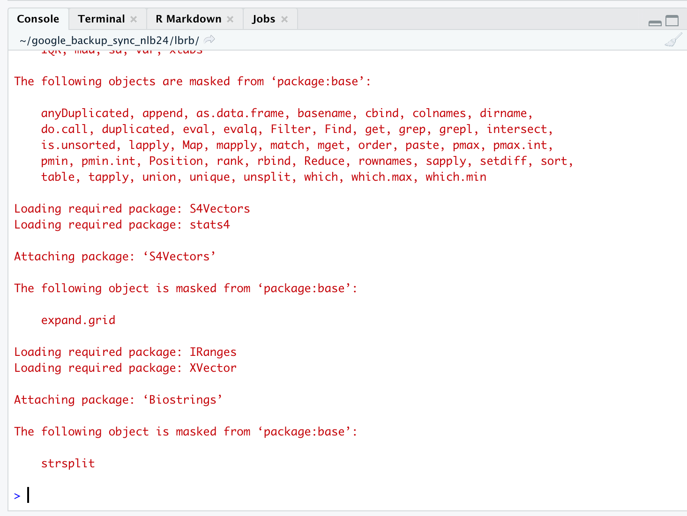
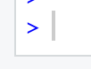

--- 
title: "A Little Book of R for Bioinformatics 2.0"
author: "Avirl Coghlan, with contributions by Nathan L. Brouwer"
date: "`r Sys.Date()`"
site: bookdown::bookdown_site
documentclass: book
bibliography: [book.bib, packages.bib]
biblio-style: apalike
link-citations: yes
description: "An entry-level text for bioinformatics and computational biology"
---

# Preface to version 2.0 {-}

Welcome to *A Little Book of R for Bioinformatics 2.0*!.

This book is based on the original [*A Little Book of R for Bioinformatics*](https://a-little-book-of-r-for-bioinformatics.readthedocs.io/en/latest/) by Dr. Avril Coghlan (Hereafter "ALBRB 1.0").  Dr. Coghlan's book was one of the first and most thorough introductions to using R for bioinformatics, and was generously published under the Creative Commons 3.0 Attribution License [(CC BY 3.0)](https://creativecommons.org/licenses/by/3.0/).  In addition to describing how to do bioinformatics in R, Coghlan provided numerous functions to facilitate important tasks, practice questions, and references to further reading. 

[ALBRB 1.0](https://a-little-book-of-r-for-bioinformatics.readthedocs.io/en/latest/) was extremely useful to me when I was learning bioinformatics and computational biology.  In this version of the book, which I'll refer to as ALBRB 2.0, I have adapted Dr. Coghlan's original book to suit my own teaching needs.  


Below I've outlined the general types of changes I've made to the original book.  I have tried to link back to the original content that these updates are derived from and note how changes were made.  Any errors or inconsistencies should be ascribed to me, not Dr. Coghlan.  If you have any feedback, please email me at brouwern@gmail.com

Nathan Brouwer, June 2021


**Changes implemented in ALBRB 2.0 by Nathan Brouwer**

1. Converted the entire book to RMarkdown and published it via bookdown.
1. Added instructions for using RStudio and RStudio Cloud.
1. Updated instructions to reflect any changes in software, including changes to how the bioinformatics  repository Bioconductor now works.
1. Split up chapters into smaller units.
1. Reorganized the order of some material.
1. Added links to the book I am developing, *Computational Biology for All*.
1. Moved most functions and datasets to my teaching package [compbio4all](https://github.com/brouwern/compbio4all).
1. Changed some plotting to ggplot2 or ggpubr.
1. Added additional subheadings
1. Added vocab and function lists to the beginning of many chapters
1. At times replaced non-biological examples with biological ones.
1. Change from British to American English (Sorry!Couldn't help myself.)
1. Provided additional links to external resources.
1. Added use or `rentrez` for querying NCBI databases

<!-- rentrez replaces what? Seqinr?-->


```{r include=FALSE}
# automatically create a bib database for R packages
knitr::write_bib(c(
  .packages(), 'bookdown', 'knitr', 'rmarkdown'
), 'packages.bib')
```


<!--chapter:end:index.Rmd-->

---
output: html_document
editor_options: 
  chunk_output_type: console
---
# How to review this book


## File format

These lessons are written in RStudio using RMarkdown.  Each .RMd file is a mix of test, written in plain format, and **code chunks**, which look like this

```{r}


```

Code chunks start with there apostrophes and {r}, like this: \`\`\`{r}.  They end with three apostrophes\`\`\`.  They will appear gray when opened up in RStudio but be white in the normal R code editor or other text editor.

## What can you do?

* Read and fix typos : )
* Add comments within the file
* Email me general comments about the files (structure, topics, confusing parts etc)

## Adding comments


You're welcome to add comments anywhere to the files, do the exercises and type up the key, propose you own exercises, etc.

### HTML-tagged comments 

The easiest way is to type a comment into the normal text part of the .Rmd file and then surround it with an html comment tag.  A comment saying "A comment" will therefore look like this:

<!-- A comment -->

In RStudio you can type up a comment, highlight it then hit Shift+Control+C on a PC or Shift+Command+C on a mac.

### Code chunk comments

Another way to add a comment is to make a RMarkdown code chunk thne type up your comments in it by commenting out each line, like the one below.  Key to doing this is to put eval = F, echo = F in the braces after the r.  eval = F, echo = F tells RStudio to leave that alone when the .Rmd file gets rendered into and web page or PDF.

```{r eval = F, echo = F}
# line 1 of comment
# line 2 of comment
# line 3 of comment.
```

In RStudio you can add code chunks with a shortcut key.  On a Mac the shortcut is OPTION + COMMAND + I.


### Keys to exercise

Some files will have exercises at the end.  I don't always include the key, and you're welcome to try the exercise and type up a key (or fix any errors in mine).  As for code chunk comments include  eval = F, echo = F in the braces so the key won't appear when rendered.    So a problem and its key would look something like this


### Problem - fix this code

```{r, eval = F}
print(correct answer)
```


```{r eval = F, echo = F}
# KEY
print("correct answer") #quotes missing
```


<!--chapter:end:0000-how_to_review_this_book.Rmd-->

# Downloading R

**By**: Avril Coghlan  

**Adapted, edited and expanded**: Nathan Brouwer (brouwern@gmail.com) under the Creative Commons 3.0 Attribution License [(CC BY 3.0)](https://creativecommons.org/licenses/by/3.0/).

## Preface

The following introduction to *R* is based on the first part of ["How to install *R* and a Brief Introduction to R"](https://a-little-book-of-r-for-bioinformatics.readthedocs.io/en/latest/src/installr.html) by Avril Coghlan, which was released under the Creative Commons 3.0 Attribution License [(CC BY 3.0)](https://creativecommons.org/licenses/by/3.0/).  For additional information see the Appendices and ["Getting *R* onto your computer"](https://brouwern.github.io/BOOK_R_Ecological_Data_Science/getting-r-onto-your-computer.html).

<!-- TODO: Update links to send to Comp Bio 4 All -->


## Introduction to R

_R_ (www.r-project.org) is a commonly used free statistics software. _R_ allows you to carry out statistical analyses in an interactive mode, as well as allowing  programming.

## Installing R

To use R, you first need to install the _R_ program on your computer.  

### Installing *R* on a Windows PC

These instructions will focus on installing *R* on a Windows PC. However, I will also briefly mention how to install *R* on a Macintosh or Linux computer (see below).  

**These steps have not been checked as of 8/13/2019 so there may be small variations in what the prompts are.  Installing R, however, is basically that same as any other program.  Clicking "Yes" etc on everything should work.**

> **PROTIP:** Even if you have used *R* before its good to regularly update it to avoid conflicts with recently produced software.

Minor updates of *R* are made very regularly (approximately every 6 months), as *R* is actively being improved all the time. It is worthwhile installing new versions of *R* a couple times a year, to make sure that you have a recent version of *R* (to ensure compatibility with all the latest versions of the *R* packages that you have downloaded).

To install *R* on your **Windows** computer, follow these steps:

1. Go to https://cran.r-project.org/
1. Under “Download and Install R”, click on the “Windows” link.
1. Under “Subdirectories”, click on the **“base”** link.
1. On the next page, you should see a link saying something like “Download *R* 4.1.0 for Windows” (or *R* X.X.X, where X.X.X gives the version of the program). Click on this link.
1. You may be asked if you want to save or run a file “R-x.x.x-win32.exe”. Choose “Save” and save the file. Then double-click on the icon for the file to run it.
1. You will be asked what language to install it in.
1. The *R* Setup Wizard will appear in a window. Click “Next” at the bottom of the *R* Setup wizard window.
1. The next page says “Information” at the top. Click “Next” again.
1. The next page says “Select Destination Location” at the top. By default, it will suggest to install *R* on the C drive in the  “Program Files” directory on your computer.
1. Click “Next” at the bottom of the *R* Setup wizard window.
1. The next page says “Select components” at the top. Click “Next” again.
1. The next page says “Startup options” at the top. Click “Next” again.
1. The next page says “Select start menu folder” at the top. Click “Next” again.
1. The next page says “Select additional tasks” at the top. Click “Next” again.
1. *R* should now be installing. This will take about a minute. When *R* has finished, you will see “Completing the *R* for Windows Setup Wizard” appear. Click “Finish”.
1. To start R, you can do one of the following steps:
1. Check if there is an “R” icon on the desktop of the computer that you are using. If so, double-click on the “R” icon to start R. If you cannot find an “R” icon, try the next step instead.
1. Click on the “Start” button at the bottom left of your computer screen, and then choose “All programs”, and start *R* by selecting “R” (or *R* X.X.X, where X.X.X gives the version of R) from the menu of programs.
1. The *R* console (a rectangle) should pop up:


### How to install *R* on non-Windows computers (eg. Macintosh or Linux computers)

**These steps have not been checked as of 8/13/2019 so there may be small variations in what the prompts are.  Installing R, however, is basically that same as any other program.  Clicking "Yes" etc on everything should work.**

The instructions above are for installing *R* on a Windows PC. If you want to install *R* on a computer that has a non-Windows operating system (for example, a Macintosh or computer running Linux, you should download the appropriate *R* installer for that operating system at https://cran.r-project.org/ and follow the *R* installation instructions for the appropriate operating system at https://cran.r-project.org/doc/FAQ/R-FAQ.html#How-can-R-be-installed_003f .

## Starting *R* 

To start R,  Check if there is an *R* icon on the desktop of the computer that you are using. If so, double-click on the *R* icon to start *R*. If you cannot find an *R* icon, try the next step instead.

You can also start *R* from the Start menu in Windows.  Click on the “Start” button at the bottom left of your computer screen, and then choose “All programs”, and start *R* by selecting “R” (or *R* X.X.X, where X.X.X gives the version of R, e.g.. *R* 2.10.0) from the menu of programs.

Say "Hi" to *R* and take a quick look at how it looks.  Now say "Goodbye", because we will never actually do any work in this version of *R*; instead, we'll use the **RStudio IDE (integrated development environment)**.

<!--chapter:end:01-downloading_R_AC01-1.Rmd-->

# Installing the RStudio IDE

**By:** Nathan Brouwer

<!-- TODO: UPDATE with comp bio 4 all -->

The name "R" refers both to the programming language and the program that runs that language.  When you download *it*R* there is also a basic **GUI** (graphical user interface) that you can access via the *R* icon.

Other GUIs are available, and the most popular currently is **RStudio.**  RStudio a for-profit company that is a main driver of development of R.  Much of what they produce has free basic versions or is entirely free.  They produce software (RStudio), cloud-based applications (**RStudio Cloud**), and web server infrastructure for business applications of R. 

A brief overview of installing RStudio can be found here ["Getting RStudio on to your computer"](https://brouwern.github.io/BOOK_R_Ecological_Data_Science/getting-rstudio-on-to-your-computer.html)

## Getting to know RStudio

For a brief overview of RStudio see ["Getting started with RStudio"](https://brouwern.github.io/BOOK_R_Ecological_Data_Science/getting-started-with-rstudio.html)

A good overview of what the different parts of RStudio can be seen in the image in this tweet: https://twitter.com/RLadiesNCL/status/1138812826917724160?s=20


## RStudio versus RStudio Cloud

RStudio and RStudio cloud work almost identically, so anything you read about RStudio will apply to RStudio Cloud.  RStudio is easy to download an use, but RStudio Cloud eliminates even the minor hiccups that occur.  Free accounts with RStudio Cloud allow up to 15 hours per month, which is enough for you to get a taste for using R. 

<!--chapter:end:02-installing_RStudio_AC01-2.Rmd-->

# Installing *R* packages

**By**: Avril Coghlan.  

**Adapted, edited and expanded**: Nathan Brouwer under the Creative Commons 3.0 Attribution License [(CC BY 3.0)](https://creativecommons.org/licenses/by/3.0/).

*R* is a programming language, and **packages**  (aka **libraries**) are bundles of software built using *R*.  Most sessions using *R* involve using additional *R*  packages.  This is especially true for bioinformatics and computational biology.

>**NOTE**: If you are working in an RStudio Cloud environment organized by someone else (e.g. a course instructor), they likely are taking care of many of the package management issues.  The following information is still useful to be familiar with.

<!-- TODO: link to compbio4all -->

## Downloading packages with the RStudio IDE

There is a point-and-click interface for installing *R*  packages in RStudio.  There is a brief introduction to downloading packages on this site: http://web.cs.ucla.edu/~gulzar/rstudio/ 

I've summarized it here:

1. "Click on the "Packages" tab in the bottom-right section and then click on "Install". The following dialog box will appear.
1. In the "Install Packages" dialog, write the package name you want to install under the Packages field and then click install. This will install the package you searched for or give you a list of matching package based on your package text.

## Downloading packages with the function `install.packages()`

The easiest way to install a package if you know its name is to use the *R* function `install.packages(`)`. Note that it might be better to call this “download.packages” since after you install it, you also have to load it!

Frequently I will include `install.packages(...)` at the beginning of a chapter the first time we use a package to make sure the package is downloaded. Note, however, that if you already have downloaded the package, running `install.packages(...)` will download a new copy.  While packages do get updated from time to time, but its best to re-run `install.packages(...)` only occassionaly. 

We’ll download a package used for plotting called `ggplot2`, which stands for “Grammar of Graphics.”  `ggplot2` was developed by Dr. [Hadley Wickham](http://hadley.nz/), who is now the Chief Scientists for RStudio.


To download `ggplot2`, run the following command: 

```{r, eval = F}
install.packages("ggplot2") # note the " "
```

Often when you download a package you’ll see a fair bit of angry-looking red text, and sometime other things will pop up. Usually there’s nothing of interest here, but sometimes you need to read things carefully over it for hints about why something didn’t work.


## Using packages after they are downloaded

To actually make the functions in package accessible you need to use the `library()` command.  Note that this is *not* in quotes.

```{r, eval = F}
library(ggplot2) # note: NO " "
```


<!--chapter:end:03-installing_packages_in_RStudio_AC01-3.Rmd-->

---
output: html_document
editor_options: 
  chunk_output_type: console
---
# Installing Bioconductor

**By**: Avril Coghlan.  

**Adapted, edited and expanded**: Nathan Brouwer under the Creative Commons 3.0 Attribution License [(CC BY 3.0)](https://creativecommons.org/licenses/by/3.0/), including details on install Bioconductor and common prompts and error messages that appear during installation. 


## Bioconductor

*R* **packages** (aka "libraries") can live in many places.  Most are accessed via **CRAN**, the **Comprehensive R Archive Network**.  The bioinformatics and computational biology community also has its own package hosting system called [Bioconductor](www.bioconductor.org).  *R* has played an important part in the development and application of bioinformatics techniques in the 21th century.  Bioconductor 1.0 was released in 2002 with 15 packages.  As of winter 2021, there are almost 2000 packages in the current release!

>**NOTE**: If you are working in an RStudio Cloud environment organized by someone else (eg a course instructor), they likely are taking care of most of package management issues, inlcuding setting up Bioconductor.  The following information is still useful to be familiar with.


To interface with Bioconductor you need the [BiocManager](https://cran.r-project.org/web/packages/BiocManager/vignettes/BiocManager.html) package.  The Bioconductor people have put [BiocManager](https://cran.r-project.org/web/packages/BiocManager/vignettes/BiocManager.html) on CRAN to allow you to set up interactions with Bioconductor.  See the [BiocManager documentation](https://cran.r-project.org/web/packages/BiocManager/vignettes/BiocManager.html) for more information ([https://cran.r-project.org/web/packages/BiocManager/vignettes/BiocManager.html](https://cran.r-project.org/web/packages/BiocManager/vignettes/BiocManager.html)).

Note that if you have an old version of R you will need to update it to interact with Bioconductor.


## Installing BiocManager

BiocManager can be installed using the `install.packages()` packages command.

```{r, eval = F}
install.packages("BiocManager") # Remember the "  "; don't worry about the red text
```


Once downloaded, BioManager needs to be explicitly loaded into your active R session using `library()`
```{r, eval = F}
library(BiocManager) # no quotes; again, ignore the red text
```

Individual Bioconductor packages can then be downloaded using the `install()` command.  An essential packages is `Biostrings`.  To do this , 
```{r, eval=F}
BiocManager::install("Biostrings")
```


## The ins and outs of package installation

**IMPORANT** Bioconductor has many **dependencies** - other packages which is relies on.  When you install Bioconductor packages you may need to update these packages.  If something seems to not be working during this process, restart R and begin the Bioconductor installation process until things seem to work.

Below I discuss the series of prompts I had to deal with while re-installing Biostrings while editing this chapter.  

### Updating other packages when downloading a package

When I re-installed `Biostrings` while writing this I was given a HUGE blog of red test that contained this:
```{r, eval = F}
'getOption("repos")' replaces Bioconductor standard repositories, see '?repositories' for
details

replacement repositories:
    CRAN: https://cran.rstudio.com/

Bioconductor version 3.11 (BiocManager 1.30.16), R 4.0.5 (2021-03-31)
Old packages: 'ade4', 'ape', 'aster', 'bayestestR', 'bio3d', 'bitops', 'blogdown',
  'bookdown', 'brio', 'broom', 'broom.mixed', 'broomExtra', 'bslib', 'cachem', 'callr',
  'car', 'circlize', 'class', 'cli', 'cluster', 'colorspace', 'corrplot', 'cpp11', 'curl',
  'devtools', 'DHARMa', 'doBy', 'dplyr', 'DT', 'e1071', 'ellipsis', 'emmeans', 'emojifont',
  'extRemes', 'fansi', 'flextable', 'forecast', 'formatR', 'gap', 'gargle', 'gert', 'GGally',
  'ggfortify', 'ggplot2', 'ggsignif', 'ggVennDiagram', 'gh', 'glmmTMB', 'googledrive',
  'gtools', 'haven', 'highr', 'hms', 'htmlTable', 'httpuv', 'huxtable', 'jquerylib',
  'KernSmooth', 'knitr', 'later', 'lattice', 'lme4', 'magick', 'manipulateWidget', 'MASS',
  'Matrix', 'matrixcalc', 'matrixStats', 'mgcv', 'mime', 'multcomp', 'mvtnorm', 'nnet',
  'openssl', 'openxlsx', 'parameters', 'pBrackets', 'pdftools', 'phangorn', 'phytools',
  'pillar', 'plotly', 'processx', 'proxy', 'qgam', 'quantreg', 'ragg', 'Rcpp',
  'RcppArmadillo', 'remotes', 'rgl', 'rio', 'rJava', 'rlang', 'rmarkdown', 'robustbase',
  'rsconnect', 'rversions', 'sandwich', 'sass', 'segmented', 'seqinr', 'seqmagick', 'servr',
  'sf', 'shape', 'spatial', 'statmod', 'stringi', 'systemfonts', 'testthat', 'textshaping',
  'tibble', 'tidyselect', 'tidytree', 'tinytex', 'tufte', 'UniprotR', 'units', 'vctrs',
  'viridis', 'viridisLite', 'withr', 'xfun', 'zip'
```

Hidden at the bottom was a prompt: "Update all/some/none? [a/s/n]:"

Its a little vague, but what it wants me to do is type in a, s or n  and press enter to tell it what to do.  I almost always chose "a", though this may take a while to update everything.

### Packages "from source"

You are likely to get lots of random-looking feedback from R when doing Bioconductor-related installations.  Look carefully for any prompts as the very last line.  While updating `Biostrings` I was told: "*There are binary versions available but the source versions are later:*" and given a table of packages.  I was then asked "*Do you want to install from sources the packages which need compilation? (Yes/no/cancel)*"

I almost always chose "no".

### More on angry red text

After the prompt about packages from source, R proceeded to download a lot of updates to packages, which took a few minutes.  Lots of red text scrolled by, but this is normal.

<!-- TODO: add example of angry red text -->

```{r echo = F}
knitr::include_graphics("images/angry_red_text_download_biostrings.png")
```


## Actually loading a package

Again, to actually load the `Biostrings` package into your active R sessions requires the `libary()` command:

```{r, eval = F}
library(Biostrings)
```

As you might expect, there's more red text scrolling up my screen!

```{r echo = F}

```

I can tell that is actually worked because at the end of all the red stuff is the R prompt of ">" and my cursor.

```{r echo = F}


```


<!--chapter:end:04-installing_bioconductor_AC01-4.Rmd-->

---
output: html_document
editor_options: 
  chunk_output_type: console
---
# A Brief introduction to R

**By**: Avril Coghlan.  

**Adapted, edited and expanded**: Nathan Brouwer under the Creative Commons 3.0 Attribution License [(CC BY 3.0)](https://creativecommons.org/licenses/by/3.0/).

This chapter provides a brief introduction to R.  At the end of are links to additional resources for getting started with R.

<!-- Add link to compbio4all -->


## Vocabulary

* scalar
* vector
* list
* class
* numeric
* character
* assignment
* elements of an object
* indices
* attributes of an object
* argument of a function

## R functions 

* <-
* [ ]
* $
* table()
* function
* c()
* log10()
* help(), ?
* help.search()
* RSiteSearch()
* mean()
* return()
* q()

## Interacting with R

You will type *R* commands into the RStudio **console** in order to carry out analyses in *R*. In the RStudio console you will see the R prompt starting with the symbol ">".  ">" will always be there at the beginning of each new command - don't try to delete it!  Moreover, you never need to type it.

```{r echo = F}

```


We type the **commands** needed for a particular task after this prompt. The command is carried out by *R* after you hit the Return key.

Once you have started R, you can start typing commands into the RStudio console, and the results will be calculated immediately, for example:

```{r}
2*3
```

Note that prior to the output of "6" it shows "[1]".

Now subtraction:

```{r}
10-3
```

Again, prior to the output of "7" it shows "[1]".

*R* can act like a basic calculator that you type commands in to.  You can also use it like a more advanced scientific calculator and create **variables** that store information. All variables created by R are called **objects**. In R, we assign values to variables using an arrow-looking function `<-` the **assignment operator**. For example, we can **assign** the value 2*3 to the variable x using the command:


```{r}
x <- 2*3
```


To view the contents of any R object, just type its name, press enter, and the contents of that R object will be displayed:
```{r}
x
```

## Variables in R

There are several different types of objects in R with fancy math names, including **scalars**, **vectors**, **matrices** (singular: **matrix), **arrays**,  **dataframes**, **tables**, and **lists**. The **scalar** variable x above is one example of an R object. While a scalar variable such as x has just one element, a **vector** consists of several elements. The elements in a vector are all of the same **type** (e.g.. numbers or alphabetic characters), while **lists** may include elements such as characters as well as numeric quantities.  Vectors and dataframes are the most common variables you'll use.  You'll also encounter matrices often, and lists are ubiquitous in R but beginning users often don't encounter them because they remain behind the scenes.


### Vectors

To create a vector, we can use the `c()` (combine) function. For example, to create a vector called `myvector` that has elements with values 8, 6, 9, 10, and 5, we type:

```{r}
myvector <- c(8, 6, 9, 10, 5) # note: commas between each number!
```

 
To see the contents of the variable `myvector`, we can just type its name and press enter:

```{r}
myvector
```

### Vector indexing

The `[1]` is the **index** of the first **element** in the vector. We can **extract** any element of the vector by typing the vector name with the index of that element given in **square brackets** `[...]`. 

For example, to get the value of the 4th element in the vector `myvector`, we type:

```{r}
myvector[4]
```


### Character vectors

Vectors can contain letters, such as those designating nucleic acids

```{r}
my.seq <- c("A","T","C","G")
```

They can also contain multi-letter **strings**:

```{r}
my.oligos <- c("ATCGC","TTTCGC","CCCGCG","GGGCGC")
```


### Lists 

**NOTE**: *below is a discussion of lists in R.  This is excellent information, but not necessary if this is your very very first time using R.*

In contrast to a vector, a **list** can contain elements of different types, for example, both numbers and letters. A list can even include other variables such as a vector. The `list()` function is used to create a list. For example, we could create a list `mylist` by typing:

```{r}
mylist <- list(name="Charles Darwin", 
               wife="Emma Darwin", 
               myvector)
```

We can then print out the contents of the list mylist by typing its name:

```{r}
mylist
```

The **elements** in a list are numbered, and can be referred to using **indices**. We can extract an element of a list by typing the list name with the index of the element given in double **square brackets** (in contrast to a vector, where we only use single square brackets). 

We can extract the second element from `mylist` by typing:

```{r}
mylist[[2]]  # note the double square brackets [[...]]
```


As a baby step towards our next task, we can wrap index values as in the `c()` command like this: 

```{r}
mylist[[c(2)]]  # note the double square brackets [[...]]
```


The number `2` and `c(2)` mean the same thing.


Now, we can extract the second AND third elements from `mylist`.  First, we put the indices 2 and 3 into a vector `c(2,3)`, then wrap that vector in double square brackets: `[c(2,3)]`.  All together it looks like this.

```{r}
mylist[c(2,3)] # note the double brackets
```

Elements of lists may also be named, resulting in a **named lists**.  The elements may then be referred to by giving the list name, followed by “\$”, followed by the element name. For example, mylist\$name is the same as mylist[[1]] and mylist$wife is the same as mylist[[2]]:

```{r}
mylist$wife
```

We can find out the names of the named elements in a list by using the `attributes()` function, for example:

```{r}
attributes(mylist)
```

When you use the `attributes()` function to find the named elements of a list variable, the named elements are always listed under a heading “\$names”. Therefore, we see that the named elements of the list variable `mylist` are called “name” and “wife”, and we can retrieve their values by typing mylist\$name and mylist\$wife, respectively.

### Tables 

Another type of object that you will encounter in R is a **table**.  The `table()` function allows you to total up or tabulate the number of times a value occurs within a vector.  Tables are typically used on vectors containing **character data**, such as letters, words, or names, but can work on numeric data data.

#### Tables - The basics

If we made a vector variable "nucleotides" containing the of a DNA molecule, we can use the `table()` function to produce a **table variable** that contains the number of bases with each possible nucleotides:

```{r}
bases <- c("A", "T", "A", "A", "T", "C", "G", "C", "G")
```

Now make the table
```{r}
table(bases)
```

We can store the table variable produced by the function `table()`, and call the stored table “bases.table”, by typing:
```{r}
bases.table <- table(bases)
```

Tables also work on vectors containing numbers.  First, a vector of numbers.

```{r}
numeric.vecter <- c(1,1,1,1,3,4,4,4,4)
```

Second, a table, showing how many times each number occurs.

```{r}
table(numeric.vecter)
```


#### Tables - further details

To access elements in a table variable, you need to use double square brackets, just like accessing elements in a list. For example, to access the fourth element in the table bases.table (the number of Ts in the sequence), we type:


```{r}
bases.table[[4]]  # double brackets!
```

Alternatively, you can use the name of the fourth element in the table (“John”) to find the value of that table element:


```{r}
bases.table[["T"]]
```


## Arguments 

Functions in R usually require **arguments**, which are input variables (i.e.. objects) that are **passed** to them, which they then carry out some operation on. For example, the `log10()` function is passed a number, and it then calculates the log to the base 10 of that number:

```{r}
log10(100)
```

There's a more generic function, `log()`, where we pass it not only a number to take the log of, but also the specific **base** of the logarithm.  To take the log base 10 with the `log()` function we do this

```{r}
log(100, base = 10)
```

We can also take logs with other bases, such as 2:

```{r}
log(100, base = 2)
```

## Help files with `help()` and `?`

In *R*, you can get help about a particular function by using the `help()` function. For example, if you want help about the `log10()` function, you can type:

```{r, eval = F}
help("log10")
```
 
When you use the `help()` function, a box or web pag will show up in one of the panes of RStudio with information about the function that you asked for help with.  You can also use the `?` next to the function like this

```{r, eval = F}
?log10
```

Help files are a mixed bag in R, and it can take some getting used to them.  An excellent overview of this is Kieran Healy's ["How to read an R help page."](https://socviz.co/appendix.html)


## Searching for functions with `help.search()` and `RSiteSearch()`

If you are not sure of the name of a function, but think you know part of its name, you can search for the function name using the `help.search()` and `RSiteSearch()` functions. The `help.search()` function searches to see if you already have a function installed (from one of the R packages that you have installed) that may be related to some topic you’re interested in.  `RSiteSearch()`  searches *all* R functions (including those in packages that you haven’t yet installed) for functions related to the topic you are interested in.

For example, if you want to know if there is a function to calculate the standard deviation (SD) of a set of numbers, you can search for the names of all installed functions containing the word “deviation” in their description by typing:

```{r, eval = F}
help.search("deviation")
```

Among the functions that were found, is the function `sd()` in the `stats` package (an R package that comes with the base R installation), which is used for calculating the standard deviation.

Now, instead of searching just the packages we've have on our computer let's search all R packages on CRAN.  Let's look for things related to DNA.  Note that `RSiteSearch()` doesn't provide output within RStudio, but rather opens up your web browser for you to display the results.

```{r, eval = F}
RSiteSearch("DNA")
```

The results of the `RSiteSearch()` function will be hits to descriptions of R functions, as well as to R mailing list discussions of those functions.


## More on functions 

We can perform computations with R using objects such as scalars and vectors. For example, to calculate the average of the values in the vector `myvector` (i.e.. the average of 8, 6, 9, 10 and 5), we can use the `mean()` function:

```{r}
mean(myvector) # note: no " "
```

We have been using built-in R functions such as mean(), length(), print(), plot(), etc. 

### Writing your own functions

**NOTE**: *Writing your own functions is an advanced skills.  New users can skip this section.

We can also create our own functions in R to do calculations that you want to carry out very often on different input data sets. For example, we can create a function to calculate the value of 20 plus square of some input number:

```{r}
myfunction <- function(x) { return(20 + (x*x)) }
```

This function will calculate the square of a number (x), and then add 20 to that value. The `return()` statement returns the calculated value. Once you have typed in this function, the function is then available for use. For example, we can use the function for different input numbers (e.g.. 10, 25):

```{r}
myfunction(10)
```


## Quiting R

To quit R either close the program, or type:

```{r,eval = F}
q()
```

## Links and Further Reading

Some links are included here for further reading.

For a more in-depth introduction to R, a good online tutorial is available on the “Kickstarting R” website, cran.r-project.org/doc/contrib/Lemon-kickstart.

There is another nice (slightly more in-depth) tutorial to R available on the “Introduction to R” website, cran.r-project.org/doc/manuals/R-intro.html.

[Chapter 3](https://learningstatisticswithr.com/book/introR.html) of Danielle Navarro's book is an excellent intro to the basics of R.

<!-- Add compbio4all -->

```{r}

```


<!--chapter:end:05-brief_intro_to_R_AC01-5.Rmd-->

---
output: html_document
editor_options: 
  chunk_output_type: console
---
# DNA descriptive statics - Part 1

**By**: Avril Coghlan  

**Adapted, edited and expanded**: Nathan Brouwer (brouwern@gmail.com) under the Creative Commons 3.0 Attribution License [(CC BY 3.0)](https://creativecommons.org/licenses/by/3.0/).

## Preface

This is a modification of ["DNA Sequence Statistics (1)"](https://a-little-book-of-r-for-bioinformatics.readthedocs.io/en/latest/src/chapter1.html) from Avril Coghlan's [*A little book of R for bioinformatics.*](https://a-little-book-of-r-for-bioinformatics.readthedocs.io/en/latest/index.html).  The text and code were originally written by Dr. Coghlan and distributed under the [Creative Commons 3.0](https://creativecommons.org/licenses/by/3.0/us/) license. 

## Writing TODO:

* Add biology introduction
* Work on flow
* organize intial sections (intro, vocab, preliminaries)


## Introduction

<!-- Check the current status of the biology of this section -->
<!-- ### Note on the biology in this section -->

<!-- Some of the biology in this tutorial appears to be out of date.  Specifically, research on the biological basis of unusual frequencies of DNA "words" does not appear to be much current interest in bioinformatics and genomics.  (In contrast, methylation of bases within certain DNA words is being worked on.)  The examples are still good for practicing R skills. -->


## Vocabulary

* GC content
* DNA words
* scatterplots, histograms, piecharts, and boxplots


## Functions
* `seqinr::GC()`
* `seqinr::count()`


## Preliminaries

```{r}
library(compbio4all)
library(seqinr)
```


## Converting DNA from FASTA format

In a previous exercise we downloaded and examined DNA sequence in the FASTA format. The sequence we worked with is also stored as a data file within the `compbio4all` pa package and can be brought into memory using the `data()` command.

```{r}
data("dengueseq_fasta")
```

We can look at this data object with the `str()` command

```{r}
str(dengueseq_fasta)
```

This isn't in a format we can work with directly so we'll use the function fasta_cleaner() to set it up.

```{r}
header. <- ">NC_001477.1 Dengue virus 1, complete genome"
dengueseq_vector <- compbio4all::fasta_cleaner(dengueseq_fasta)
```


Now check it out.
```{r}
str(dengueseq_vector)
```

What we have here is each base of the sequence in a seperate slot of our vector.

The first four bases are "AGTT"

We can see the first one like this
```{r}
dengueseq_vector[1]
```

The second one like this
```{r}
dengueseq_vector[2]
```

The first and second like this
```{r}
dengueseq_vector[1:2]
```

and all four like this
```{r}
dengueseq_vector[1:4]
```


## Length of a DNA sequence

Once you have retrieved a DNA sequence, we can obtain some simple statistics to describe that sequence, such as the sequence’s total length in nucleotides. In the above example, we retrieved the DEN-1 Dengue virus genome sequence, and stored it in the vector variable dengueseq_vector To obtain the length of the genome sequence, we would use the length() function, typing:


```{r}
length(dengueseq_vector)
```


The length() function will give you back the length of the sequence stored in variable dengueseq_vector, in nucleotides. The length() function actually gives the number of **elements** (slots) in the input vector that you passed to it, which in this case in the number of elements in the vector dengueseq_vector. Since each element of the vector dengueseq_vector contains one nucleotide of the DEN-1 Dengue virus sequence, the result for the DEN-1 Dengue virus genome tells us the length of its genome sequence (ie. 10735 nucleotides long).

### Base composition of a DNA sequence

An obvious first analysis of any DNA sequence is to count the number of occurrences of the four different nucleotides (“A”, “C”, “G”, and “T”) in the sequence. This can be done using the the table() function. For example, to find the number of As, Cs, Gs, and Ts in the DEN-1 Dengue virus sequence (which you have put into vector variable dengueseq_vector, using the commands above), you would type:


```{r}
table(dengueseq_vector)
```


This means that the DEN-1 Dengue virus genome sequence has 3426 As occurring throughout the genome, 2240 Cs, and so forth.

### GC Content of DNA

One of the most fundamental properties of a genome sequence is its **GC content**, the fraction of the sequence that consists of Gs and Cs, ie. the %(G+C).

The GC content can be calculated as the percentage of the bases in the genome that are Gs or Cs. That is, GC content = (number of Gs + number of Cs)*100/(genome length). For example, if the genome is 100 bp, and 20 bases are Gs and 21 bases are Cs, then the GC content is (20 + 21)*100/100 = 41%.

You can easily calculate the GC content based on the number of As, Gs, Cs, and Ts in the genome sequence. For example, for the DEN-1 Dengue virus genome sequence, we know from using the table() function above that the genome contains 3426 As, 2240 Cs, 2770 Gs and 2299 Ts. Therefore, we can calculate the GC content using the command:

```{r}
(2240+2770)*100/(3426+2240+2770+2299)
```


Alternatively, if you are feeling lazy, you can use the GC() function in the SeqinR package, which gives the fraction of bases in the sequence that are Gs or Cs.

```{r}
seqinr::GC(dengueseq_vector)
```

The result above means that the fraction of bases in the DEN-1 Dengue virus genome that are Gs or Cs is 0.4666977. To convert the fraction to a percentage, we have to multiply by 100, so the GC content as a percentage is 46.66977%.

### DNA words

As well as the frequency of each of the individual nucleotides (“A”, “G”, “T”, “C”) in a DNA sequence, it is also interesting to know the frequency of longer **DNA words**, also referred to as **genomic words**. The individual nucleotides are DNA words that are 1 nucleotide long, but we may also want to find out the frequency of DNA words that are 2 nucleotides long (ie. “AA”, “AG”, “AC”, “AT”, “CA”, “CG”, “CC”, “CT”, “GA”, “GG”, “GC”, “GT”, “TA”, “TG”, “TC”, and “TT”), 3 nucleotides long (eg. “AAA”, “AAT”, “ACG”, etc.), 4 nucleotides long, etc.

To find the number of occurrences of DNA words of a particular length, we can use the count() function from the R SeqinR package. 


The count() function only works with lower-case letters, so first we have to use the tolower() function to convert our upper class genome to lower case

```{r}
dengueseq_vector <-tolower(dengueseq_vector)
```

Now we can look for words. For example, to find the number of occurrences of DNA words that are 1 nucleotide long in the sequence dengueseq_vector, we type:


```{r}
seqinr::count(dengueseq_vector, 1)
```


As expected, this gives us the number of occurrences of the individual nucleotides. To find the number of occurrences of DNA words that are 2 nucleotides long, we type:

```{r}
seqinr::count(dengueseq_vector, 2)
```


Note that by default the count() function includes all overlapping DNA words in a sequence. Therefore, for example, the sequence “ATG” is considered to contain two words that are two nucleotides long: “AT” and “TG”.

If you type help(‘count’), you will see that the result (output) of the function count() is a table object. This means that you can use double square brackets to extract the values of elements from the table. For example, to extract the value of the third element (the number of Gs in the DEN-1 Dengue virus sequence), you can type:

```{r}
denguetable_2 <- seqinr::count(dengueseq_vector,2)
denguetable_2[[3]]
```

The command above extracts the third element of the table produced by count(dengueseq_vector,1), which we have stored in the table variable denguetable.

Alternatively, you can find the value of the element of the table in column “g” by typing:


```{r}
denguetable_2[["aa"]]
```


Once you have table you can make a basic plot
```{r}
barplot(denguetable_2)
```

We can sort by the number of words using the sort() command

```{r}
sort(denguetable_2)
```


Let's save over the original object
```{r}
denguetable_2 <- sort(denguetable_2)
```


```{r}
barplot(denguetable_2)
```

R will automatically try to optimize the appearance of the labels on the graph so you may not see all of them; no worries.


R can also make pie charts.  Piecharts only really work when there are a few items being plots, like the four bases.
```{r}
denguetable_1 <- seqinr::count(dengueseq_vector,1)
```

Make a piechart with pie()
```{r}
pie(denguetable_1)
```


### Summary

In this practical, have learned to use the following R functions:

length() for finding the length of a vector or list
table() for printing out a table of the number of occurrences of each type of item in a vector or list.
These functions belong to the standard installation of R.

You have also learnt the following R functions that belong to the SeqinR package:

GC() for calculating the GC content for a DNA sequence
count() for calculating the number of occurrences of DNA words of a particular length in a DNA sequence


## Acknowledgements

This is a modification of ["DNA Sequence Statistics (1)"](https://a-little-book-of-r-for-bioinformatics.readthedocs.io/en/latest/src/chapter1.html) from Avril Coghlan's [*A little book of R for bioinformatics.*](https://a-little-book-of-r-for-bioinformatics.readthedocs.io/en/latest/index.html).  Almost all of text and code was originally written by Dr. Coghlan and distributed under the [Creative Commons 3.0](https://creativecommons.org/licenses/by/3.0/us/) license. 

In "A little book..." Coghlan noted: "Many of the ideas for the examples and exercises for this chapter were inspired by the Matlab case studies on Haemophilus influenzae (www.computational-genomics.net/case_studies/haemophilus_demo.html) and Bacteriophage lambda (http://www.computational-genomics.net/case_studies/lambdaphage_demo.html) from the website that accompanies the book Introduction to Computational Genomics: a case studies approach by Cristianini and Hahn (Cambridge University Press; www.computational-genomics.net/book/)."

### License

The content in this book is licensed under a Creative Commons Attribution 3.0 License.

https://creativecommons.org/licenses/by/3.0/us/

### Exercises

Answer the following questions, using the R package. For each question, please record your answer, and what you typed into R to get this answer.

Model answers to the exercises are given in Answers to the exercises on DNA Sequence Statistics (1).

1. What are the last twenty nucleotides of the Dengue virus genome sequence?
1. What is the length in nucleotides of the genome sequence for the bacterium Mycobacterium leprae strain TN (accession NC_002677)?
Note: Mycobacterium leprae is a bacterium that is responsible for causing leprosy, which is classified by the WHO as a neglected tropical disease. As the genome sequence is a DNA sequence, if you are retrieving its sequence via the NCBI website, you will need to look for it in the NCBI Nucleotide database.
1. How many of each of the four nucleotides A, C, T and G, and any other symbols, are there in the Mycobacterium leprae TN genome sequence?
Note: other symbols apart from the four nucleotides A/C/T/G may appear in a sequence. They correspond to positions in the sequence that are are not clearly one base or another and they are due, for example, to sequencing uncertainties. or example, the symbol ‘N’ means ‘aNy base’, while ‘R’ means ‘A or G’ (puRine). There is a table of symbols at www.bioinformatics.org/sms/iupac.html.
1. What is the GC content of the *Mycobacterium leprae TN* genome sequence, when (i) all non-A/C/T/G nucleotides are included, (ii) non-A/C/T/G nucleotides are discarded?
Hint: look at the help page for the GC() function to find out how it deals with non-A/C/T/G nucleotides.
1. How many of each of the four nucleotides A, C, T and G are there in the complement of the Mycobacterium leprae TN genome sequence?  *Hint*: you will first need to search for a function to calculate the complement of a sequence. Once you have found out what function to use, remember to use the help() function to find out what are the arguments (inputs) and results (outputs) of that function. How does the function deal with symbols other than the four nucleotides A, C, T and G? Are the numbers of As, Cs, Ts, and Gs in the complementary sequence what you would expect?
1. How many occurrences of the DNA words CC, CG and GC occur in the Mycobacterium leprae TN genome sequence?
1. How many occurrences of the DNA words CC, CG and GC occur in the (i) first 1000 and (ii) last 1000 nucleotides of the Mycobacterium leprae TN genome sequence?
1.How can you check that the subsequence that you have looked at is 1000 nucleotides long?

```{r}

```


<!--chapter:end:06-DNA_sequence_descriptive_stats-AC03-02-.Rmd-->

# Programming in R: for loops

**By**: Avril Coghlan  

**Adapted, edited and expanded**: Nathan Brouwer (brouwern@gmail.com) under the Creative Commons 3.0 Attribution License [(CC BY 3.0)](https://creativecommons.org/licenses/by/3.0/).

## Preface

This is a modification of ["DNA Sequence Statistics (1)"](https://a-little-book-of-r-for-bioinformatics.readthedocs.io/en/latest/src/chapter1.html) from Avril Coghlan's [*A little book of R for bioinformatics.*](https://a-little-book-of-r-for-bioinformatics.readthedocs.io/en/latest/index.html).  The text and code was originally written by Dr. Coghlan and distributed under the [Creative Commons 3.0](https://creativecommons.org/licenses/by/3.0/us/) license. 


## Vocab

* for loop
* curly brackets

## Functions

* `for()`
* `print()`


## Basic for loops in in R

In *R*, just as in programming languages such as **Python**, it is possible to write a **for loop** to carry out the same command several times. For example, say we have a pressing need to calculate the square the square of each number between 1 and 4.  We could write for lines of code like this to do it:

```{r}
1^2
2^2
3^2
4^2
```

If we know how to write a for loop, we could do the same think like this: 

```{r}
for (i in 1:4) { 
  print (i*i) 
  }
```

In the for loop above, the variable `i` is a counter or **index** for the number of cycles through the loop. In the first cycle through the loop, the value of `i` is 1, and so `i * i` = 1 is printed out. In the second cycle through the loop, the value of `i` is 2, and so `i * i` = 4 is printed out. In the third cycle through the loop, the value of `i` is 3, and so `i * i` = 9 is printed out. The loop continues until the value of `i` is 4. 

Note that the commands that are to be carried out at each cycle of the for loop must be enclosed within **curly brackets** (“{” and “}”).

You may be thinking "*ok, so it took four lines of code to do 1^2^ through 4^2^ each on their own, and three lines to do it wit the loop; what's the big deal?*".  What if you need to do 1 through 100 squared for some reason?  Now the for loop is a lot less work.

You can also give a for loop a vector of numbers containing the values that you want the counter `i` to take in subsequent cycles. For example, you can make a vector  containing the numbers 1, 2, 3, and 4, and write a for loop to print out the square of each number in vector avector:

```{r, echo = F}
# vector with valuea to square
avector <- c(1, 2, 3, 4)

# for() loop to do the squaring
 for (i in avector) { 
   print (i*i) 
   }
```

The results should be the same as before.


## Challenge: complicated vectors of values

Here's a more complex example.  If you don't understand it don't worry, its not something you'd probably do in practice.

Challenge: How can we use a for loop to print out the square of every second number between, say, 1 and 10? The answer is to use the seq() function with "by = 2" to tell the for loop to take every second number between 1 and 10:

```{r}
for (i in seq(1, 10, by = 2)) { 
  print (i*i) 
  }
```

In the first cycle of this loop, the value of i is 1, and so i * i = 1 is printed out. In the second cycle through the loop, the value of i is 3, and so i * i = 9 is printed out. The loop continues until the value of i is 9. In the fifth cycle through the loop, the value of i is 9, and so i * i = 81 is printed out.


<!--chapter:end:07-programming_in_R-forloops_AC04-02.Rmd-->

---
output: html_document
editor_options: 
  chunk_output_type: console
---
# Mini tutorial: Vectors in R

**By**: Avril Coghlan  

**Adapted, edited and expanded**: Nathan Brouwer (brouwern@gmail.com) under the Creative Commons 3.0 Attribution License [(CC BY 3.0)](https://creativecommons.org/licenses/by/3.0/).


## Preface 

<!-- rename this attribution?  put at end? -->

This is a modification of part of["DNA Sequence Statistics (2)"](https://a-little-book-of-r-for-bioinformatics.readthedocs.io/en/latest/src/chapter2.html) from Avril Coghlan's [*A little book of R for bioinformatics.*](https://a-little-book-of-r-for-bioinformatics.readthedocs.io/en/latest/index.html).  Most of text and code was originally written by Dr. Coghlan and distributed under the [Creative Commons 3.0](https://creativecommons.org/licenses/by/3.0/us/) license. 

## Vocab 

* base R
* scalar, vector, matrix
* regular expressions

# Functions
* `seq()`
* `is()`, `is.vector()`, `is.matrix()`
* `gsub()`


## Vectors in R

**Variables** in R include **scalars**, **vectors**, and **lists**.  **Functions** in R carry out operations on variables, for example, using the `log10()` function to calculate the log to the base 10 of a scalar variable `x`, or using the `mean()` function to calculate the average of the values in a vector variable `myvector`.  For example, we can use `log10()` on a scalar object like this:

```{r}
# store value in object
x <- 100

# take log base 10 of object
log10(x)
```

Note that while mathematically x is a single number, or a scalar, R considers it to be a vector:

```{r}
is.vector(x)
```

There are many "is" commands.  What is returned when you run `is.matrix()` on a vector?
```{r}
is.matrix(x)
```


Mathematically this is a bit odd, since often a vector is defined as a one-dimensional matrix, e.g., a single column or single row  of a matrix.  But in *R* land, a vector is a vector, and matrix is a matrix, and there are no explicit scalars.


## Math on vectors

Vectors can serve as the input for mathematical operations. When this is done *R* does the mathematical operation separately on each element of the vector.  This is a unique feature of *R* that can be hard to get used to even for people with previous programming experience.

Let's make a vector of numbers:

```{r}

myvector <- c(30,16,303,99,11,111)

```

What happens when we multiply `myvector` by 10?

```{r}
myvector*10
```

R has taken each of the 6 values, 30 through 111, of `myvector` and multiplied each one by 10, giving us 6 results.  That is, what R did was

```{r, eval =-F}
30*10    # first value of myvector
16*10    # second value of myvector
303*10   # ....
99*10
111*10   # last value of myvector
```


The normal order of operations rules apply to vectors as they do to operations we're more used to.   So multiplying `myvector` by 10 is the same whether you put he 10 before or after vector.  That is `myvector\*10` is the same as `10\*myvector`.

```{r}
myvector*10
10*myvector
```


What happen when you subtract 30 from myvector?  Write the code below.

```{r}
myvector-30
```

So, what R did was
```{r, eval =-F}
30-30    # first value of myvector
16-30    # second value of myvector
303-30   # ....
99-30
111-30   # last value of myvector
```


You can also square a vector

```{r}
myvector^2
```

Which is the same as
```{r, eval =-F}
30^2    # first value of myvector
16^2    # second value of myvector
303^2   # ....
99^2
111^2   # last value of myvector
```

Also you can take the square root of a vector...

```{r}
sqrt(myvector)
```


...and take the log of a vector...

```{r}

log(myvector)

```

...and just about any other mathematical operation.  Here we are working on a separate vector object; all of these rules apply to a column in a matrix or a dataframe.  This attribution of R is called **vectorization**.


## Functions on vectors

We can use functions on vectors. Typically these use the vectors as an input and all the numbers are processed into an output.  Call the `mean()` function  on the vector we made called `myvector`.
```{r}
mean(myvector)
```
 
Note how we get a single value back - the mean of all the values in the vector.  R saw that we had a vector of multiple and knew that the mean is a function that doesn't get applied to single number, but sets of numbers.
 
The function `sd()` calculates the standard deviation. Apply the `sd()` to myvector:

```{r}
sd(myvector)
```


## Operations with two vectors

You can also subtract one vector from another vector.  This can be a little weird when you first see it.  Make another vector with the numbers 5, 10, 15, 20, 25, 30.  Call this myvector2:

```{r}
myvector2 <- c(5, 10, 15, 20, 25, 30)
```


Now subtract myvector2 from myvector.  What happens?

```{r}
myvector-myvector2
```

 
## Subsetting vectors
 
You can extract an **element** of a vector by typing the vector name with the index of that element given in **square brackets**. For example, to get the value of the 3rd element in the vector `myvector`, we type:


```{r}
myvector[3]
```


Extract the 4th element of the vector:

```{r}
myvector[4]
```


You can extract more than one element by using a vector in the brackets:

First, say I want to extract the 3rd and the 4th element.  I can make a vector with 3 and 4 in it:
```{r}
nums <- c(3,4)
```


Then put that vector in the brackets:
```{r}
myvector[nums]
```


We can also do it directly like this, skipping the vector-creation step:

```{r}
myvector[c(3,4)]
```


In the chunk below extract the 1st and 2nd elements:

```{r}
myvector[c(1,2)]
```

## Sequences of numbers

Often we want a vector of numbers in **sequential order**. That is, a vector with the numbers 1, 2, 3, 4, ... or 5, 10, 15, 20, ...  The easiest way to do this is using a colon
```{r}
1:10
```

Note that in R 1:10 is equivalent to c(1:10)
```{r}
c(1:10)
```

Usually to emphasize that a vector is being created I will use c(1:10)

We can do any number to any numbers
```{r}
c(20:30)
```


We can also do it in *reverse*.  In the code below put 30 before 20:

```{r}
c(30:20)
```


A useful function in *R* is the `seq()` function, which is an explicit function that can be used to create a vector containing a sequence of numbers that run from a particular number to another particular number.

```{r}
seq(1, 10)
```

Using `seq()` instead of a `:` can be useful for readability to make it explicit what is going on.  More importantly, `seq` has an argument `by = ...` so you can make a sequence of number with any interval between  For example, if we want to create the sequence of numbers from 1 to 10 in steps of 1 (i.e.. 1, 2, 3, 4, ... 10), we can type:

```{r}
seq(1, 10,
    by = 1)
```


We can change the **step size** by altering the value of the `by` argument given to the function `seq()`. For example, if we want to create a sequence of numbers from 1-100 in steps of 20 (i.e.. 1, 21, 41, ... 101), we can type:

```{r}
seq(1, 101,
    by = 20)
```


## Vectors can hold numeric or character data

The vector we created above holds numeric data, as indicated by `class()`

```{r}
class(myvector)
```

Vectors can also holder character data, like the genetic code:

```{r}
# vector of character data
myvector <- c("A","T","G")

# how it looks
myvector

# what is "is"
class(myvector)
```

## Regular expressions can modify character data

We can use **regular expressions** to modify character data. For example, change the Ts to Us

```{r}
myvector <- gsub("T", "U", myvector)
```

Now check it out
```{r}
myvector
```

Regular expressions are a deep subject in computing.  You can find some more information about them [here](https://rstudio-pubs-static.s3.amazonaws.com/74603_76cd14d5983f47408fdf0b323550b846.html).


<!--chapter:end:08-vectors-AC04-01.Rmd-->

---
output: html_document
editor_options: 
  chunk_output_type: console
---
# Plotting vectors in base R

**By**: Avril Coghlan  

**Adapted, edited and expanded**: Nathan Brouwer (brouwern@gmail.com) under the Creative Commons 3.0 Attribution License [(CC BY 3.0)](https://creativecommons.org/licenses/by/3.0/).


## Preface 

<!-- rename this attribution?  put at end? -->

This is a modification of part of["DNA Sequence Statistics (2)"](https://a-little-book-of-r-for-bioinformatics.readthedocs.io/en/latest/src/chapter2.html) from Avril Coghlan's [*A little book of R for bioinformatics.*](https://a-little-book-of-r-for-bioinformatics.readthedocs.io/en/latest/index.html).  Most of text and code was originally written by Dr. Coghlan and distributed under the [Creative Commons 3.0](https://creativecommons.org/licenses/by/3.0/us/) license. 


## Plotting numeric data

R allows the production of a variety of plots, including **scatterplots**, **histograms**, **piecharts**, and **boxplots**.  Usually we make plots from dataframes with 2 or more columns, but we can also make them from two separate vectors.  This flexibility is useful, but also can cause some confusion.   

For example, if you have two equal-length vectors of numbers `numeric.vect1` and `numeric.vect1`, you can plot a scatterplot of the values in `myvector1` against the values in `myvector2` using the **base R** `plot() `function. 

First, let's make up some data in put it in vectors:

```{r}
numeric.vect1 <- c(10, 15, 22, 35, 43)
numeric.vect2 <- c(3, 3.2, 3.9, 4.1, 5.2)
```

Not plot with the base R `plot()` function:
```{r}
plot(numeric.vect1, numeric.vect2)
```
Note that there is a comma between the two vector names.  When building plots from dataframes you usually see a tilde (~), but when you have two vectors you can use just a comma.  

Also note the order of the vectors within the `plot()` command and which axes they appear on.  The first vector is `numeric.vect1` and it appears on the horizontal x-axis.

If you want to label the axes on the plot, you can do this by giving the `plot()` function values for its optional arguments `xlab = ` and `ylab = `:
```{r}
plot(numeric.vect1,   # note again the comma, not a ~
     numeric.vect2, 
     xlab="vector1", 
     ylab="vector2")
```

We can store character data in vectors so if we want we could do this to set up our labels:
```{r}
mylabels <-  c("numeric.vect1","numeric.vect2")
```

Then use bracket notation to call the labels from the vector
```{r}
plot(numeric.vect1, 
     numeric.vect2, 
     xlab=mylabels[1],
     ylab=mylabels[2])

```


If we want we can use a tilde to make our plot like this:
```{r}
plot(numeric.vect2 ~ numeric.vect1)
```

Note that now, `numeric.vect2` is on the left and `numeric.vect1` is on the right.  This flexibility can be tricky to keep track of.

We can also combine these vectors into a dataframe and plot the data by referencing the data frame.  First, we combine the two separate vectors into a dataframe using the `cbind()` command.

```{r}
df <- cbind(numeric.vect1, numeric.vect2)
```

Then we plot it like this, referencing the dataframe `df` via the `data = ...` argument.

```{r}
plot(numeric.vect2 ~ numeric.vect1, data = df)
```


## Other plotting packages

Base R has lots of plotting functions; additionally, people have written packages to implement new plotting capabilities. The package `ggplot2` is currently the most popular plotting package, and `ggpubr` is a package which makes `ggplot2` easier to use.  For quick plots we'll use base R functions, and when we get to more important things we'll use ggplot2 and ggpubr.


<!--chapter:end:09-vectors-plotting-AC04-01.Rmd-->

# Programming in R: functions

**By**: Avril Coghlan  

**Adapted, edited and expanded**: Nathan Brouwer (brouwern@gmail.com) under the Creative Commons 3.0 Attribution License [(CC BY 3.0)](https://creativecommons.org/licenses/by/3.0/).

## Preface

This is a modification of ["DNA Sequence Statistics (1)"](https://a-little-book-of-r-for-bioinformatics.readthedocs.io/en/latest/src/chapter1.html) from Avril Coghlan's [*A little book of R for bioinformatics.*](https://a-little-book-of-r-for-bioinformatics.readthedocs.io/en/latest/index.html).  The text and code was originally written by Dr. Coghlan and distributed under the [Creative Commons 3.0](https://creativecommons.org/licenses/by/3.0/us/) license. 


## Vocab

* function
* curly brackets

## Functions

* `function()`

## Functions in R

We have been using **built-in functions** such as mean(), length(), print(), plot(), etc. We can also create our own functions in R to do calculations that you want to carry out very often on different input data sets. For example, we can create a function to calculate the value of 20 plus the square of some input number:

```{r}
myfunction <- function(x) { 
  output <- (20 + (x*x)) 
  return(output)
  }
```

This function will calculate the square of a number (x), and then add 20 to that value.  It stores this in a temporary object called output. The return() statement returns the calculated value. Once you have typed in this function, the function is then available for use. For example, we can use the function for different input numbers (e.g.. 10, 25):


```{r}
myfunction(10)
myfunction(25)
```

 
 
You can view the code that makes up a function by typing its name (without any parentheses). For example, we can try this by typing “myfunction”:

```{r}
myfunction
```
 

## Comments in R

When you are typing R, if you want to, you can write comments by writing the comment text after the “#” sign. This can be useful if you want to write some R commands that other people need to read and understand. R will ignore the comments when it is executing the commands. For example, you may want to write a comment to explain what the function log10() does:

```{r}
x <- 100
log10(x) # Finds the log to the base 10 of variable x.
```


<!--chapter:end:10-programming_in_R-functions-AC04-02.Rmd-->

---
output: html_document
editor_options: 
  chunk_output_type: console
---
# Downloading DNA sequences as FASTA files in R

This is a modification of ["DNA Sequence Statistics"](https://a-little-book-of-r-for-bioinformatics.readthedocs.io/en/latest/src/chapter1.html) from Avril Coghlan's [*A little book of R for bioinformatics.*](https://a-little-book-of-r-for-bioinformatics.readthedocs.io/en/latest/index.html).  Most of the text and code was originally written by Dr. Coghlan and distributed under the [Creative Commons 3.0](https://creativecommons.org/licenses/by/3.0/us/) license.  

<!-- how much is sequinr actually useD? -->


**NOTE**: There is some reduncnacy in this current draft that needs to be eliminated.


### Functions

* library()
* help()
* length
* table
* seqinr::GC()
* seqinr::count()
* seqinr::write.fasta()

### Software/websites

* www.ncbi.nlm.nih.gov
* Text editors (e.g. Notepad++, TextWrangler)

### R vocabulary

* list
* library
* package
* CRAN
* wrapper


### File types

* FASTA

### Bioinformatics vocabulary

* accession, accession number
* NCBI
* NCBI Sequence Database
* EMBL Sequence Database
* FASTA file

### Organisms and Sequence accessions

* Dengue virus: DEN-1, DEN-2, DEN-3, and DEN-4. 

The NCBI accessions for the DNA sequences of the DEN-1, DEN-2, DEN-3, and DEN-4 Dengue viruses are NC_001477, NC_001474, NC_001475 and NC_002640, respectively.

According to Wikipedia

> "Dengue virus (DENV) is the cause of dengue fever. It is a mosquito-borne, single positive-stranded RNA virus ... Five serotypes of the virus have been found, all of which can cause the full spectrum of disease. Nevertheless, scientists' understanding of dengue virus may be simplistic, as rather than distinct ... groups, a continuum appears to exist." https://en.wikipedia.org/wiki/Dengue_virus

### Preliminaries

```{r}
library(rentrez)
library(compbio4all)  
```

<!-- is compbio4all called? -->

## DNA Sequence Statistics: Part 1

### Using R for Bioinformatics

The chapter will guide you through the process of using R to carry out simple analyses that are common in bioinformatics and computational biology.  In particular, the focus is on computational analysis of biological sequence data such as genome sequences and protein sequences. The programming approaches, however, are broadly generalizable to statistics and data science.

The tutorials assume that the reader has some basic knowledge of biology, but not necessarily of bioinformatics. The focus is to explain simple bioinformatics analysis, and to explain how to carry out these analyses using *R*.


### R packages for bioinformatics: Bioconductor and SeqinR

Many authors have written *R* packages for performing a wide variety of analyses. These do not come with the standard *R* installation, but must be installed and loaded as “add-ons”.  

<!-- old Loading the dayoff package will automatically load most of the packages we need. -->
<!-- have these as dependencies of combio4all? -->

Bioinformaticians have written numerous specialized packages for *R*. In this tutorial, you will learn to use some of the function in the [`SeqinR`](https://cran.r-project.org/web/packages/seqinr/index.html) package to to carry out simple analyses of DNA sequences.  (`SeqinR` can retrieve sequences from a DNA sequence database, but this has largely been replaced by the functions in the package `rentrez`)

Many well-known bioinformatics packages for *R* are in the Bioconductor set of *R* packages (www.bioconductor.org), which contains  packages with many *R* functions for analyzing biological data sets such as microarray data.  The [`SeqinR`](https://cran.r-project.org/web/packages/seqinr/index.html) package is from CRAN, which contains R functions for obtaining sequences from DNA and protein sequence databases, and for analyzing DNA and protein sequences.  

<!-- SequinR will automatically load when you load dayoff.   For instructions on how to install an R package on your own see [How to install an R package](https://a-little-book-of-r-for-bioinformatics.readthedocs.io/en/latest/src/installr.html). -->

We will also use functions from the `rentrez` and `ape` packages. 

<!-- Both of these also are loaded automatically by the dayoff package. -->
<!-- ape still used?. -->

Remember that you can ask for more information about a particular *R* command by using the `help()` function. For example, to ask for more information about the `library()`, you can type:

```{r, eval = F}
help("library")
```

You can also do this
```{r, eval = F}
?library
```


### FASTA file format

The FASTA format is a simple and widely used format for storing biological (e.g. DNA or protein) sequences. It was first used by the [FASTA program](https://en.wikipedia.org/wiki/FASTA) for sequence alignment in the 1980s and has been adopted as standard by many other programs. 

FASTA files begin with a single-line description starting with a greater-than sign `>` character, followed on the next line by the sequences. Here is an example of a FASTA file.  (If you're looking at the source script for this lesson you'll see the `cat()` command, which is just a text display function used format the text when you run the code).

```{r, eval = T, echo = F}
cat(">A06852 183 residues MPRLFSYLLGVWLLLSQLPREIPGQSTNDFIKACGRELVRLWVEICGSVSWGRTALSLEEPQLETGPPAETMPSSITKDAEILKMMLEFVPNLPQELKATLSERQPSLRELQQSASKDSNLNFEEFKKIILNRQNEAEDKSLLELKNLGLDKHSRKKRLFRMTLSEKCCQVGCIRKDIARLC")
```


### The NCBI sequence database

The US [National Centre for Biotechnology Information (NCBI)](www.ncbi.nlm.nih.gov) maintains the **NCBI Sequence Database**, a huge database of all the DNA and protein sequence data that has been collected. There are also similar databases in Europe, the [European Molecular Biology Laboratory (EMBL) Sequence Database](www.ebi.ac.uk/embl), and Japan, the [DNA Data Bank of Japan (DDBJ)](www.ddbj.nig.ac.jp). These three databases exchange data every night, so at any one point in time, they contain almost identical data.

Each sequence in the NCBI Sequence Database is stored in a separate **record**, and is assigned a unique identifier that can be used to refer to that record. The identifier is known as an **accession**, and consists of a mixture of numbers and letters. 

For example, Dengue virus causes Dengue fever, which is classified as a **neglected tropical disease** by the World Health Organization (WHO), is classified by any one of four types of Dengue virus: DEN-1, DEN-2, DEN-3, and DEN-4. The NCBI accessions for the DNA sequences of the DEN-1, DEN-2, DEN-3, and DEN-4 Dengue viruses are 

* NC_001477
* NC_001474
* NC_001475  
* NC_002640

Note that because the NCBI Sequence Database, the EMBL Sequence Database, and DDBJ exchange data every night, the DEN-1 (and DEN-2, DEN-3, DEN-4) Dengue virus sequence are present in all three databases, but they  have different accessions in each database, as they each use their own numbering systems for referring to their own sequence records.


### Retrieving genome sequence data using rentrez

You can retrieve sequence data from NCBI directly from *R* using the `rentrez` package.  The DEN-1 Dengue virus genome sequence has NCBI accession NC_001477. To retrieve a sequence with a particular NCBI accession, you can use the function `entrez_fetch()` from the `rentrez` package.  Note that to be specific where the function comes from I write it as `package::function()`.  

<!-- QUESTION: How many arguments does entrez_fetch take in this call? -->
```{r}
dengueseq_fasta <- rentrez::entrez_fetch(db = "nucleotide", 
                          id = "NC_001477", 
                          rettype = "fasta")
```


Note that the "_" in the name is just an arbitrary way to separate two words.  Another common format would be `dengueseq.fasta`. Some people like `dengueseqFasta`, called **camel case** because the capital letter makes a hump in the middle of the word.  Underscores are becoming most common and are favored by developers associated with RStudio and the **tidyverse** of packages that many data scientists use.  I switch between "." and "_" as separators, usually favoring "_" for function names and "." for objects; I personally find camel case harder to read and to type.

Ok, so what exactly have we done when we made `dengueseq_fasta`?  We have an R object `dengueseq_fasta` which has the sequence linked to the accession number "NC_001477."  So where is the sequence, and what is it?

First, what is it?
```{r}
is(dengueseq_fasta)
class(dengueseq_fasta)
```

How big is it?  Try the `dim()` and `length()` commands and see which one works.  Do you know why one works and the other doesn't?
<!-- question:l which one works -->
```{r}
dim(dengueseq_fasta)
length(dengueseq_fasta)
```

The size of the object is 1.  Why is this?  This is the genomics sequence of a virus, so you'd expect it to be fairly large.  We'll use another function below to explore that issue.  Think about this first: how many pieces of unique information are in the `dengueseq` object?  In what sense is there only _one_ piece of information?


If we want to actually see the sequence we can type just type `dengueseq_fasta` and press enter.  This will print the WHOLE genomic sequence out but it will probably run of your screen.  
```{r eval = F}
dengueseq_fasta
```

This is a whole genome sequence, but its stored as single entry in a vector, so the `length()` command just tells us how many entries there are in the vector, which is just one!  What this means is that the entire genomic sequence is stored in a single entry of the vector `dengueseq_fasta`.  (If you're not following along with this, no worries - its not essential to actually working with the data)

If we want to actually know how long the sequence is, we need to use the function `nchar()`.
```{r}
nchar(dengueseq_fasta)
```

The sequence is `r nchar(dengueseq_fasta)` bases long.  All of these bases are stored as a single **character string** with no spaces in a single entry of our `dengueseq_fasta` vector.  This isn't actually a useful format for us, so below were' going to convert it to something more useful.

If we want to see just part of the sequence we can use the `strtrim()` function.  Before you run the code below, predict what the 100 means.

```{r, echo = F}
strtrim(dengueseq_fasta, 100)
```


Note that at the end of the  name is a slash followed by an n, which indicates to the computer that this is a **newline**; this is read by text editor, but is ignored by R in this context.
```{r, echo = F}
strtrim(dengueseq_fasta, 45)
```

After the `\\n` begins the sequence, which will continue on for a LOOOOOONG way.  Let's just print a little bit.
```{r, echo = F}
strtrim(dengueseq_fasta, 52)
```

Let's print some more.  Do you notice anything beside A, T, C and G in the sequence?
```{r}
strtrim(dengueseq_fasta, 200)
```

Again, there are the `\\n`  newline characters, which tell text editors and wordprocessors how to display the file.

Now that we a sense of what we're looking at let's explore the `dengueseq_fasta` a bit more.

We can find out more information about what it is using the `class() `command.  
```{r}
class(dengueseq_fasta)
```
As noted before, this is character data.


Many things in R are vectors so we can ask *R *`is.vector()`
```{r}
is.vector(dengueseq_fasta)
```

Yup, that's true.

Ok, let's see what else.  A handy though often verbose command is `is()`, which tells us what an object, well, what it is:

```{r}
is(dengueseq_fasta)
```

There is a lot here but if you scan for some key words you will see "character" and "vector" at the top.  The other stuff you can ignore.  The first two things, though, tell us the dengueseq_fasta is a **vector** of the class **character**: that is, a **character vector**.

Another handy function is `str()`, which gives us a peak at the context and structure of an *R* object.  This is most useful when you are working in the R console or with dataframes, but is a useful function to run on all *R* objects.  How does this output differ from other ways we've displayed dengueseq_fasta?
```{r}
str(dengueseq_fasta)
```

We know it contains character data - how many characters?  `nchar()` for "number of characters" answers that:
```{r}
nchar(dengueseq_fasta)
```

## OPTIONAL: Saving FASTA files

We can save our data as .fasta file for safe keeping.  The `write()` function will save the data we downloaded as a plain text file.  

```{r, eval = F}
write(dengueseq_fasta, 
      file="dengueseq.fasta")
```

If you do this, you'll need to figure out where *R* is saving things, which requires and understanding *R's* **file system**, which can take some getting used to, especially if you're new to programming.  As a start, you can see where *R* saves things by using the `getwd()` command, which tells you where on your harddrive R currently is using as its home base for files.

```{r}
getwd()
```


## Next steps

On their own, FASTA files in R are not directly useful.  In the next lesson we'll process our `dengueseq_fasta` file so that we can use it in analyses.

<!--chapter:end:11-download_FASTA_in_R.Rmd-->

# Downloading DNA sequences as FASTA files in R

This is a modification of ["DNA Sequence Statistics"](https://a-little-book-of-r-for-bioinformatics.readthedocs.io/en/latest/src/chapter1.html) from Avril Coghlan's [*A little book of R for bioinformatics.*](https://a-little-book-of-r-for-bioinformatics.readthedocs.io/en/latest/index.html).  Most of the text and code was originally written by Dr. Coghlan and distributed under the [Creative Commons 3.0](https://creativecommons.org/licenses/by/3.0/us/) license.  

<!-- how much is sequinr actually useD? -->

<!-- download stringr -->

## Preliminaries

We'll need the `dengueseq_fasta` FASTA data object, which is in the `compbio4all` package.  We'll also use the `stringr` package for cleaning up the FASTA data, which can be downloaded with `install.packages("stringr")`

```{r}
# compbio4all, which has dengueseq_fasta
library(compbio4all)
data(dengueseq_fasta)

# stringr, for data cleaning
library(stringr)
```


## Convert FASTA sequence to an R variable

We can't actually do much with the contents of the `dengueseq_fasta` we downloaded with the `rentrez` package except read them.  If we want do address some biological questions with the data we need is to convert it into a data structure *R* can work with. 

There are several things we need to remove: 

1. The **meta data** line `>NC_001477.1 Dengue virus 1, complete genome` (metadata is "data" about data, such as where it came from, what it is, who made it, etc.).
1. All the `\n` that show up in the file (these are the **line breaks**).
1. Put each nucleotide of the sequence into its own spot in a vector.

There are functions that can do this automatically, but 

1. I haven't found one I like, and 
1. walking through this will help you understand the types of operations you can do on text data.

The first two steps involve removing things from the existing **character string** that contains the sequence.  The third step will split the single continuous character string like "AGTTGTTAGTCTACGT..." into a **character vector** like `c("A","G","T","T","G","T","T","A","G","T","C","T","A","C","G","T"...)`, where each element of the vector is a single character a stored in a separate slot in the vector.


### Removing unwanted characters

The second item is the easiest to take care of.   *R* and many programming languages have tools called **regular expressions** that allow you to manipulate text.  R has a function called `gsub()` which allows you to substitute or delete character data from a string.  First I'll remove all those `\n` values.

The regular expression function `gsub()` takes three arguments:
1. `pattern = ...`.  This is what we need it to find so we can replace it.
1. `replacement = ...`.  The replacement.
1. `x = ...`.  A character string or vector where `gsub()` will do its work.

<!-- TODO: check that this is rendering correcting with the number of slashes -->

We need to get rid of the `\n` so that we are left with only A, T and G, which are the actually information of the sequence.  We want `\n` completely removed, so the replacement will be `""`, which is as set of quotation marks with nothing in the middle, which means "delete the target pattern and put nothing in its place."

One thing that is tricky about regular expressions is that many characters have special meaning to the functions, such as slashes, dollar signs, and brackets.  So, if you want to find and replace one of these specially designated characters you need to put a slash in front of them.  So when we set the pattern, instead of setting the pattern to a slash before an n `\n`, we have to give it two slashes `\\n`.  

Here is the regular expression to delete the newline character \\n.
```{r}
 # note: we want to find all the \n, but need to set the pattern as \\n
dengueseq_vector <- gsub(pattern = "\\n",  
                         replacement = "", 
                         x = dengueseq_fasta)
```

We can use `strtrim()` to see if it worked

```{r}
strtrim(dengueseq_vector, 80)
```

Now for the metadata header.  This is a bit complex, but the following code is going to take all the that occurs before the beginning of the sequence ("AGTTGTTAGTC") and delete it.

First, I'll define what I want to get rid of in an *R* object. This will make the **call** to `gsub()` a little cleaner to read 
```{r}
seq.header <- ">NC_001477.1 Dengue virus 1, complete genome"
```


Now I'll get rid of the header with  with `gsub()`.
```{r}
dengueseq_vector <- gsub(pattern = seq.header, # object defined above
                         replacement = "", 
                         x = dengueseq_vector)
```


See if it worked:
```{r}
strtrim(dengueseq_vector, 80)
```

### Spliting unbroken strings in character vectors

Now the more complex part.  We need to split up a continuous, unbroken string of letters into a vector where each letter is on its own. This can be done with the `str_split()` function ("string split") from the `stringr` package.  The notation `stringr::str_split()` mean "use the `str_split` function from from the `stringr` package."  More specifically, it temporarily loads the `stringr` package and gives R access to just the `str_split` function.  These allows you to call a single function without loading the whole library.

There are several arguments to `str_split`, and I've tacked a `[[1]]` on to the end.  

First, run the command

```{r}
dengueseq_vector_split <- stringr::str_split(dengueseq_vector,
                                       pattern = "",
                                       simplify = FALSE)[[1]]
```

Look at the output with str()
```{r}
str(dengueseq_vector_split)
```


We can explore what the different arguments do by modifying them.  Change `pattern = "" to pattern = "A"`.  Can you figure out what happened?
```{r}
# re-run the command with "pattern  = "A"
dengueseq_vector_split2 <- stringr::str_split(dengueseq_vector,
                                       pattern = "A",
                                       simplify = FALSE)[[1]]
str(dengueseq_vector_split2)
```

And try it with `pattern = "" to pattern = "G"`.
```{r}
# re-run the command with "pattern  = "G"
dengueseq_vector_split3 <- stringr::str_split(dengueseq_vector,
                                       pattern = "G",
                                       simplify = FALSE)[[1]]
str(dengueseq_vector_split3)
```


Run this code to compare the two ways we just used `str_split` (don't worry what it does). Does this help you see what's up?
```{r}
options(str = strOptions(vec.len = 10))
str(list(dengueseq_vector_split[1:20],
     dengueseq_vector_split2[1:10], 
     dengueseq_vector_split3[1:10]))
```


So, what does the `pattern = ... ` argument do?  For more info open up the help file for `str_split` by calling `?str_split`.

Something cool which we will explore in the next exercise is that we can do summaries on vectors of nucleotides, like this:
```{r}
table(dengueseq_vector_split)
```


<!--chapter:end:12-clean_FASTA_in_R-AC03-01.Rmd-->

---
output: html_document
editor_options: 
  chunk_output_type: console
---
# Downloading protein sequences in *R*

**By**: Avril Coghlan.  

**Adapted, edited and expanded**: Nathan Brouwer under the Creative Commons 3.0 Attribution License [(CC BY 3.0)](https://creativecommons.org/licenses/by/3.0/).


<!-- Add gsub walk through -->

## Preliminaries

```{r}
library(compbio4all)
```


## Retrieving a UniProt protein sequence using rentrez

We can use `entrez_fetch()` to download protein sequences.

For example to retrieve the protein sequences for UniProt accessions Q9CD83 and A0PQ23, we type in R:


```{r}
# sequence 1: Q9CD83
leprae_fasta <- rentrez::entrez_fetch(db = "protein",
                        id = "Q9CD83",
                         rettype = "fasta")
# sequence 2: OIN17619.1
ulcerans_fasta <- rentrez::entrez_fetch(db = "protein",
                         id = "OIN17619.1",
                         rettype = "fasta")
```


Display the contents of the `lepraeseq` FASTA file.
```{r}
leprae_fasta
```

<!-- When did I introduce FASTA cleaner? -->
<!-- Are these data files in compbio4all? -->

Let's clean these up to remove the header and new line characters usin the function `fasta_cleaner()`.
```{r}
leprae_vector   <- fasta_cleaner(leprae_fasta)
ulcerans_vector <- fasta_cleaner(ulcerans_fasta)
```

Examine the output using `length()`, `class()`, and `head()`:

```{r, eval = F}
length(leprae_vector)
class(leprae_vector)
head(leprae_vector, 20)
```

<!--chapter:end:14-download_protein_sequences.Rmd-->

---
output: html_document
editor_options: 
  chunk_output_type: console
---
# Sequence dotplots in *R*

**By**: Avril Coghlan.  

**Adapted, edited and expanded**: Nathan Brouwer under the Creative Commons 3.0 Attribution License [(CC BY 3.0)](https://creativecommons.org/licenses/by/3.0/).


**NOTE: I've added some new material that is rather terse and lacks explication.**

<!-- stronger motivation / explanation -->
<!-- good sources -->
<!-- https://omicstutorials.com/interpreting-dot-plot-bioinformatics-with-an-example/ -->
<!-- http://resources.qiagenbioinformatics.com/manuals/clcgenomicsworkbench/650/Examples_interpretations_dot_plots.html -->

## Preliminaries

```{r}
library(compbio4all)
```


### Download sequences

As we did in the previous lesson on dotplots, we'll look at two sequences.


```{r}
# sequence 1: Q9CD83
leprae_fasta <- rentrez::entrez_fetch(db = "protein",
                        id = "Q9CD83",
                         rettype = "fasta")
# sequence 2: OIN17619.1
ulcerans_fasta <- rentrez::entrez_fetch(db = "protein",
                         id = "OIN17619.1",
                         rettype = "fasta")

leprae_vector   <- fasta_cleaner(leprae_fasta)
ulcerans_vector <- fasta_cleaner(ulcerans_fasta)
```


## Visualzing two identical sequences

To help build our intuition about dotplots we'll first look at some artificial examples.  First, we'll see what happens when we make a dotplot comparing the alphabet versus itself.  The build-in `LETTERS` object in R contains the alphabet from A to Z.  This is a sequence with no repeats.

```{r}
seqinr::dotPlot(LETTERS, 
                LETTERS)
```

What we get is a perfect diagonal line.


## Visualizing repeats

Now lets' make a sequence where the alphabet gets repeats twice

```{r}
LETTERS.2.times <- c(LETTERS,LETTERS)

seqinr::dotPlot(LETTERS.2.times, 
                LETTERS.2.times)
```

Note the diagonal lines.

Now 3 repeats
```{r}
LETTERS.3.times <- c(LETTERS,LETTERS,LETTERS)

seqinr::dotPlot(LETTERS.3.times, 
                LETTERS.3.times)
```


Here's another example of repeats.

Create sequence with repeats:
```{r}
seq.repeat <- c("A","C","D","E","F","G","H","I")
seq1 <- rep(seq.repeat,3)
```

Make the dotplot:
```{r}
seqinr::dotPlot(seq1, 
                seq1)
```


## Inversions

See if you can figure out what's going on here.

```{r}
LETTERS.3.times.with.invert <- c(LETTERS,rev(LETTERS),LETTERS)

seqinr::dotPlot(LETTERS.3.times, 
                LETTERS.3.times.with.invert)
```

## Translocations

See if you can figure out what's going on here.

```{r}
seg1 <- LETTERS[1:8]
seg2 <- LETTERS[9:18]
seg3 <- LETTERS[18:26]

LETTERS.with.transloc <- c(seg1,seg3,seg2)

seqinr::dotPlot(LETTERS, 
                LETTERS.with.transloc)
```


## Random sequence


```{r}
letters.rand1 <- sample(x = LETTERS, size = 26, replace = F)
letters.rand2 <- sample(x = LETTERS, size = 26, replace = F)


seqinr::dotPlot(letters.rand1, 
                letters.rand2)
```


## Comparing two real sequences using a dotplot

As a first step in comparing two protein, RNA or DNA sequences, it is a good idea to make a **dotplot**. A **dotplot** is a graphical method that allows the comparison of two protein or DNA sequences and identify regions of close similarity between them. A dotplot is essentially a two-dimensional matrix (like a grid), which has the sequences of the proteins being compared along the vertical and horizontal axes.

In order to make a simple dotplot to represent of the similarity between two sequences, individual cells in the matrix can be shaded black if residues are identical, so that matching sequence segments appear as runs of diagonal lines across the matrix. Identical proteins will have a line exactly on the main diagonal of the dotplot, that spans across the whole matrix.

For proteins that are not identical, but share regions of similarity, the dotplot will have shorter lines that may be on the **main diagonal**, or off the main diagonal of the matrix. In essence, a dotplot will reveal if there are any regions that are clearly very similar in two protein (or DNA) sequences.

We can create a dotplot for two sequences using the `dotPlot()` function in the `seqinr`  package.

First, let's look at a dotplot created using only a single sequence.  You'd never do this in practice, but it will give you a sense of what dotplots are doing.

```{r}
seqinr::dotPlot(leprae_vector, 
                leprae_vector)
```

These two sequences are identical, so we have a very distinct diagonal line.  But there's also other 


Now we'll make a real dotplot of the [chorismate lyase](https://en.wikipedia.org/wiki/Chorismate_lyase) proteins from two closely related species, *Mycobacterium leprae* and *Mycobacterium ulcerans*.


```{r}
seqinr::dotPlot(leprae_vector, 
                ulcerans_vector)
```


In the dotplot above, the *M. leprae* sequence is plotted along the x-axis (horizontal axis), and the *M. ulcerans* sequence is plotted along the y-axis (vertical axis). The dotplot displays a dot at points where there is an identical amino acid in the two sequences.

For example, if amino acid 53 in the *M. leprae* sequence is the same amino acid (eg. “W”) as amino acid 70 in the M. ulcerans sequence, then the dotplot will show a dot the position in the plot where x =50 and y =53.

In this case you can see a lot of dots along a diagonal line, which indicates that the two protein sequences contain many identical amino acids at the same (or very similar) positions along their lengths. This is what you would expect, because we know that these two proteins are **homologs** (related proteins) because they share a close evolutionary history.


<!-- TO DO:  Add the same gene from more distance relatives -->

<!--chapter:end:15-dotplots.Rmd-->

---
output: html_document
editor_options: 
  chunk_output_type: console
---
# Global proteins aligments in *R*

**By**: Avril Coghlan.  

**Adapted, edited and expanded**: Nathan Brouwer under the Creative Commons 3.0 Attribution License [(CC BY 3.0)](https://creativecommons.org/licenses/by/3.0/).


## Preliminaries

<!-- is compbio4all needed? -->
<!-- have on gone over biodoncdutor and biostrings? -->

```{r}
library(compbio4all)

library(Biostrings)
```


### Download sequences

As we did in the previous lesson on dotplots, we'll look at two sequences.


```{r}
# Download
## sequence 1: Q9CD83
leprae_fasta <- rentrez::entrez_fetch(db = "protein",
                        id = "Q9CD83",
                         rettype = "fasta")
## sequence 2: OIN17619.1
ulcerans_fasta <- rentrez::entrez_fetch(db = "protein",
                         id = "OIN17619.1",
                         rettype = "fasta")

# clean
leprae_vector   <- fasta_cleaner(leprae_fasta)
ulcerans_vector <- fasta_cleaner(ulcerans_fasta)
```


## Pairwise global alignment of DNA sequences using the Needleman-Wunsch algorithm

If you are studying a particular pair of genes or proteins, an important question is to what extent the two sequences are similar.

<!-- Could precede this by an R exercise to calculate compositional similarity -->

To quantify similarity, it is necessary to **align** the two sequences, and then you can calculate a similarity score based on the alignment.

There are two types of alignment in general. A **global alignment** is an alignment of the *full* length of two sequences from beginning to end, for example, of two protein sequences or of two DNA sequences. A **local alignment** is an alignment of part of one sequence to part of another sequence; the parts the end up getting aligned are the most similar, and determined by the alignment algorithm.

<!-- review mutations? -->
<!-- Introduction PID -->

The first step in computing a alignment (global or local) is to decide on a **scoring system**. For example, we may decide to give a score of +2 to a match and a penalty of -1 to a mismatch, and a penalty of -2 to a **gap** due to an **indexl**. Thus, for the alignment:

```{r echo = F}
"G A A T T C"
"G A T T - A"
```
we would compute a score of 

1. G vs G = matchb   = 2
1. A vs A = match    = 2
1. A vs T = mismatch = -1
1. T vs T = match    = 2
1. T vs - = gap      = -2
1. C vs A = mismatch = 2

So, the scores is 2 + 2 -1 + 2 -2 - 1 = 2. 

Similarly, the score for the following alignment is 2 + 2 -2 + 2 + 2 -1 = 5:

```{r echo = F}
"G A A T T C"
"G A - T T A"
```

The **scoring system** above can be represented by a **scoring matrix** (also known as a **substitution matrix**). The scoring matrix has one row and one column for each possible letter in our alphabet of letters (e.g. 4 rows and 4 columns for DNA and RNA sequences, 20 x 20 for amino acids). The (i,j) element of the matrix has a value of +2 in case of a match and -1 in case of a mismatch.

We can make a scoring matrix in R by using the `nucleotideSubstitutionMatrix()` function in the `Biostrings` package.  `Biostrings` is part of a set of R packages for bioinformatics analysis known as [Bioconductor](www.bioconductor.org/) (www.bioconductor.org/).

The arguments (inputs) for the `nucleotideSubstitutionMatrix()` function are the score that we want to assign to a match and the score that we want to assign to a mismatch. We can also specify that we want to use only the four letters representing the four nucleotides (ie. A, C, G, T) by setting `baseOnly=TRUE`, or whether we also want to use the letters that represent **ambiguous cases** where we are not sure what the nucleotide is (e.g. ‘N’ = A/C/G/T; ambiguous cases occur in some sequences due to sequencing errors or ambiguities).

To make a scoring matrix which assigns a score of +2 to a match and -1 to a mismatch, and store it in the variable `sigma`, we type:

```{r}
# make the matrix
sigma <- nucleotideSubstitutionMatrix(match = 2, 
                                      mismatch = -1, 
                                      baseOnly = TRUE)
# Print out the matrix
sigma 
```


Instead of assigning the same penalty (e.g. -8) to every gap position, it is common instead to assign a **gap opening penalty** to the first position in a gap (e.g. -8), and a smaller **gap extension penalty** to every subsequent position in the same gap.

The reason for doing this is that it is likely that adjacent gap positions were created by the same insertion or deletion event, rather than by several independent insertion or deletion events. Therefore, we don’t want to penalize a 3-letter gap (AAA---AAA) as much as we would penalize three separate 1-letter gaps (AA-A-A-AA), as the 3-letter gap may have arisen due to just one insertion or deletion event, while the 3 separate 1-letter gaps probably arose due to three independent insertion or deletion events.

For example, if we want to compute the score for a global alignment of two short DNA sequences ‘GAATTC’ and ‘GATTA’, we can use the **Needleman-Wunsch** algorithm to calculate the highest-scoring alignment using a particular scoring function.

The `pairwiseAlignment()` function in the Biostrings package finds the score for the optimal global alignment between two sequences using the Needleman-Wunsch algorithm, given a particular scoring system.

As arguments (inputs), `pairwiseAlignment()` takes 

1. the two sequences that you want to align, 
1. the scoring matrix, 
1. the gap opening penalty, and 
1. the gap extension penalty. 

You can also tell the function that you want to just have the optimal global alignment’s score by setting `scoreOnly = TRUE`, or that you want to have both the optimal global alignment and its score by setting `scoreOnly = FALSE`.

For example, let's find the score for the optimal global alignment between the sequences ‘GAATTC’ and ‘GATTA’.

First, we'll store the sequences as **character vectors**:
```{r}
s1 <- "GAATTC"
s2 <- "GATTA"
```

Now we'll align them:
```{r}
globalAligns1s2 <- Biostrings::pairwiseAlignment(s1, s2, 
                                                 substitutionMatrix = sigma, 
                                                 gapOpening = -2,
                                                 gapExtension = -8, 
                                                 scoreOnly = FALSE)
```


The output:
```{r}
globalAligns1s2 
```

The above commands print out the optimal global alignment for the two sequences and its score.

**Note**  we set `gapOpening` to be -2 and `gapExtension` to be -8, which means that the first position of a gap is assigned a score of -8 - 2= -10, and every subsequent position in a gap is given a score of -8. Here the alignment contains four matches, one mismatch, and one gap of length 1, so its score is (4*2)+(1*-1)+(1*-10) = -3.

## Pairwise global alignment of protein sequences using the Needleman-Wunsch algorithm

As well as DNA alignments, it is also possible to make alignments of protein sequences. In this case it is necessary to use a scoring matrix for amino acids rather than for nucleotides.

### Protein score matrices

There are several well known scoring matrices that come with *R*, such as the **BLOSUM** series of matrices. Different BLOSUM matrices exist, named with different numbers. BLOSUM with high numbers are designed for comparing closely related sequences, while BLOSUM with low numbers are designed for comparing evolutionarily distantly related sequences. For example, **BLOSUM62** is used for **less divergent alignments** (alignments of sequences that differ little), and **BLOSUM30** is used for more divergent alignments (alignments of sequences that differ a lot).

Many *R* packages come with example data sets or data files and you use the `data()` function is used to load these data files. You can use the `data()` function to load a data set of BLOSUM matrices that comes with `Biostrings` 

To load the BLOSUM50 matrix, we type:

```{r}
data(BLOSUM50)
BLOSUM50 # Print out the data
```

You can get a list of the available scoring matrices that come with the Biostrings package by using the data() function, which takes as an argument the name of the package for which you want to know the data sets that come with it:

```{r, eval = F}
data(package="Biostrings")
```

Another well-known series of scoring matrices are the **PAM** matrices developed by [Margaret Dayhoff](https://en.wikipedia.org/wiki/Margaret_Oakley_Dayhoff) and her team.  These have largely been replaced by BLOSUM but are important for historical reasons because they represent one of the first major bioinformatics, computational biology, and phyolgenetics projects ever.

### Example protein alignment

Let's find the optimal global alignment between the protein sequences “PAWHEAE” and “HEAGAWGHEE” using the Needleman-Wunsch algorithm using the BLOSUM50 matrix.

First, load the scoring matrix `BLOSUM50` and make vectors for the sequence
```{r}
# matrix
data(BLOSUM50)

# sequences
s3 <- "PAWHEAE"
s4 <- "HEAGAWGHEE"
```


Now do the alignments.
```{r}
globalAligns3s4 <- pairwiseAlignment(s3, s4,
                                     substitutionMatrix = "BLOSUM50", 
                                     gapOpening = -2,
                                     gapExtension = -8, 
                                     scoreOnly = FALSE)
```

Look at the results:
```{r}
globalAligns3s4 # Print out the optimal global alignment and its score
```

We set `gapOpening` to be -2 and `gapExtension` to be -8, which means that the first position of a gap is assigned a score of -8-2=-10, and every subsequent position in a gap is given a score of -8. This means that the gap will be given a score of -10-8-8 = -26.

## Aligning UniProt sequences

We discussed previously how you can search for UniProt accessions and retrieve the corresponding protein sequences, either via the UniProt website or using the `rentrez` package.

In the examples given above, we learned how to retrieve the sequences for the chorismate lyase proteins from *Mycobacterium leprae* (UniProt Q9CD83) and *Mycobacterium ulcerans* (UniProt A0PQ23), and read them into R, and store them as vectors lepraeseq and ulceransseq.

You can align these sequences using `pairwiseAlignment()` from the Biostrings package.

As its input, the `pairwiseAlignment() `function requires that the sequences be in the form of a single string (e.g. “ACGTA”), rather than as a vector of characters (e.g. a vector with the first element as “A”, the second element as “C”, etc.). Therefore, to align the *M. leprae* and *M. ulcerans* chorismate lyase proteins, we first need to convert the vectors lepraeeq and ulceransseq into strings. We can do this using the `paste()` function:

```{r}
# convert leprae_vector to an object lepraeseq_string
lepraeseq_string <-paste(leprae_vector,collapse = "")    

# convert ulcerans_vector to an object ulceransseq_string
ulceransseq_string <-paste(ulcerans_vector,collapse = "") 
```

Furthermore, pairwiseAlignment() requires that the sequences be stored as uppercase characters. Therefore, if they are not already in uppercase, we need to use the `toupper()` function to convert `lepraeseq_string` and `ulceransseq_string` to uppercase:

```{r}
lepraeseq_string   <- toupper(lepraeseq_string)
ulceransseq_string <- toupper(ulceransseq_string)
```


Check the output
```{r}
lepraeseq_string # Print out the content of "lepraeseq_string"
```


We can now align the the *M. leprae* and *M. ulcerans* chorismate lyase protein sequences using the `pairwiseAlignment()` function:

```{r}
globalAlignLepraeUlcerans <- Biostrings::pairwiseAlignment(lepraeseq_string, 
                                               ulceransseq_string,
                                               substitutionMatrix = BLOSUM50, 
                                               gapOpening = -2, 
                                               gapExtension = -8, 
                                               scoreOnly = FALSE)

```

The output:
```{r}
globalAlignLepraeUlcerans # Print out the optimal global alignment and its score
```

As the alignment is very long, when you type `globalAlignLepraeUlcerans`, you only see the start and the end of the alignment. Therefore, we need to have a function to print out the whole alignment (see below).

## Viewing a long pairwise alignment

If you want to view a long pairwise alignment such as that between the *M. leprae* and *M. ulerans* chorismate lyase proteins, it is convenient to print out the alignment in blocks.

The R function `printPairwiseAlignment()` below will do this for you:

```{r}
printPairwiseAlignment(globalAlignLepraeUlcerans, 60)
```

The position in the protein of the amino acid that is at the end of each line of the printed alignment is shown after the end of the line. For example, the first line of the alignment above finishes at amino acid position 50 in the *M. leprae* protein and also at amino acid position 60 in the *M. ulcerans* protein.  Becaues there as a difference of 60-50 = 10 bases, there must be 10 insertions in the *M. leprae* to get it to line up.  Count the number of dashes in the sequence to see how many there are.

<!--chapter:end:16_alignment_global_protein.Rmd-->

---
output: html_document
editor_options: 
  chunk_output_type: console
---
# Local protein aligments in *R*

**By**: Avril Coghlan.  

**Adapted, edited and expanded**: Nathan Brouwer under the Creative Commons 3.0 Attribution License [(CC BY 3.0)](https://creativecommons.org/licenses/by/3.0/).


## Preliminaries

<!-- is compbio4all needed? -->
<!-- have on gone over biodoncdutor and biostrings? -->

```{r}
library(compbio4all)
library(Biostrings)
```


### Download sequences

As we did in the previous lesson on dotplots, we'll look at two sequences.


```{r}
# Download
## sequence 1: Q9CD83
leprae_fasta <- rentrez::entrez_fetch(db = "protein",
                        id = "Q9CD83",
                         rettype = "fasta")
## sequence 2: OIN17619.1
ulcerans_fasta <- rentrez::entrez_fetch(db = "protein",
                         id = "OIN17619.1",
                         rettype = "fasta")

# clean
leprae_vector   <- fasta_cleaner(leprae_fasta)
ulcerans_vector <- fasta_cleaner(ulcerans_fasta)

# convert leprae_vector to an object lepraeseq_string
lepraeseq_string <-paste(leprae_vector,collapse = "")    

# convert ulcerans_vector to an object ulceransseq_string
ulceransseq_string <-paste(ulcerans_vector,collapse = "") 
```


## Pairwise local alignment of protein sequences using the Smith-Waterman algorithm

You can use the `pairwiseAlignment()` function to find the optimal **local alignment** of two sequences, that is the best alignment of parts (**subsequences**) of those sequences, by using the `type=local` argument in `pairwiseAlignment()`. This uses the **[Smith-Waterman algorithm](https://en.wikipedia.org/wiki/Smith%E2%80%93Waterman_algorithm)** for local alignment.  This is the classic bioinformatics algorithm for finding optimal local alignments.  (We'll discuss updated approaches when we get into **database searches** with **BLAST**, the **Basic, Local Alignment Search Tool* that is the workhorse of many day-to-day bioinformatics tasks).

For example, to find the best local alignment between the *M. leprae* and *M. ulcerans* chorismate lyase proteins, we can run:

```{r}
# load scoring matrix
data(BLOSUM50)

# run alignment
localAlignLepraeUlcerans <- pairwiseAlignment(lepraeseq_string, 
                                              ulceransseq_string,
                                              substitutionMatrix = BLOSUM50, 
                                              gapOpening = -2, 
                                              gapExtension = -8, 
                                              scoreOnly = FALSE, 
                                              type="local")  # <= type = "local !

```

 Print out the optimal local alignment and its score
```{r}
localAlignLepraeUlcerans 
```


As before, we can print out the full alignment with `printPairwiseAlignment()`:
```{r}
printPairwiseAlignment(localAlignLepraeUlcerans, 60)
```


We see that the optimal local alignment is quite similar to the optimal global alignment in this case, except that it excludes a short region of poorly aligned sequence at the start and at the ends of the two proteins.


<!--chapter:end:17-alignment_local-protein_in_R-AC07-02.Rmd-->

---
output: html_document
editor_options: 
  chunk_output_type: console
---
# Retrieving multiple sequences in R

```{r eval = T}
library(compbio4all)
```


**By**: Avril Coghlan.  
Multiple Alignment and Phylogenetic trees
https://a-little-book-of-r-for-bioinformatics.readthedocs.io/en/latest/src/chapter5.html

**Adapted, edited and expanded**: Nathan Brouwer under the Creative Commons 3.0 Attribution License [(CC BY 3.0)](https://creativecommons.org/licenses/by/3.0/).


## Prelminaries

<!-- TODO:  add entrez_fetch_list to combio4all -->
<!-- Add output to combio4all -->

```{r}
## package
library(compbio4all)
library(rentrez)

# function

## this function is called in this lesson
## it will be added to the combio4all package
### and called from it
entrez_fetch_list <- function(db, id, rettype, ...){
  
  #setup list for storing output
  n.seq <- length(id)
  list.output <- as.list(rep(NA, n.seq))
  names(list.output) <- id
  
  # get output
  for(i in 1:length(id)){
  list.output[[i]] <- rentrez::entrez_fetch(db = db, 
                          id = id[i], 
                          rettype = rettype)
  }
  
  
  return(list.output)
}
```


## Retrieving a set of sequences from UniProt

Using websites or *R* you can search fort DNA or protein sequences in sequence databases such as the **NCBI** database and **UniProt**.  Oftentimes, it is useful to retrieve several sequences at once. The *R* function `entrez_fetch()` from the *rentrez* package is useful for this purpose.  Other packages can also, such as `sequinr` this but *rentrez* has the cleanest interface.

<!-- have I ever mention ACNUC before -->

<!-- IS this necessary?: -->
<!-- As its input, you need to give `entrez_fetch()` a vector containing the **accessions** for the sequences you wish to retrieve, as well as the name of the **ACNUC sub-database** that the sequences should be retrieved from. In this case, we want to retrieve sequences from **UniProt**, so the sequences should be in the **swissprot** ACNUC sub-database.  (It can be tricky to know exactly where to get sequences from sometimes so I will usually give you the code to do this). -->

<!-- This isn't actually how it works -->
<!-- The `entrez_fetch()` function returns a **list** variable, in which each element is a separate **vector** containing one of the sequences of interest.  **Lists* are a common data structure in *R* and can take some getting used to, but by working with them we will become familiar with how they work.  Unfortunately there are some quirks in how *R* likes you to write code referring to lists, so I will frequently provide the necessary code for this. -->

We'll retrieve the protein sequences for these UniProt accessions 

1. P06747: rabies virus phosphoprotein
1. P0C569: Mokola virus phosphoprotein
1. O56773: Lagos bat virus phosphoprotein
1. Q5VKP1: Western Caucasian bat virus phosphoprotein

Rabies virus is the virus responsible for rabies, which is classified by the WHO as a **neglected tropical disease**. Rabies is not a major human pathogen in the USA and Europe, but is problem in Africa.   [Mokola virus](https://en.wikipedia.org/wiki/Mokola_lyssavirus() and rabies virus are closely related viruses that both belong to a group of viruses called the [Lyssaviruses](https://en.wikipedia.org/wiki/Lyssavirus). Mokola virus causes a rabies-like infection in mammals including humans.

You can type make a vector containing the names of the sequences.   Note that the accessions aren't numbers but are **quoted character strings**: 

```{r}
seqnames <- c("P06747", 
              "P0C569", 
              "O56773", 
              "Q5VKP1")  
```


Confirm that we are working with character data using `is.character()`
```{r}
is.character(seqnames)
```


We can access the first element of the vector, P06747, using **bracket notation** like this:
```{r}
seqnames[1]
```


The code to access the second and third elements of the vector of accessions is:
```{r}
# 2nd accession
seqnames[2]

# 3rd accession
seqnames[3]

```

Now let's use this vector of accessions to download sequence data.  To make sure we understand what we're doing, first we'll download just the sequences one by one.  This code retrieves the first sequence and store them in vector variable `seqs`.
```{r}
seq1 <- rentrez::entrez_fetch(db = "protein", 
                          id = seqnames[1], 
                          rettype = "fasta")      

```

We can do the next two sequences by change `id = ...` to ` seqnames[2]` and ` seqnames[3]`.
```{r}
# sequence two using seqnames[2]
seq2 <- rentrez::entrez_fetch(db = "protein", 
                          id = seqnames[2], 
                          rettype = "fasta") 

# sequence two using seqnames[3]
seq3 <- rentrez::entrez_fetch(db = "protein", 
                          id = seqnames[3], 
                          rettype = "fasta")

# sequence two using seqnames[4]
seq4 <- rentrez::entrez_fetch(db = "protein", 
                          id = seqnames[4], 
                          rettype = "fasta")
```


Each of these is in raw FASTA format
```{r}
seq1
```

To do an analysis of these we need to clean each of these vectors using `fasta_cleaner()`.
```{r}
seq1 <- fasta_cleaner(seq1, parse = T)  
seq2 <- fasta_cleaner(seq2, parse = T)  
seq3 <- fasta_cleaner(seq3, parse = T)  
seq4 <- fasta_cleaner(seq4, parse = T)  
```

Print out the first 20 letters of the first sequence
```{r}
seq1[1:20]                                   
```

Print out the first 20 letters of the second sequence
```{r}
seq2[1:20]                                   
```

We have these four sequences, each cleaned and in its own vector.  We can therefore do dotplots, alignments, and other analyses.  Creating all these seprate vectors is a bit laborious.  Luckily `entrez_fetch()` can download multiple sequences for us.

## Downloading sequences in bulk

Previously we were giving `entrez_fetch` the name of just one sequence at a time by using square brackets on our `seqnames` vector, e.g. `seqnames[1]`, `seqnames[2]` etc.  If don't include square brackets, `entrez_fetch()` will download *all* of the sequences in succession and package them up into a single long, formatted string.  This may take a second or two, depending on your internet connection and how busy the NCBI serverse are.

```{r}
seq_1_2_3_4 <- rentrez::entrez_fetch(db = "protein", 
                          id = seqnames, 
                          rettype = "fasta")
```

We can view what we have in a nice format using the `cat()` function.
```{r}
cat(seq_1_2_3_4)
```

This is a good way to store FASTA files, but we can't work with them in this format - they need to be in vectors.  To give us FASTA data in a usable form the `compbio4all` package has a function called `entrez_fetch_list()`, which is a **wrapper** for `entrez_fetch()` which returns each sequence in its own separate slot in a list.

```{r}
seq_1_2_3_4 <- entrez_fetch_list(db = "protein", 
                          id = seqnames, 
                          rettype = "fasta")
```

Let's look at the output
```{r}
seq_1_2_3_4
```

Note that before each sequence is its name, preceded by a dollar sign, e.g. `$P06747`.

This is the name of each element of our list.  We can confirm that we have a list using `is.list()`.

```{r}
is.list(seq_1_2_3_4)
```


The size of the list is the number of elements it contains, not the amount of data in each element.  There are 4 sequences, so 4 elements, so length = 4.
```{r}
length(seq_1_2_3_4)
```

We can access each element of the list by name, like this:

```{r}
seq_1_2_3_4$P06747
```

We can also access it by its index number, like this, using **double-bracket notation.**

```{r}
seq_1_2_3_4[[1]] #NOTE: double brackets
```


Each element of the list is a vector.  We can check this using `is.vector()` like this 
```{r}
is.vector(seq_1_2_3_4$P06747)
```

or using double brackets like this

```{r, eval = F}
is.vector(seq_1_2_3_4[[1]])
```

Its character data, which we can confirm with `class()`
```{r, eval = F}
class(seq_1_2_3_4$P06747) # dollar sign notation
class(seq_1_2_3_4[[1]])   # double-bracket notation
```


<!-- Once you have retrieved the sequences using `entrez_fetch()`, you can then use the function write.fasta() from the SeqinR package to write the sequences to a FASTA-format file. As its arguments (inputs), the write.fasta() function takes the list variable containing the sequences, and a vector containing the names of the sequences, and the name that you want to give to the FASTA-format file. For example: -->

<!-- TODO: make this a data object in package -->
<!-- TODO: where should students write this to? -->
<!-- ```{r. eval = F} -->
<!-- seqinr::write.fasta(seq_1_2_3_4, seqnames,file="data-raw/phosphoproteins.fasta") -->
<!-- ``` -->

<!-- The command above will write the sequences in list variable seqs to a FASTA-format file called “phosphoproteins.fasta” in the “My Documents” folder on your computer. -->


<!--chapter:end:18-ac-m1-retrieving_mult_seqs-AC08-01.Rmd-->

---
output: html_document
editor_options: 
  chunk_output_type: console
---

# (PART) Appendices {-}

### {-}


# Appendix 01: Getting access to R {-}


## Getting Started With R and RStudio

* R is a piece of software that does calculations and makes graphs.
* RStudio is a GUI (graphical user interface) that acts as a front-end to R
* Your can use R directly, but most people use a GUI of some kind
* RStudio has become the most popular GUI

The following instructions will lead you click by click through downloading R and RStudio and starting an initial session.  If you have trouble with downloading either program go to YouTube and search for something like "Downloading R" or "Installing RStudio" and you should be able to find something helpful, such as ["How to Download R for Windows"](https://www.youtube.com/watch?v=GYdmkLgV9n8).

### RStudio Cloud

TODO: Add RStudio cloud

### Getting R onto your own computer

To get R on to your computer first go to the [CRAN website](https://cran.r-project.org/) at https://cran.r-project.org/ (CRAN stands for "comprehensive R Archive Network").  At the top of the screen are three bullet points; select the appropriate one (or click the link below)

* [Download R for Linux](https://cran.r-project.org/bin/linux/)
* [Download R for (Mac) OS X](https://cran.r-project.org/bin/macosx/)
* [Download R for Windows](https://cran.r-project.org/bin/windows/)

Each page is formatted slightly differently.  For a current Mac, click on the top link, which as of 8/16/2018 was "[R-3.5.1.pkg](https://cran.r-project.org/bin/macosx/R-3.5.1.pkg)" or click this link.  If you have an older Mac you might have to scroll down to find your operating system under "Binaries for legacy OS X systems."

For PC select "[base](https://cran.r-project.org/bin/windows/base/)" or click this link.

When its downloaded, run the installer and accept the defaults.  

### Getting RStudio onto your computer

[RStudio](www.rstudio.com/) is an R interface developed by a company of the same name.  RStudio has a number of commercial products, but much of their portfolio is freeware.  You can download RStudio from their website www.rstudio.com/ .  The [download page](https://www.rstudio.com/products/rstudio/download/) (www.rstudio.com/products/rstudio/download/) is a bit busy because it shows all of their commercial products; the free version is on the far left side of the table of products.  Click on the big green DOWNLOAD button under the column on the left that says "RStudio Desktop Open Source License" (or click on this [link](https://www.rstudio.com/products/rstudio/download/#download) ).  

This will scroll you down to a list of downloads titled "Installers for Supported Platforms."  Windows users can select the top option [RStudio 1.1.456 - Windows Vista/7/8/10](https://download1.rstudio.org/RStudio-1.1.456.exe) and Mac the second option [RStudio 1.1.456 - Mac OS X 10.6+ (64-bit)](https://download1.rstudio.org/RStudio-1.1.456.dmg).  (Versions names are current of 8/16/2018).

Run the installer after it downloads and accept the default.  RStudio will automatically link up with the most current version of R you have on your computer.  Find the RStudio icon on your desktop or search for "RStudio" from your task bar and you'll be read to go.

### Keep R and RStudio current

Both R and RStudio undergo regular updates and you will occasionally have to re-download and install one or both of them.  In practice I probably do this about every 6 months.


<!--chapter:end:99-A01_getting_access_to_R.Rmd-->

# Getting started with R itself (or not) {-}

## Vocabulary {-}

* console
* script editor / source viewer
* interactive programming
* scripts / script files
* .R files
* text files / plain text files
* command execution / execute a command from script editor
* comments / code comments
* commenting out / commenting out code
* stackoverflow.com
* the rstats hashtag

## R commands {-}

* c(...)
* mean(...)
* sd(...)
* ?
* read.csv(...)


This  is a walk-through of a very basic R session. It assumes you have successfully installed R and RStudio onto your computer, and nothing else.

Most people who use R do not actually use the program itself - they use a GUI (graphical user interface) "front end" that make R a bit easier to use.  However, you will probably run into the icon for the underlying R program on your desktop or elsewhere on your computer.  It usually looks like this:


ADD IMAGE HERE

```{r, eval = F, echo=FALSE, fig.cap = "The R logo"}
knitr::include_graphics(here::here("images/R_logo_on_desktop.png"))
```

The long string of numbers have to do with the version and whether is 32 or 64 bit (not important for what we do).

If you are curious you can open it up and take a look - it actually looks a lot like RStudio, where we will do all our work (or rather, RStudio looks like R).  Sometimes when people are getting started with R they will accidentally open R instead of RStudio; if things don't seem to look or be working the way you think they should, you might be in R, not RStudio


#### R's console as a scientific calculator

You can interact with R's console similar to a scientific calculator.  For example, you can use parentheses to set up mathematical statements like

```{r}
5*(1+1)
```

Note however that you have to be explicit about multiplication.  If you try the following it won't work.

```{r eval=FALSE}
5(1+1)
```


R also has built-in functions that work similar to what you might have used in Excel.  For example, in Excel you can calculate the average of a set of numbers by typing "=average(1,2,3)" into a cell.  R can do the same thing except

* The command is "mean"
* You don't start with "="
* You have to package up the numbers like what is shown below using "c(...)"

```{r}
mean(c(1,2,3))
```

Where "c(...)" packages up the numbers the way the mean() function wants to see them.

If you just do the following R will give you an answer, but its the wrong one

```{r eval=FALSE}
mean(1,2,3)
```

**This is a common issue with R -- and many programs, really -- it won't always tell you when somethind didn't go as planned.  This is because it doesn't know something didn't go as planned; you have to learn the rules R plays by.**


#### Practice: math in the console

See if you can reproduce the following results

**Division**
```{r}
10/3
```

**The standard deviation**
```{r}
sd(c(5,10,15)) # note the use of "c(...)"
```


#### The script editor

While you can interact with R directly within the console, the standard way to work in R is to write what are known as **scripts.**  These are computer code instructions written to R in a **script file.**  These are save with the extension **.R** but area really just a form of **plain text file.**

To work with scripts, what you do is type commands in the script editor, then tell R to **excute** the command.  This can be done several ways.  

First, you tell RStudio the line of code you want to run by either
* Placing the cursor at the end a line of code, OR
* Clicking and dragging over the code you want to run in order highlight it.

Second, you tell RStudio to run the code by
* Clicking the "Run" icon in the upper right hand side of the script editor (a grey box with a green error emerging from it)
* pressing the control key ("ctrl)" and then then enter key on the keyboard

The code you've chosen to run will be sent by RStudio from the script editor over to the console.  The console will show you both the code and then the output.

You can run several lines of code if you want; the console will run a line, print the output, and then run the next line.  First I'll use the command mean(), and then the command sd() for the standard deviation:
```{r}
mean(c(1,2,3))
sd(c(1,2,3))
```

#### Comments 

One of the reasons we use script files is that we can combine R code with **comments** that tell us what the R code is doing.  Comments are preceded by the hashtag symbol **#**.  Frequently we'll write code like this:

```{r eval = FALSE}
#The mean of 3 numbers
mean(c(1,2,3))
```

If you highlight all of this code (including the comment) and then click on "run", you'll see that RStudio sends all of the code over console.
```{r echo=FALSE}
#The mean of 3 numbers
mean(c(1,2,3))
```

Comments can also be placed at the *end* of a line of code

```{r eval = FALSE}
mean(c(1,2,3)) #Note  the use of c(...)
```

Sometimes we write code and then don't want R to run it.  We can prevent R from executing the code even if its sent to the console by putting a "#" *infront* of the code.

If I run this code, I will get just the mean but not the sd.  

```{r eval = FALSE}
mean(c(1,2,3))
#sd(c(1,2,3))
```

Doing this is called **commenting out** a line of code.

## Help!

There are many resource for figuring out R and RStudio, including

* R's built in "help" function
* Q&A websites like **stackoverflow.com**
* twitter, using the hashtag #rstats
* blogs
* online books and course materials

### Getting "help" from R

If you are using a function in R you can get info about how it works like this
```{r eval = FALSE}
?mean
```

In RStudio the help screen should appear, probably above your console.  If you start reading this help file, though, you don't have to go far until you start seeing lots of R lingo, like "S3 method","na.rm", "vectors".  Unfortunately, the R help files are usually not written for beginners, and reading help files is a skill you have to acquire.

For example, when we load data into R in subsequent lessons we will use a function called "read.csv"

Access the help file by typing "?read.csv" into the console and pressing enter.  Surprisingly, the function that R give you the help file isn't what you asked for, but is read.table().  This is a related function to read.csv, but when you're a beginner thing like this can really throw you off.

Kieran Healy as produced a great cheatsheet for reading R's help pages as part of his forthcoming book.  It should be available online at http://socviz.co/appendix.html#a-little-more-about-r

### Getting help from the internet

The best way to get help for any topic is to just do an internet search like this: "R read.csv".  Usually the first thing on the results list will be the R help file, but the second or third will be a blog post or something else where a usually helpful person has discussed how that function works.

Sometimes for very basic R commands like this might not always be productive but its always work a try.  For but things related to stats, plotting, and programming there is frequently lots of information.  Also try searching YouTube.

### Getting help from online forums

Often when you do an internet search for an R topic you'll see results from the website www.stackoverflow.com, or maybe www.crossvalidated.com if its a statistics topic.  These are excellent resources and many questions that you may have already have answers on them.  Stackoverflow has an internal search function and also suggests potentially relevant posts.

Before posting to one of these sites yourself, however, do some research; there is a particular type and format of question that is most likely to get a useful response.  Sadly, people new to the site often get "flamed" by impatient pros.

### Getting help from twitter

Twitter is a surprisingly good place to get information or to find other people knew to R.  Its often most useful to ask people for learning resources or general reference, but you can also post direct questions and see if anyone responds, though usually its more advanced users who engage in twitter-based code discussion.  

A standard tweet might be 
"Hey #rstats twitter, am knew to #rstats and really stuck on some of the basics.  Any suggestions for good resources for someone starting from scratch?"


## Other features of RStudio

### Ajusting pane the layout

You can adjust the location of each of RStudio 4 window panes, as well as their size.

To set the pane layout go to
1. ”Tools” on the top menu
1. ”Global options”
1. "Pane Layout"

Use the drop-down menus to set things up. I recommend
1. Lower left: "Console""
1. Top right: "Source"
1. Top left: "Plot, Packages, Help Viewer"
1. This will leave the "Environment..." panel in the lower right.


### Adjusting size of windows

You can clicked on the edge of a pane and adjust its size.  For most R work we want the console to be big.  For beginners, the "Environment, history, files" panel can be made really small.


## Practice (OPTIONAL)

Practice the following operations.  Type the directly into the console and execute them.  Also write them in a script in the script editor and run them.

**Square roots**
```{r}
sqrt(42)
```

**The date**
Some functions in R can be executed within nothing in the parentheses.  
```{r}
date()
```

**Exponents**
The **^** is used for exponents
```{r}
42^2
```

**A series of numbers**
A colon between two numbers creates a series of numbers.
```{r}
1:42
```

**logs**
The default for the log() function is the natural log.
```{r}
log(42)
```

log10() gives the base-10 log.
```{r}
log10(42)
```

**exp() raises e to a power**
```{r}
exp(3.73767)
```

**Multiple commands can be nested**
```{r eval = F}
sqrt(42)^2
log(sqrt(42)^2)
exp(log(sqrt(42)^2))
```


<!--chapter:end:99-A02_getting_started_with_R.Rmd-->

